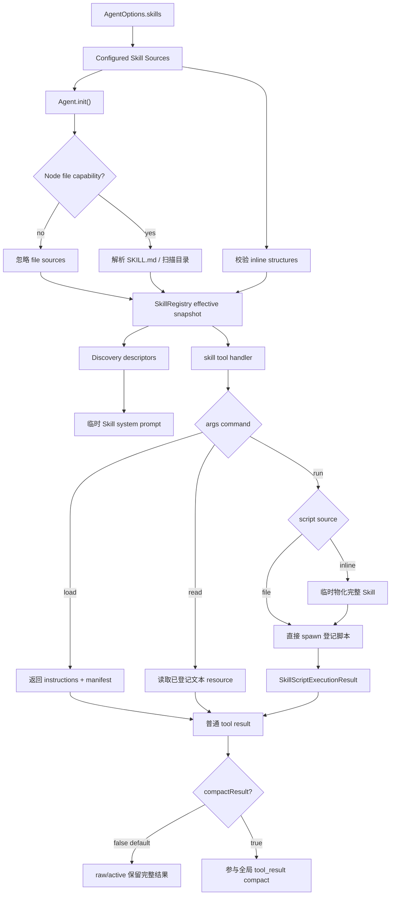

# Agent Skills 技术架构设计

## 1. 文档信息

- 状态：设计已确认，待实施
- 适用包：`@ruixutong.manee/maneeagent-framework`
- 变更性质：Skill 公共契约的破坏性升级
- 设计范围：Skill 分层披露、内存与文件来源、文本资源读取、Node 脚本运行、Context Compact 协作
- 关联计划：同目录 `implementation-plan.md`
- 参考格式：[Agent Skills Specification](https://agentskills.io/specification)

## 2. 背景与现状

当前框架已经包含一版轻量 Skill 能力：

- `AgentSkill` 由 `name`、`description`、`systemContent` 和 `sops` 组成；
- `Agent` 在内部 system prompt 中按数组下标展示 Skill 的名称和描述；
- 模型通过内置 `get-skill({ index })` 一次性取得完整手册；
- `Agent` 直接持有 `AgentSkill[]`，没有独立 registry、source adapter 或资源层；
- Skill 名称没有唯一性校验，数字下标是对模型可见的不稳定身份；
- Skill 不能携带按需资源或脚本，也不能从 Agent Skills `SKILL.md` 目录来源加载。

现有能力具备“元数据常驻、正文按需读取”的雏形，但无法表达主流 Agent Skills 的三级披露：

1. 发现：常驻 `name + description`；
2. 激活：按名称加载完整 instructions；
3. 执行：按需读取 references/assets，或运行 scripts。

本次设计把 Skill 从 Agent 内的一段特殊数组逻辑升级为独立子系统。结构体定义是核心、跨运行时的数据模型；Agent Skills portable text subset 目录只是 Node 环境下的可选输入适配器，不能反过来约束整个框架必须依赖文件系统。

## 3. 目标与非目标

### 3.1 目标

- 用稳定 Skill 名称替代数组下标。
- 只保留一个内置 `skill` 工具，通过 `args` 中的固定命令完成 load/read/run 分发。
- 首轮请求只暴露元数据，正文、资源和脚本内容都按需进入 context。
- 直接通过 TypeScript 结构体定义完整 Skill，不要求创建目录。
- 在 Node 且具有文件读取能力时，兼容 Agent Skills portable text subset 的目录或 `SKILL.md` 路径来源。
- 支持 `references/`、`assets/` 下的文本资源。
- 支持 `scripts/` 文件执行，以及结构体脚本源码的临时物化执行。
- 脚本后缀到执行命令的映射由初始化配置控制，并提供主流运行时自动检测辅助能力。
- 文件、进程能力全部做 Node 前置检测；非 Node 环境忽略文件来源并禁止脚本执行。
- Skill tool result 默认不进入工具结果压缩，避免刚加载的 instructions 或资源被裁剪。
- 保持 Chat/Responses 协议无关，不扩展 provider wire message。

### 3.2 非目标

- 不兼容旧 `get-skill(index)`、`systemContent`、`sops` 或 `AgentSkillSop`。
- 不提供旧工具别名或自动迁移层。
- 不执行 `allowed-tools` 授权，也不在公共结构中保留该字段。
- 不提供脚本沙箱、容器、权限降级、网络隔离或系统调用隔离。
- 不提供默认脚本超时、输出上限、stdin 或流式输出。
- 不把模型输入解释为任意文件路径或任意系统命令。
- 不解码或返回二进制 resource；file 扩展名只声明文本候选，实际内容在 lazy read 时必须是合法 UTF-8，否则返回 calling error。
- 不宣称完整兼容任意 Agent Skills 目录；候选路径的空/点 segment、反斜杠、ASCII control/DEL、`<>:"|?*`、NUL、末尾空格/点、Windows 保留 basename，以及 NFC/大小写 alias 和 file/directory prefix collision 均被拒绝。POSIX 合法的 `query?.md`、`a:b.md` 等文件名、二进制 references/assets、未登记的根目录内容和 `allowed-tools` 都在 portable text subset 之外。
- 不实现远程 Skill registry、MCP Skill source、安装、更新或版本分发。
- 不因为本功能宣称整个 npm 包已经兼容浏览器；当前 Responses adapter 仍有 Node 顶层依赖。

## 4. 设计原则

### 4.1 结构体是规范模型，目录是适配器

Agent 的后续逻辑只消费统一的 resolved skill。Inline source 与 file source 的差异止于 source adapter：

```text
AgentSkill (inline) ─┐
                    ├─> SkillRegistry ─> ResolvedSkill ─> skill tool
SKILL.md (file) ────┘
```

工具处理、prompt 构造和 compact 判断不能在各处重复区分来源。

### 4.2 Progressive disclosure 是工具协议，不是提示词约定

Skill 的三层内容必须由 registry 和命令路由器强制控制：

- discovery prompt 只能读取 descriptor；
- load 只能读取选中 Skill 的 instructions；
- read 只能读取选中 Skill 已登记的文本资源；
- run 只能运行选中 Skill 已登记的脚本。

不能依赖模型“自觉不读取”未选中的内容。

### 4.3 模型输入不参与路径或命令解析

`SkillToolInput.skill` 只用于精确查找已注册 Skill；`args` 中出现的 resource/script id 也只能命中 registry 中的逻辑 id。以下保证限定于框架 dispatcher 自身，不限制一个已登记、受信任脚本如何解释其 argv。

dispatcher 不会把模型输入：

- 拼接成本地绝对路径；
- 使用 `..` 逃逸 Skill 根目录；
- 指定未配置的 executable；
- 通过管道、重定向、变量展开或命令替换启动其他进程。

模型仍可把外部路径作为普通 argv 传给已登记脚本；脚本是否读取它属于受信任代码行为，不是 `skill` dispatcher 的文件访问能力。

### 4.4 文件能力 fail-safe，配置错误 fail-fast

- 非 Node、缺少 Node builtin capability、权限明确拒绝或访问被系统拒绝：忽略对应 file source。
- 已具备文件能力，但路径不存在、类型错误、frontmatter 非法或 Skill 内容不合法：`init()` 失败。
- 这样既满足跨环境降级，也避免 Node 部署中的拼写错误被静默隐藏。

### 4.5 脚本是显式开启的受信任代码

脚本执行默认关闭。只有用户在 `skillRuntime.scripts` 中显式启用自动检测或提供后缀映射后，run 才可用。

`shell: false` 和 registry 限制只防止 dispatcher 直接执行任意命令，不构成脚本沙箱。一个被允许执行的 Python、Node 或 Shell 脚本仍拥有当前进程用户可访问的环境变量、网络和文件权限。

## 5. 总体架构



### 5.1 模块划分

| 模块                 | 职责                                                                               |
| -------------------- | ---------------------------------------------------------------------------------- |
| `Agent`              | 持有 configured sources/runtime config，初始化 registry，构建 prompt，注册内置工具 |
| `SkillRegistry`      | 事务性 source 解析、唯一性校验、descriptor snapshot、命令分发                      |
| `InlineSkillAdapter` | 校验结构体内容，生成逻辑 resource/script ids，提供内存正文                         |
| `FileSkillAdapter`   | Node capability 检测、SKILL.md 解析、目录扫描和安全路径索引                        |
| `SkillCommandRouter` | 解析 load/read/run DSL，不包含文件系统或进程逻辑                                   |
| `SkillScriptRuntime` | 后缀映射解析、自动检测、临时物化、spawn 和结构化结果                               |
| `Context Compact`    | 根据 execution record 的逐条标记决定是否调用 result compactor                      |

## 6. 公共 API

所有公共类型从 Agent 入口和包根入口导出，并提供中文 TSDoc。

### 6.1 Tool 输入

```ts
export interface SkillToolInput {
  readonly skill: string;
  readonly args?: string;
}
```

- `skill`：精确、区分大小写查找；有效 Skill 名本身按小写 slug 规则定义。
- `args`：原始命令字符串；不做 JSON、Shell 或环境变量解析。

工具 schema：

```ts
z.object({
  skill: z.string(),
  args: z.string().optional(),
});
```

Zod 只负责 wire type；dispatcher 再按 Skill slug 规则校验 `skill`，使空串、超长或含控制字符的字符串稳定返回 `invalid_arguments`，而不是被回显到错误消息。缺失字段或非 string 仍沿用框架统一 schema error。

### 6.2 Inline Skill

```ts
export interface AgentSkillScript {
  /** 例如 .py、.js；必须带前导点。 */
  readonly extension: string;
  readonly content: string;
  readonly description?: string;
}

export interface AgentSkill extends AgentSkillDescriptor {
  readonly license?: string;
  readonly compatibility?: string;
  readonly metadata?: Readonly<Record<string, string>>;
  readonly instructions: string;

  readonly references?: Readonly<Record<string, string>>;
  readonly assets?: Readonly<Record<string, string>>;
  readonly scripts?: Readonly<Record<string, AgentSkillScript>>;
}
```

`references/assets/scripts` 的 key 是对应目录下的逻辑相对名称，而不是宿主机路径：

```ts
const skill: AgentSkill = {
  name: 'invoice-review',
  description: 'Review invoices and explain detected billing issues.',
  instructions: [
    'Read references/policy.md before reviewing.',
    'Run scripts/check.py with the invoice path when validation is required.',
  ].join('\n'),
  references: {
    'policy.md': '# Invoice policy\n...',
    'examples/duplicate-charge.md': '# Example\n...',
  },
  assets: {
    'report-template.md': '# Review report\n...',
  },
  scripts: {
    check: {
      extension: '.py',
      content: 'import sys\nprint(sys.argv[1:])\n',
      description: 'Validate an invoice and print findings.',
    },
  },
};
```

由此生成以下逻辑 id：

- `references/policy.md`
- `references/examples/duplicate-charge.md`
- `assets/report-template.md`
- `scripts/check.py`

key 可以包含安全的 `/` 子目录分隔。每个 segment 必须非空且不能是 `.`/`..`，并拒绝绝对路径、反斜杠、ASCII control/DEL、`<>:"|?*`、NUL、末尾空格/点，以及不区分大小写的 Windows 保留 basename（`CON/PRN/AUX/NUL/COM1..9/LPT1..9`，含扩展名形式）。segment 内部普通空格和 Unicode 允许。

Registry 对全部最终物化路径建立逐目录 trie；每层 segment 使用 `normalize('NFC').toLowerCase()` collision key。相同父节点下 collision key 相同但原 segment 不同、一个路径是另一路径的严格 file/directory 前缀，或同一路径被 resource/script 重复占用，均属于配置错误。该规则覆盖 `A/x` 与 `a/y` 的父目录 alias，以及 `references/foo` 与 `references/foo/bar.md` 的 file/directory 冲突。file discovery 的候选项使用同一 trie，不能生成只在 load/read 可用、到 inline run 才冲突的 registry。

### 6.3 File source

```ts
export interface AgentSkillFileSource {
  readonly source: 'file';
  /** Agent Skills portable text subset 目录，或目录中的 SKILL.md。 */
  readonly path: string;
}

export type AgentSkillSource = AgentSkill | AgentSkillFileSource;
```

使用显式 discriminator，避免把 inline content、资源名或普通字符串误判为文件路径。

### 6.4 Descriptor

```ts
export interface AgentSkillDescriptor {
  readonly name: string;
  readonly description: string;
}
```

`AgentSkillDescriptor` 是唯一允许进入 discovery prompt 和动态工具描述的发现视图。`ToolDescriptionContext.skills` 改为 `readonly AgentSkillDescriptor[]`，因此第一层披露严格只有 `name + description`，不包含：

- license/compatibility/metadata；
- instructions；
- references/assets/scripts 内容；
- file source 路径；
- executable 命令。

Inline source 和 file frontmatter 中的 license、compatibility、metadata 仍由 registry 保存为 source metadata，供未来框架 API 扩展使用，但本版不把它们注入任何模型请求。

### 6.5 Script executor

```ts
export interface SkillScriptExecutor {
  /** 绝对 executable 或可从 PATH 解析的命令名。 */
  readonly command: string;
  /** 插在 script path 之前，例如 pwsh 的 ['-File']。 */
  readonly commandArgs?: readonly string[];
}

export type SkillScriptExecutorMap = Readonly<Record<string, SkillScriptExecutor | false>>;

export interface SkillScriptRuntimeOptions {
  /** 默认 false。 */
  readonly autoDetect?: boolean;
  /** 在 auto 结果之上覆盖；false 删除该 extension。 */
  readonly executors?: SkillScriptExecutorMap;
}

export interface SkillRuntimeOptions {
  /** 默认 false；true 表示参与全局 tool_result compact。 */
  readonly compactResult?: boolean;
  /** 默认 false。 */
  readonly scripts?: false | SkillScriptRuntimeOptions;
  /** 替换 file source 的缺省文本扩展名列表。 */
  readonly resourceExtensions?: readonly string[];
}
```

缺省文本资源扩展名作为冻结运行时常量导出：

```ts
export const DEFAULT_SKILL_TEXT_RESOURCE_EXTENSIONS = Object.freeze([
  '.md',
  '.txt',
  '.json',
  '.yaml',
  '.yml',
  '.csv',
  '.xml',
] as const);
```

自定义 `resourceExtensions` 必须是数组；每项必须匹配单后缀规则 `/^\.[a-z0-9]+$/i`。初始化时统一转为小写并拒绝归一化后的重复项；传入空数组表示 file source 不索引任何 references/assets。该配置是调用方对“哪些后缀按文本处理”的声明，只影响 file discovery；inline resource 已经是 JavaScript string，不再按后缀过滤。被登记文件在 `read` 时仍必须通过 fatal UTF-8 解码。

### 6.6 Script result

```ts
export interface SkillScriptExecutionResult {
  readonly exitCode: number | null;
  readonly signal: string | null;
  readonly stdout: string;
  readonly stderr: string;
}
```

无论 exit code 是否为 0，只要进程成功启动并完成，都返回这个结构。进程非零退出不自动转换成工具异常。

### 6.7 自动检测 API

```ts
export function detectSkillScriptExecutors(): Record<string, SkillScriptExecutor>;
```

- 同步执行，与同步 `Agent.init()` 兼容。
- 每次调用返回新的可修改 map，并重新复制其中 readonly executor object/commandArgs array；调用方可替换 map entry，任何运行时 mutation/cast 也不会污染后续调用。
- 非 Node 或缺少所需 capability 时返回空对象。
- 不自动修改 Agent 配置。

### 6.8 AgentOptions 与实例方法

```ts
export interface AgentOptions<P extends AgentProtocol> {
  // existing fields...
  skills?: readonly AgentSkillSource[];
  skillRuntime?: SkillRuntimeOptions;
}
```

```ts
addSkill(...skills: AgentSkillSource[]): this;
```

`addSkill()` 只追加 configured sources 并设置 `#skillConfigurationDirty = true`。Agent 未运行时同时把 `#initialized` 设为 false；运行中不能让该写入打断当前 loop，因此保留本次 run 的初始化通行状态和旧 registry，待 run finalization 后再转为未初始化。新增 Skill 只有重新 `init()` 成功后才进入 effective snapshot。

这是有意的破坏性变化：Skill 名称唯一性、file parsing 和 executable resolution 都必须在请求模型前完成，不能让一次运行看到半更新状态。

被环境或权限忽略的 file source 通过只读诊断快照对宿主可见：

```ts
export type AgentSkillSourceDiagnosticReason =
  | 'node_unavailable'
  | 'file_capability_unavailable'
  | 'read_permission_denied'
  | 'source_access_denied';

export interface AgentSkillSourceDiagnostic {
  /** configured sources 中的 0-based 下标。 */
  readonly sourceIndex: number;
  readonly reason: AgentSkillSourceDiagnosticReason;
}

getSkillSourceDiagnostics(): readonly AgentSkillSourceDiagnostic[];
```

diagnostics 数组和成员在运行时冻结，只代表最近一次成功 `init()` 的快照，并与 effective registry 原子替换。它不包含 path；capability 缺失时不得为了生成诊断访问 file source 的 `path`。库不写 console，也不新增诊断事件。配置错误继续抛出，不生成 ignored diagnostic。

## 7. Skill Registry 内部设计

### 7.1 配置态与生效态分离

Agent 保存两层状态：

```ts
#skillSources: AgentSkillSource[];
#skillRuntimeConfig: SkillRuntimeOptions | undefined;
#skillRegistry: SkillRegistry;
#skillConfigurationDirty: boolean;
```

`#skillSources` 是外部配置的浅拷贝；`#skillRegistry` 只包含最近一次成功 `init()` 生成的 snapshot。

内部 resolved 类型不导出：

```ts
interface ResolvedSkill {
  readonly descriptor: AgentSkillDescriptor;
  readonly sourceMetadata: {
    readonly license?: string;
    readonly compatibility?: string;
    readonly metadata?: Readonly<Record<string, string>>;
  };
  readonly instructions: string;
  readonly resources: ReadonlyMap<string, ResolvedSkillResource>;
  readonly scripts: ReadonlyMap<string, ResolvedSkillScript>;
  readonly source: 'inline' | 'file';
  readonly rootDirectory?: string;
}
```

资源与脚本内部记录只暴露逻辑 id：

```ts
type ResolvedSkillResource =
  | { source: 'inline'; content: string }
  | { source: 'file'; absolutePath: string; realPath: string };

type ResolvedSkillScript =
  | {
      source: 'inline';
      extension: string;
      content: string;
      description?: string;
    }
  | {
      source: 'file';
      extension: string;
      absolutePath: string;
      realPath: string;
    };
```

这些绝对路径永远不会由框架写入 system prompt、工具描述、manifest、可纠正错误结果或 `ToolDescriptionContext`。脚本自己的 stdout/stderr 和资源正文属于受信任内容透传，不在此保证内。

### 7.2 init 事务

`Agent.init()` 按如下顺序工作：

1. 若 Agent 正在运行，立即抛错，且不修改初始化状态或 registry。
2. 标记未初始化。
3. 校验工具名和子代理名。
4. 解析 Skill runtime config。
5. 获取一次 Node capability snapshot，并为被忽略的 file source 构造无 path diagnostics candidate。
6. 解析 inline sources。
7. 能力允许时解析 file sources，否则跳过。
8. 对全部 effective skills 做名称唯一性校验。
9. 构造新的 immutable registry 和冻结 diagnostics snapshot。
10. 解析现有 context compact/recovery 配置。
11. 一切成功后一次替换 registry/diagnostics，清除 skill dirty，并标记初始化完成。

任何非法配置都不能让部分新 Skill 覆盖旧 registry。重复调用 `init()` 会刷新 SKILL.md、目录清单、权限状态、PATH runtime detection 和 executable resolution。

### 7.3 名称与元数据校验

Skill name：

- 1 到 64 个字符；
- 只允许小写 ASCII 字母、数字和单个连字符分组；
- 不允许前导、尾随或连续连字符；
- inline source 不要求与目录匹配；
- file source 要求等于 canonical Skill root 的 basename；若 configured root 本身是 symlink，比较 realpath 后目标目录名，而不是 symlink 名。

Description：

- trim 后非空；
- 最大 1,024 个 Unicode code points。

Compatibility：

- 提供时 trim 后非空；
- 最大 500 个 Unicode code points；
- 仅作为声明性元数据，不由框架解释。

License：

- 提供时必须是字符串；
- trim 后非空；框架不额外设置规范之外的长度上限。

Metadata：

- 必须是普通对象；
- key/value 都是字符串；
- 浅拷贝并冻结。

Instructions 必须是字符串，可以为空；空 instructions 的 Skill 仍可作为资源/脚本入口。Inline Skill、script、references/assets/scripts map 和 source 都必须是非 null、非数组普通对象；未知字段忽略。File source 只需先识别 `source: 'file'`：若 file capability 缺失，整个 payload（包括 path）直接忽略；能力存在时 `AgentSkillFileSource.path` 才必须是非空字符串，不能全为空白或包含 NUL，实际路径值不做 trim，以保留合法的首尾空格文件名。

本文“普通对象”固定指 prototype 为 `Object.prototype` 或 `null` 的 record；class instance、Date、Map、数组和 function 均拒绝。所有 map 只遍历 own enumerable string keys，并复制到内部 `Map`/null-prototype record，避免 prototype pollution。

Inline script 的 `extension` 必须匹配 `/^\.[a-z0-9]+$/i` 并转成小写，确保与 file source 的最后一段后缀语义一致；`.foo.py`、路径分隔符和 NUL 均非法。`content` 必须是字符串；可选 `description` trim 后非空且最大 1,024 Unicode code points。所有“字符”上限都用 code-point iterator 计数，不使用 UTF-16 `.length`。

### 7.4 重名规则

- 名称精确比较。
- inline/file 之间没有来源优先级。
- 任意重复名使 `init()` 失败。
- file source 因环境或权限被忽略后，不参与重名比较。
- 不支持先到先得、覆盖或 merge。

### 7.5 稳定顺序

- effective Skill/discovery descriptor 保持 `skills` configured source 顺序；被忽略 source 直接移除，不重排其余项，`addSkill()` 追加在末尾。
- 每个 Skill 的 resources 和 scripts 在 snapshot/manifest 中按完整逻辑 id 的 UTF-16 code-unit 顺序排序，使用确定性的 JS `<`/`>` comparator，禁止依赖 `readdir`、Unicode code-point comparator 或 locale collation。
- `detectSkillScriptExecutors()` 和 resolved executor map 的 enumerable key 也按规范化 extension 的 UTF-16 code-unit 顺序写入新对象；auto/manual 合并只决定值，不改变最终输出排序。

## 8. Discovery Prompt 与内置工具

### 8.1 Prompt 内容

原 `#buildSkillPrompt()` 改为从 registry 获取 descriptors。每轮模型请求仍临时构建，不写入 raw/active context。

有 Skill 时仅列出；description 固定使用 `JSON.stringify()` 生成单个 JSON string literal，并额外把 U+2028/U+2029 写成 `\u2028/\u2029`，使换行、引号和 Markdown 字符不会改变 catalog 行结构：

```text
- invoice-review: "Review invoices and explain detected billing issues."
- pdf-processing: "Extract, inspect, and transform PDF documents."
```

不能列出正文、资源名、脚本名、本地路径或 executable。

提示词同时说明：

- 任务匹配时先调用 `skill`；
- 省略 args 或使用 `load` 激活正文；
- 获取正文后再按 manifest 使用 read/run；
- 不得猜测未登记的资源或脚本 id。

没有 effective Skill 时提示模型不要调用 `skill`。为了保持内置工具集合稳定，工具本身仍存在。

### 8.2 工具定义

移除：

```text
get-skill({ index: number })
```

新增：

```text
skill({ skill: string, args?: string })
```

内置工具继续使用 `@Tool` 注册，因此自动复用既有行为：

- 参数 JSON 解析和 Zod 校验；
- before/after listener；
- `onToolCallError`；
- 工具结果序列化；
- raw/active context 写入；
- tool payload compact 生命周期。

## 9. Skill 命令 DSL

### 9.1 语法

```ebnf
input        = ascii-whitespace* [ load | read | run ] ;
load         = "load" [ ascii-whitespace raw-arguments ] ;
read         = "read" ascii-whitespace quoted-token { ascii-whitespace } ;
run          = "run" ascii-whitespace quoted-token { ascii-whitespace quoted-token }
               { ascii-whitespace } ;
quoted-token = bare | single-quoted | double-quoted ;
```

省略 `args`、空字符串或全空白字符串等价于 `load`。

`ascii-whitespace` 固定只包含 U+0009 TAB、U+000A LF、U+000D CR 和 U+0020 SPACE；NBSP、U+2028 及其他 Unicode whitespace 都是普通 token/raw 字符。上述 input 末尾空白规则只适用于 read/run，不能套到 load raw tail。

解析器先拒绝整个 `args` 中的 NUL。随后跳过开头空白并识别第一个 command token：只有完整的 `load`、`read`、`run` 合法，其他 token 返回 `invalid_command`。下列 Lexer 规则只用于 read/run；load 不进入 lexer：

- 仅上述 ASCII 空白分隔 token；read/run 的 token 间及末尾分隔空白被丢弃；
- 单引号和双引号只用于分组；
- 引号必须完整包围一个 token，closing quote 后只能是 ASCII 空白或 EOF；
- 反斜杠转义下一个 Unicode code point；
- 不执行 `$VAR`、`$()`、反引号、`*`、`?`、`;`、`&&`、`||`、`|`、`>`、`<`；
- 上述字符在 token 内都是普通字符；
- 未闭合 quote 或悬空反斜杠仅在 read/run 中返回稳定的 DSL 错误。

### 9.2 load

调用：

```json
{ "skill": "invoice-review" }
```

或：

```json
{ "skill": "invoice-review", "args": "load invoices/acme.json" }
```

处理规则：

1. 取得完整 instructions。
2. `load` 后先消费 command 与 raw tail 之间的全部分隔空白，再保持剩余字符完全原样；因此引号、反斜杠和末尾空白均保留，但分隔用的开头空白不属于 `$ARGUMENTS`。
3. 用 callback replacement 替换所有字面量 `$ARGUMENTS`，避免 `$&` 等 replacement pattern 生效。
4. 没有占位符且 raw tail 非空时，在末尾追加 `ARGUMENTS:` 独立区块。
5. 追加 framework-generated manifest，只列 resource/script id、脚本 description 和当前执行可用性。

manifest 是框架内容，不写回 Skill 定义，也不缓存到 raw source。

manifest 中不含空白的 id 直接输出；含空白的 id 使用双引号包裹。由于 portable-id 已拒绝双引号、反斜杠和控制字符，不需要另一套 escape 语法，渲染值可被 read/run lexer 无损还原。可选 script description 使用同一 JSON string renderer（含 U+2028/U+2029 处理），不让换行或 Markdown 改变列表结构。

load 使用固定 Markdown envelope，便于模型和离线测试稳定识别：

```text
# Skill: <name>

## Instructions
<rendered instructions>

## Resources
- <resource-id>

## Scripts
- <script-id> [available|unavailable] — <optional description>

## Commands
- read <resource-id>
- run <script-id> [args...]
```

没有资源或脚本时对应 section 仍保留，并写 `- none`。license、compatibility 和 metadata 属于 source metadata，本版不注入 envelope 或其他模型请求。

### 9.3 read

调用：

```json
{
  "skill": "invoice-review",
  "args": "read references/policy.md"
}
```

规则：

- 必须且只能提供一个 resource id；
- id 必须精确命中该 Skill 的 resource map；
- inline source 直接返回内存 string；
- file source 调用时读取已登记 real path，使用 fatal UTF-8 decoder；非法字节序列进入工具 calling error；
- 不根据输入再次 resolve 任意路径；
- 文件被删除、替换为目录或读取失败时进入工具 calling error 路径；
- 返回内容不附带宿主机绝对路径。

### 9.4 run

调用：

```json
{
  "skill": "invoice-review",
  "args": "run scripts/check.py --format json invoices/acme.json"
}
```

规则：

- 第一个参数是已登记 script id；
- 后续 token 原样作为 argv 数组；
- 后缀从 registered script 得出，不接受模型覆盖；
- executable 从 resolved executor map 得出，不接受模型指定；
- 未启用脚本、没有对应 executor 或非 Node 环境时返回稳定的 unavailable 结果，不启动进程。

### 9.5 可纠正错误与框架错误

可纠正错误统一返回内部结构，并由现有工具结果序列化规则转成 JSON：

```ts
interface SkillDispatchErrorResult {
  readonly ok: false;
  readonly error: {
    readonly code:
      | 'skill_not_found'
      | 'invalid_command'
      | 'invalid_arguments'
      | 'resource_not_found'
      | 'script_not_found'
      | 'script_execution_unavailable';
    readonly message: string;
  };
}
```

`message` 只能包含已经按上述控制字符规则校验过的 Skill 名/逻辑 id 和固定 usage，不回显未校验的原始 `args`，也不包含绝对路径、临时目录或 executable。read 成功仍只返回资源原文，run 成功仍返回 `SkillScriptExecutionResult`，不额外包裹 `ok`。

判定顺序和 code 固定如下，前一步命中即返回，不继续泄漏后续状态：

| 顺序 | 条件                                                                       | code                           |
| ---- | -------------------------------------------------------------------------- | ------------------------------ |
| 1    | `args` 含 NUL，或 `skill` 不是合法 slug                                    | `invalid_arguments`            |
| 2    | 合法 slug 未注册                                                           | `skill_not_found`              |
| 3    | 非空 args 的首 command token 不是 load/read/run                            | `invalid_command`              |
| 4    | read/run quote 或 escape 未闭合、arity 错误、id 不是 portable-id           | `invalid_arguments`            |
| 5    | read 的合法 id 未在 resource map 中                                        | `resource_not_found`           |
| 6    | run 的合法 id 未在 script map 中                                           | `script_not_found`             |
| 7    | 已登记 script 但 scripts disabled、capability 缺失或 extension 无 executor | `script_execution_unavailable` |

因此“未知 Skill + 未知 command”返回 `skill_not_found`；“未知 script + scripts disabled”先返回 `script_not_found`；`load` raw tail 的 quote/backslash 永不触发第 4 步，但 NUL 仍在第 1 步拒绝。缺失/非 string 的 `skill` 或非 string 的 `args` 在进入该表前由统一 Zod schema error 处理。

以下情况抛入既有工具 calling error 流程：

- 已登记 file resource 在调用时读取失败；
- inline Skill 临时物化失败；
- executable 在 init 后消失或 spawn 失败；
- 进程通信本身异常。

请求中的 Skill 名和 resource/script id 在查找前先经过 slug/portable-id 校验；非法值返回固定 `invalid_arguments` 且不回显。Registry 捕获底层文件/进程错误后抛出内部 `SkillRuntimeError`：其公开 `message` 只包含操作阶段、已校验 Skill 名和逻辑 id，并把原始异常放在标准 `cause` 中。现有 `onToolCallError` listener 收到该 wrapper，宿主应用仍可通过 `error.cause` 诊断；写入模型 context 的 `normalizeErrorMessage()` 只会使用脱敏后的 wrapper message，不包含 file source、临时目录或 executable。

## 10. File Skill Adapter

本 adapter 明确实现框架定义的 **Agent Skills portable text subset**，而不是对规范中任意物理目录的无条件兼容：

- `SKILL.md` 支持规范中的 name、description、license、compatibility、metadata 和 Markdown body；`allowed-tools` 及未知字段不产生行为。
- `references/`、`assets/` 只把配置扩展名的合法 UTF-8 文件作为文本资源；其他扩展名和二进制内容不进入可读取资源层。
- `scripts/` 只登记具有单后缀的普通文件；可执行语言和运行时由 executor 配置决定。
- 候选 resource/script 的每个相对路径 segment 必须满足 portable-id：拒绝空 segment、`.`、`..`、反斜杠、ASCII control/DEL、`<>:"|?*`、NUL、末尾空格/点，以及 Windows 保留 basename `CON/PRN/AUX/NUL/COM1..9/LPT1..9`（含扩展名形式）。例如 POSIX 上合法的 `references/query?.md` 和 `references/a:b.md` 仍不属于本 subset。
- 完整物化路径还必须通过逐目录 NFC + lowercase collision 和 file/directory prefix 检查。候选文件违反这些限制时 `init()` 报配置错误；unsupported resource 或无后缀 script 在成为候选前直接忽略。
- `references/assets/scripts` 之外的其他根目录项忽略。

### 10.1 Node capability 检测

Skill 文件模块不能新增静态 `node:fs`、`node:path`、`node:os` 或 `node:child_process` import。新增内部 `skill-node-runtime.ts` 作为唯一 capability provider，file adapter、script runtime 和公开 detector 都单向依赖它，避免各模块重复探测全局对象。

Provider 通过结构化 runtime 检测：

1. `Reflect.get(globalThis, 'process')` 存在；
2. `process.release.name === 'node'`；
3. `process.versions.node` 存在；
4. `process.getBuiltinModule` 是函数；
5. 通过 `getBuiltinModule()` 取得所需最小能力。

返回值明确拆成三层可选能力：

```ts
interface SkillNodeCapabilities {
  readonly files?: SkillFileCapabilities; // fs + path + cwd/read permission
  readonly processes?: SkillProcessCapabilities; // resolveExecutable + spawn + env/execPath
  readonly temporaryFiles?: SkillTemporaryFileCapabilities; // os.tmpdir + mkdir/write/rm
}
```

- File source 初始化和 lazy read 只要求 `files`。
- File script run 同时要求 `files + processes`。
- Inline load/read 不要求任何 Node capability。
- Inline run 同时要求 `processes + temporaryFiles`，因为需要临时物化和 spawn。
- `detectSkillScriptExecutors()` 只要求 `processes`；缺失时返回空对象。

File capability 缺失时，adapter 在读取/解析 `path` 属性之前就跳过 file source；测试使用抛错 getter 证明降级路径不会触碰文件路径配置。

`SkillProcessCapabilities` 暴露经过 provider 封装的 `resolveExecutable/isExecutable/spawn`，因此 PATH 校验所需的 `stat/access(X_OK)` 不会形成 script runtime 对 fs 模块的反向依赖。若 Node permission API 的 `process.permission.has('child')` 明确返回 false，则 `processes` 整层缺失，detector 返回空 map，run 显示 unavailable。若 `process.permission.has('fs.write', os.tmpdir())` 明确返回 false，则只缺失 `temporaryFiles`：file run 仍可用，inline run unavailable。未提供 permission API 时继续以真实操作结果为准。

Provider 接受内部可注入 adapter，生产代码读取真实 runtime，测试注入 fake fs/process/child-process，不修改 `globalThis`。

`process.getBuiltinModule()` 从 Node 22.3.0 才可用。包的现有 engines 仍保持 `>=22`；在 Node 22.0–22.2 中 provider 返回三层能力均缺失，因此 file source 会被忽略、脚本执行不可用，而 inline load/read 继续工作。该降级也避免 Skill 模块本身让非 Node bundler 在解析阶段立即失败。

注意：根包当前仍会导出包含 `node:fs` 顶层 import 的 Responses adapter，所以本设计只承诺 Skill source 的能力门控，不承诺完整 browser build。

### 10.2 权限前置校验

若存在 Node permission API：

```ts
process.permission?.has('fs.read', resolvedPath);
```

明确返回 `false` 时忽略该 file source。

permission API 不存在不表示拒绝；继续执行 `accessSync` 和真实读取。file source 初始化期间，从 root resolve、SKILL.md 读取到 references/assets/scripts 扫描的任意一步出现以下错误，都原子忽略整个 source，不保留部分 descriptor 或 manifest：

- `EACCES`
- `EPERM`
- `ERR_ACCESS_DENIED`

`ENOENT`、错误文件类型和解析失败不属于环境降级，必须作为配置错误抛出。registry 已成功提交后，lazy read/run 遇到权限拒绝不再回溯删除 source，而是进入脱敏后的工具 calling error。

### 10.3 path 解析

- 相对路径在 `init()` 时相对 `process.cwd()` 解析。
- 目录路径自动定位其中的 `SKILL.md`。
- 文件路径只接受 basename 为 `SKILL.md` 的普通文件。
- 根路径可以是显式配置的 symlink；初始化时 realpath 固定真实 Skill 根，frontmatter name 与该 canonical root basename 比较。
- 目录扫描不跟随根目录内部的任何 symlink entry。

### 10.4 Frontmatter

新增 `yaml` runtime dependency，使用其安全解析能力处理 `SKILL.md` 的 YAML frontmatter。

支持字段：

- `name`
- `description`
- `license`
- `compatibility`
- `metadata`

`allowed-tools` 和其他未知顶层字段不进入公共结构，也不产生授权行为；为了兼容未来格式，忽略而不是报错。已支持字段若类型非法仍必须报错。

`SKILL.md` 先以 fatal UTF-8 decoder 解码，允许并移除 UTF-8 BOM；非法字节序列属于配置错误。文档必须以一行精确的 `---` 开始，并以后一行精确的 `---` 结束 frontmatter，兼容 LF/CRLF；缺失 closing delimiter 报配置错误。YAML 根必须是 mapping，duplicate key 或解析错误直接失败。closing delimiter 行及其紧随的一个 LF/CRLF 属于 framing，不进入 instructions；delimiter 位于 EOF 时 instructions 为 `''`。正文从其后的第一个 UTF-16 code unit 开始完全保真，不 trim、不做 Markdown AST 转换或换行归一化；inline 生成与 file parsing 必须通过 round-trip 测试。

### 10.5 目录发现

以 Skill root 为边界递归扫描：

```text
skill-name/
├── SKILL.md
├── references/
├── assets/
└── scripts/
```

规则：

- 对 ordinary file 先用最后一段 suffix 分类，再决定是否成为候选：`references/assets` 的 unsupported extension 和 `scripts` 的无后缀/`.env` dotfile 立即忽略，不对被忽略项做 portable-id、trie 或 realpath 校验；因此 `references/bad?.bin` 不会让 source 失败；
- 候选 `references/assets` 只索引允许扩展名，候选 script 不要求初始化时已有 executor；候选逻辑路径随后必须依次通过 portable-id、trie collision 和 realpath containment，任何失败都使 source 配置失败；
- 多重后缀只取最后一段，有后缀的逻辑 id 保留原始文件名大小写，但 executor lookup 使用小写后缀；
- 隐藏文件与普通文件使用相同规则，不做名称猜测；
- 其他根目录项忽略；
- 所有逻辑 id 使用 `/`，与宿主机 path separator 无关；
- 每个 realpath 必须仍位于 Skill real root 内；containment 使用 `path.relative(rootReal, entryReal)`，仅当结果不是绝对路径、不是 `..` 且不以 `..${path.sep}` 开头时成立，禁止用字符串前缀判断；
- unsupported resource extension 直接忽略；
- 被允许的扩展名表示“调用方声明为文本”，discovery 阶段不为判断 binary 而预读正文；lazy read 时 fatal UTF-8 解码失败走 calling error。

三个子目录都是可选的：初始化检查时不存在等价于空目录；一旦已经开始遍历，目录或条目并发消失产生的 `ENOENT` 视为配置错误，不提交部分 source。资源和脚本后缀统一使用 `path.extname()` 的最后一段；因此 `.env` 形式 dotfile 对两类都视为无后缀，隐藏文件 `.guide.md` 则按 `.md` 处理。

目录类型矩阵固定如下：well-known 根 `references/assets/scripts` 只接受“缺失”或不经过 symlink 的普通目录，若为 symlink、普通文件、socket/FIFO/device 等其他类型则属于配置错误。树内普通目录递归，普通文件按 suffix 过滤；树内 symlink 和特殊文件直接忽略且永不跟随。开始遍历后的 `ENOENT/ENOTDIR/ELOOP` 或类型变化属于配置错误；`EACCES/EPERM/ERR_ACCESS_DENIED` 仍按权限降级规则原子忽略整个 source。

在每次 lazy read/run 前，重新执行 `lstat + realpath + regular-file + root-containment` 检查，拒绝已经变成 symlink、目录或逃出 canonical root 的登记项。该检查缩小初始化后替换的攻击窗口，但无法完全消除宿主机并发修改造成的 TOCTOU，file Skill 目录仍必须来自受信任来源。

## 11. Inline Skill Adapter 与临时物化

### 11.1 结构校验

Inline source 不访问文件系统即可完成：

- descriptor 校验；
- references/assets key 规范化；
- scripts key、extension 和 content 校验；
- 资源与脚本逻辑 id 冲突检查；
- immutable snapshot 创建。

因此非 Node 环境仍可以正常使用 inline load/read。

### 11.2 脚本物化

只有执行 inline run 时才需要 Node 文件能力。流程：

1. 使用 Node `os.tmpdir()` 和 `fs.mkdtemp()` 创建唯一目录。
2. 在目录下生成 `<skill-name>/`。
3. 使用 `yaml` serializer（`lineWidth: 0`）写入框架生成的 `SKILL.md`：name/description 来自 resolved descriptor，license/compatibility/metadata 来自 resolved source metadata；字段顺序固定为 name、description、license、compatibility、metadata，省略未提供字段；metadata key 按 UTF-16 code-unit 排序，serializer 负责字符串 quoting，框架自行写 `---` delimiters，body 使用未做 `$ARGUMENTS` 渲染的原始 instructions。
4. 写入全部 references、assets 和 scripts，恢复与 file source 等价的相对布局。
5. 只创建经过 registry 校验的相对路径；目录按稳定顺序逐级创建，`EEXIST` 只允许命中已创建的完全相同逻辑目录，文件统一使用 exclusive-create（`wx`），任何宿主文件系统额外的大小写/Unicode alias 都使 run 脱敏失败，绝不覆盖先前物化内容。
6. spawn 目标脚本，cwd 为临时 Skill root。
7. 等待进程 close。
8. 在 `finally` 使用精确临时路径递归清理。

物化全部内容而不是只写目标脚本，使具备相应运行时权限的脚本可以按 Skill 约定相对访问配套 references/assets 或调用同 Skill 的其他脚本。Deno 自动配置是明确例外：框架只传 `run`，不自动授予 read/env/network 权限；需要访问这些内容时必须使用 manual executor 配置权限参数。

### 11.3 清理语义

- spawn 失败也必须清理。
- 非零 exit code 仍必须清理。
- 清理失败不能覆盖已经取得的脚本结果；本版静默 best-effort，不新增 logger/event API，可能留下临时目录。框架生成的结果不会补充该目录路径，但脚本自行打印的 stdout/stderr 仍原样透传。
- 不复用临时目录，避免并发调用、文件残留和脚本自修改相互污染。

## 12. Script Runtime

### 12.1 配置解析

`skillRuntime` 必须是非 null、非数组普通对象；`compactResult` 必须是 boolean；`resourceExtensions` 必须是数组；`scripts` 只接受 `undefined`、`false` 或普通对象。脚本对象中的 `autoDetect` 必须是 boolean，`executors` 必须是普通对象。executor value 只能是 `false` 或普通对象，`command` 必须是 string，`commandArgs` 只能是 string 数组。提供值但类型不符时统一在 `init()` 失败，不能使用 JavaScript truthy/falsy 隐式转换；所有层级的未知字段忽略以保留向前兼容空间。

默认：

```ts
scripts: false;
```

显式自动检测：

```ts
skillRuntime: {
  scripts: {
    autoDetect: true,
  },
}
```

自动检测并覆盖：

```ts
skillRuntime: {
  scripts: {
    autoDetect: true,
    executors: {
      '.py': { command: '/opt/company/python3' },
      '.rb': false,
    },
  },
}
```

解析规则：

- executor key 与 inline script extension 都必须匹配单后缀规则 `/^\.[a-z0-9]+$/i`，并规范化为小写；
- 同一配置中规范化后重名报错；
- command trim 后不能为空且不能包含 NUL；解析时保留原字符串，不破坏含空格的绝对路径；
- command 只接受绝对路径或不含路径分隔符的 PATH 命令名；拒绝 `./tool`、`../tool` 等依赖 Agent cwd 的相对路径；
- commandArgs 每项必须是字符串且不能包含 NUL，空字符串参数允许保留；
- auto 先生成 baseline，manual 后覆盖，`false` 删除；
- process capability 可用时，manual command 在 `init()` 解析为绝对 executable；找不到或不可直接执行时报配置错误；
- process capability 缺失时仍做上述纯结构校验，但不解析 PATH、不因 manual command 不存在而失败，effective executor map 固定为空，所有 run 返回 unavailable；这不能阻断 inline load/read 或仅有 file capability 的 file load/read；
- resolved map 在 registry 生命周期内固定。

### 12.2 自动检测候选

检测只搜索当前 executable 和 PATH/PATHEXT，不运行未知程序的任意脚本。

Auto candidate 的不存在、不可访问或不可执行（含 EACCES/EPERM/ERR_ACCESS_DENIED）都只表示“未检测到”，继续下一候选并允许最终返回部分/空 map；manual command 是用户的显式配置，在 process capability 存在时同类问题属于配置错误。

| 扩展名                    | 选择顺序                | commandArgs     |
| ------------------------- | ----------------------- | --------------- |
| `.js/.mjs/.cjs`           | 当前 `process.execPath` | 无              |
| `.ts/.mts/.cts/.tsx/.jsx` | `tsx` → `bun` → `deno`  | Deno 使用 `run` |
| `.py`                     | `python3` → `python`    | 无              |
| `.sh`                     | `bash` → `sh`           | 无              |
| `.ps1`                    | `pwsh` → `powershell`   | `-File`         |
| `.rb`                     | `ruby`                  | 无              |
| `.php`                    | `php`                   | 无              |

JS 始终使用当前 Node，不因 Bun/Deno 存在而替换。TS/TSX 不回退到 Node 的部分 TypeScript 支持，避免不同 Node 22 patch 版本和语法子集产生不稳定行为。自动 Deno executor 不附加任何文件、环境或网络授权；脚本若需要读取 Skill 配套文件、读取继承环境、外部输入或网络，调用方必须用 manual executor 明确添加 Deno 权限参数。manifest 的 `available` 只表示 executor 和框架 capability 可用，不承诺脚本所需语言依赖或运行时权限已经满足。

在 Windows 上，resolver 只接受可由 `shell: false` 直接启动的 `.exe/.com` 或当前 Node executable，拒绝 `.cmd/.bat` shim。常见 npm `tsx.cmd` 因此不会被 auto 采用，检测会继续尝试 Bun/Deno 的 native executable；manual executor 同样不能绕过这条规则，否则会重新引入 shell 解释和转义风险。

### 12.3 Spawn 参数

进程启动等价于：

```ts
spawn(executor.command, [...(executor.commandArgs ?? []), scriptAbsolutePath, ...modelArgv], {
  cwd: skillRoot,
  env: process.env,
  shell: false,
  stdio: ['ignore', 'pipe', 'pipe'],
});
```

固定行为：

- 不把 command 和 argv 拼成 shell string；
- 不开放 stdin；
- stdout/stderr 分别用增量 `TextDecoder`（非 fatal）解码并在 close flush，跨 chunk 的多字节字符不会损坏，非法字节按 replacement character 处理；
- 不设置默认 timeout；
- 不设置默认输出上限；
- 不截断 stdout/stderr；
- 进程不退出时，工具调用和 Agent loop 会一直等待；
- 大量输出会持续占用内存。

这是已确认取舍，必须在 README 中突出风险。后续若增加 timeout/output limit，应作为独立、显式配置，不得静默改变本版语义。

### 12.4 结果与错误

`close` 后返回：

```json
{
  "exitCode": 1,
  "signal": null,
  "stdout": "...",
  "stderr": "..."
}
```

- exit code 0 与非 0 使用相同结果结构。
- signal termination 使用 `exitCode: null`。
- spawn 的 `error` event 属于框架执行错误。
- stderr 非空不自动代表失败。
- 结构体由既有 `serializeToolResult()` 序列化成 JSON tool result。

## 13. Context Compact 集成

### 13.1 问题

现有默认 tool result compactor 在超过 16,384 字符时会把结果压到 8,192 字符。Skill instructions、reference 或脚本输出可能超过该阈值；若直接沿用，模型刚请求的能力说明可能立刻残缺。

### 13.2 配置语义

```ts
skillRuntime: {
  compactResult: false, // default
}
```

- `false`：该 Agent 实例的所有 `skill` tool result 都跳过 tool-result compactor。
- `true`：按照现有 effective `contextCompact.toolResult` 处理；若全局没有启用则仍不压缩。
- raw history 始终保留原文。
- tool input 是否压缩继续由全局 toolInput 配置决定。
- 后续 summary compact 仍可压缩包含 Skill 结果的旧 span。

### 13.3 内部改动

扩展非公开 execution record：

```ts
interface ToolExecutionRecord<P extends AgentProtocol> {
  readonly call: AgentToolCall<P>;
  readonly resultMessage: ContextOf<P>;
  readonly originalInput: string;
  readonly originalResult: string;
  readonly compactResult: boolean;
}
```

`Agent` 在 `init()` 注册内置 `skill` runtime definition 时保存其私有对象身份。执行阶段根据实际命中的 runtime definition 身份写入标记，不能只判断 `call.name === 'skill'`，避免公开 `agent.tools` 被替换后把用户工具误认成内置工具。实际内置 Skill 工具的 JSON/schema error、before cancel、handler error 与成功结果都使用同一个 `compactResult`；未知工具或被替换的同名用户工具固定为 `true`。

`rewriteOpenLoopToolPayloads()` 仍按原调用顺序串行处理，但在 result 阶段先检查该标记：

```text
record.compactResult === false
  => 不调用 default/custom result compactor
  => 不生成 result replacement
```

这样外部自定义 result compactor 也不会收到默认保留的 Skill result。用户必须显式设置 `compactResult: true` 才交给全局策略。

## 14. Agent 生命周期集成

### 14.1 构造

构造函数：

- 浅拷贝 `options.skills` 到 configured sources；
- 保存 `options.skillRuntime` 原始配置；
- 不在 constructor 访问文件或 PATH；
- 初始化为空 registry。

### 14.2 init

Skill 解析成为 `init()` 的正式配置校验步骤。文件 I/O 和 PATH 扫描是同步的，以保持现有 `init(): this` API。实现同时新增 running guard：状态为 `running` 时 `init()` 立即失败，不能先改变 `#initialized` 或 registry。

### 14.3 build request

`#buildContextForModel()` 从 registry descriptor snapshot 构建 Skill prompt；`#buildToolsForModel()` 中动态工具描述看到同一 snapshot，避免 prompt 与工具上下文不一致。

### 14.4 tool call

`#skillTool()` 是异步 handler：

```ts
async #skillTool(parameters: unknown): Promise<unknown> {
  return this.#skillRegistry.dispatch(parameters as SkillToolInput);
}
```

它不直接操作 Agent context；结果继续走统一工具结果构建和 listener 流程。执行 helper 在找到 runtime definition 后立即确定 result compact eligibility，并把该值传到所有 schema/before/handler/success record 分支，防止错误路径丢失策略。

### 14.5 standalone toolCall

直接调用 `agent.toolCall()` 执行 skill 仍可 load/read/run，但与当前语义一致：standalone tool call 不自动执行 loop compact，因此 `compactResult` 只影响 Agent loop 的 finalization。

### 14.6 子代理

父 Agent 的 Skill sources/runtime config 不自动传播给动态子代理。子代理需要在其构造配置中显式声明自己的 Skill，保持当前子代理配置隔离语义。

## 15. 并发与快照

- 新增 `init()` running guard，运行中的 Agent 不能重建 registry。
- registry 是 immutable snapshot，单轮 load/read/run 查找不受 configured source 数组后续变更影响。
- `addSkill()` 可在运行中登记 configured source 并只设置 dirty；当前 run 的内部 tool calls 始终继续使用旧 registry，不因 `#initialized` 被提前清空而失败。run 的成功、ended 或 failed finalization 检查 dirty，并在离开 running 后统一设置 `#initialized = false`；之后任何新 `agent()`/standalone `toolCall()` 都要求重新 `init()`。
- inline run 每次使用独立临时目录，可并发执行同一个 Skill。
- file run 可以并发执行同一脚本；脚本自身的文件写入竞争不由框架协调。
- file resource/script 内容在调用时读取或执行，可能在 `init()` 后由外部修改；新增/删除的目录项只有重新 `init()` 才更新 manifest。
- registry 精确保存逻辑 id 和初始化 realpath；调用时只重新校验该登记路径，不根据模型输入 resolve 新路径。

## 16. 安全边界

### 16.1 能保证的事项

- 模型不能选择未注册 Skill。
- dispatcher 只接受 registry 中已登记的 resource/script id，并在 file read/run 前重新校验普通文件、symlink 与 canonical root。
- 模型不能通过 `skill` 工具把任意字符串直接变成新的宿主机读取路径、脚本路径或 executable。
- 模型不能覆盖脚本后缀或 executable。
- spawn 不经过 shell。
- file discovery 不跟随内部 symlink。
- Skill registry/runtime 从 resolved file/process state 生成 discovery prompt、manifest、可纠正错误和 calling-error message 时，绝不注入宿主机绝对路径或 executable。

### 16.2 不能保证的事项

- 被运行脚本可以自行读取其他文件、启动子进程或访问网络。
- descriptor/script description、instructions、脚本 stdout/stderr 与 resource 正文都是 source-authored 内容并原样或仅做语法转义后透传；它们本身可以包含或主动输出绝对路径，框架不做语义脱敏或审查。
- 模型传给登记脚本的 argv 可以包含外部路径；是否读取由脚本及其运行时权限决定。
- 宿主机并发替换文件仍存在无法完全消除的 TOCTOU 窗口。
- 子进程接收继承的环境变量；Deno 等运行时仍可用自身权限模型阻止脚本读取，框架不自动追加授权参数。
- 没有 CPU、内存、时间或输出配额。
- 同步 `init()` 对三个可选目录递归建索引，没有默认深度/文件数上限；超大 Skill 树会阻塞事件循环并扩大 manifest。
- 没有进程隔离和权限降级。
- 恶意 instructions 仍可能诱导模型调用其他 Agent 工具。
- `allowed-tools` 不提供权限边界。

文档必须把 file/inline scripts 描述为与安装和执行本地程序相同的信任级别。

## 17. 错误语义

| 场景                                              | 时机              | 行为                                                        |
| ------------------------------------------------- | ----------------- | ----------------------------------------------------------- |
| 非 Node/file capability 缺失                      | `init()`          | 原子忽略对应 file source，不进入 catalog                    |
| file source 初始化任一步权限拒绝                  | `init()`          | 原子忽略整个 source，不保留部分 manifest                    |
| file path 不存在/类型错误                         | `init()`          | 抛配置错误                                                  |
| YAML/frontmatter/Skill/runtime 结构非法           | `init()`          | 抛配置错误                                                  |
| Skill 重名                                        | `init()`          | 抛配置错误，不提交新 registry                               |
| process capability 存在但 manual executable 无效  | `init()`          | 抛配置错误                                                  |
| process capability 缺失且配置了 manual executable | `init()`          | 只做 shape 校验，effective executor 为空                    |
| 未知 Skill/DSL/resource/script                    | tool calling      | 返回稳定结构化可纠正结果                                    |
| 脚本功能未启用/无 executor                        | tool calling      | 返回 `script_execution_unavailable`                         |
| resource 调用时读取/权限失败                      | tool calling      | 抛脱敏 wrapper，进入现有 calling error 并写错误 tool result |
| spawn/materialize 失败                            | tool calling      | 抛脱敏 wrapper，进入现有 calling error 并写错误 tool result |
| 脚本 exit code 非 0                               | tool calling      | 返回结构化结果，不触发 calling error                        |
| 临时目录清理失败                                  | tool finalization | 静默 best-effort，不覆盖脚本结果                            |

配置错误信息可包含用户传入的 source 字符串以便定位；进入模型 context 的运行错误必须移除绝对路径。`onToolCallError` 收到脱敏 wrapper，底层原始错误仅通过 `cause` 对宿主可见。

## 18. 文件级改动

### 18.1 Agent 子系统

| 文件                                              | 改动                                                                                                         |
| ------------------------------------------------- | ------------------------------------------------------------------------------------------------------------ |
| `packages/core/src/agent/types.ts`                | 替换旧 Skill 类型，新增 source/runtime/executor/result 公共类型，更新 AgentOptions 与 ToolDescriptionContext |
| `packages/core/src/agent/index.ts`                | 接入 registry、替换 get-skill、调整 init/addSkill/prompt/tool record                                         |
| `packages/core/src/agent/skill-registry.ts`       | 新增 source 解析、descriptor snapshot、查找和 dispatch                                                       |
| `packages/core/src/agent/skill-command.ts`        | 新增 DSL lexer/parser 和 load 参数渲染                                                                       |
| `packages/core/src/agent/skill-node-runtime.ts`   | 新增共享且可注入的 Node file/process capability provider                                                     |
| `packages/core/src/agent/skill-file-source.ts`    | 新增 SKILL.md 解析、权限、目录扫描和 lazy revalidation                                                       |
| `packages/core/src/agent/skill-script-runtime.ts` | 新增 executor resolution、自动检测、inline 物化和 spawn                                                      |
| `packages/core/src/agent/context-compact.ts`      | execution record 增加 result compact 标记并跳过对应 compactor                                                |

具体实现可以把 skill 文件放入 `agent/skill/` 子目录；无论物理布局如何，上述职责必须分离，不能把 fs/spawn 逻辑重新堆回 `Agent` 主类。

### 18.2 构建与依赖

| 文件                           | 改动                                              |
| ------------------------------ | ------------------------------------------------- |
| `packages/core/package.json`   | 增加 `yaml` runtime dependency                    |
| `pnpm-lock.yaml`               | 锁定新增依赖                                      |
| `packages/core/vite.config.ts` | 在延续依赖 external 策略下把 `yaml` 加入 external |
| `packages/core/src/index.ts`   | 导出新类型、常量和 detector runtime value         |

Skill 模块不得新增静态 Node builtin import。现有 Vite external 设置仍保留 `/^node:/`，但这不是本功能依赖 Node import 的实现方式。

### 18.3 文档与示例

- 根 README：替换旧索引式 Skill 介绍，并将 file source 明确称为 Agent Skills portable text subset，不使用“完整 Agent Skills 目录兼容”措辞；直接列出空/点 segment、反斜杠、ASCII control/DEL、`<>:"|?*`、NUL、末尾空格/点和 Windows 保留 basename 等文件名限制。
- Core README：说明 inline/file 两种来源、DSL、script runtime、compact 和安全风险；单列 portable text subset 边界，完整列出文本扩展名、UTF-8、上述 portable-id 文件名限制、NFC/case/path-prefix collision、候选失败和 ignored-file 优先级，并以 `query?.md`、`a:b.md` 说明 POSIX 合法不等于属于本 subset。
- `demo/src/main.ts`、`demo/src/chat.ts`、`demo/src/complex.ts`：从 `{ index }` 迁移到 `{ skill, args }`，并调整热添加 snapshot 断言。
- `demo/src/windows.ts`、`demo/src/windows-chat.ts`：把共享旧 Skill 结构和提示词迁移到 instructions/resources/scripts；`windows-responses.ts` 只做现有 build 回归，无需直接修改。

Decorators、LLM Chat/Responses adapter、Model 公共能力和 `ContextStore` 不需要新增 Skill 协议或字段；只通过现有工具调用与 context API 工作。

## 19. 测试设计

### 19.1 公共契约与迁移

- 包根入口能导入全部新类型、常量和 `detectSkillScriptExecutors()`。
- `.d.ts` 包含 `SkillToolInput.skill` 必填、`args` 可选。
- `DEFAULT_SKILL_TEXT_RESOURCE_EXTENSIONS` 与 effective descriptor array/object 运行时冻结，修改不会污染 registry；detector 返回值保持独立可修改。
- `AgentOptions.skills` 与 `addSkill()` 接受 inline/file source。
- 源码中不再导出 `AgentSkillSop`，请求工具中不再出现 `get-skill`。
- 自定义 Model 不需要修改。

### 19.2 Registry 与 prompt

- 仅 `name + description` 的 discovery 首轮 prompt，不泄漏 source metadata、正文、resource、script、executable 或路径。
- zero skills、单 Skill、多 Skill。
- configured Skill 顺序、UTF-16 manifest/executor 排序，以及 description JSON string escaping。
- inline/file 重名、批量 source 中重名。
- name/description discovery 与 license/compatibility/metadata source metadata 校验。
- file path、runtime object、resource/executor extension、command/commandArgs 的 shape、NUL 与归一化冲突校验。
- `addSkill()` 后未重新 init 时 Agent 拒绝运行。
- registry 构建失败不提交半成品。

### 19.3 DSL

- 缺省/空白 args 等价 load。
- `load` 的 `$ARGUMENTS` 多处替换、无占位符追加、Unicode、换行、`$&`、分隔空白消费、尾部空白保留，以及 quote/backslash 不参与 lexer。
- read/run 的空白、单引号、双引号、反斜杠。
- 未闭合 quote 和悬空 escape。
- 全分支 NUL 拒绝，以及可纠正错误的固定 code/envelope 和绝对路径不泄漏。
- `;`、`&&`、`|`、`$()`、反引号仅作为 argv 普通字符。
- read 多余参数、run 缺少 script id、未知 command。

### 19.4 Inline source

- references/assets/scripts id 生成。
- 嵌套逻辑名称和 traversal 拒绝。
- Unicode normalization/case、父目录 alias 和 file/directory prefix collision 拒绝，并用 fake case-insensitive fs 验证 `wx`/directory alias 只失败不覆盖。
- read 返回原始文本且不修改 source。
- run 物化全部配套内容，脚本可相对读取 reference/asset。
- 生成 SKILL.md 的字段顺序、YAML quoting、metadata 排序和原始 instructions 保真。
- 并发运行使用不同临时目录。
- 成功、非零退出、signal、spawn 失败和 cleanup。

### 19.5 File source

- 目录与直接 SKILL.md 两种入口。
- relative path 固定到 init cwd。
- BOM、合法/非法 YAML、缺失 frontmatter、字段类型和目录名匹配。
- 默认及自定义 text extensions。
- references/assets 递归发现、unsupported extension 忽略，以及 allowed extension 的非法 UTF-8 在 lazy read 报 calling error。
- discovery 过滤优先级：非法名的 unsupported resource/无后缀 script 被忽略，非法名的候选项使 init 失败。
- scripts 发现和逻辑 id。
- portable text subset 兼容边界：候选路径含空/点 segment、反斜杠、ASCII control/DEL、`<>:"|?*`、NUL、末尾空格/点或 Windows 保留 basename 时稳定失败；POSIX-only 的 `query?.md`、`a:b.md` 也覆盖失败用例。
- portable logical id、NFC/case/path-prefix collision、内部 symlink、目录穿越和 separator-aware realpath root 校验。
- file source 更新后重新 init 刷新 snapshot。

### 19.6 环境门控

- 伪非 Node 环境下 file sources 被忽略且不请求 builtin module。
- `process.permission.has()` 对 file read、temp write、child 的明确拒绝分别产生 source ignore、inline-run unavailable、全部 run unavailable。
- permission API 不存在时正常读取。
- root/SKILL.md/扫描任一步 EACCES/EPERM/ERR_ACCESS_DENIED 都原子忽略整个 source，ENOENT 报配置错误；init 后 lazy 权限失败走 calling error。
- inline load/read 在非 Node 仍可用，run 返回 unavailable。
- 仅 file capability、仅 process capability 和两者均缺失的分层行为；无 process capability 时 manual executor 不阻断 load/read。

### 19.7 Executor detection

- 使用注入的 fake PATH/PATHEXT 测试，不依赖测试机真实安装。
- Node、Python、Bash/sh、PowerShell、Ruby、PHP 检测。
- tsx/Bun/Deno 优先级。
- manual override、`false` 删除、大小写 extension 归一化、单后缀与 NUL 校验。
- manual command 缺失和不可执行。
- auto/manual resolver 的 EACCES/EPERM/ERR_ACCESS_DENIED 分别验证“跳过候选”与“配置失败”。
- detector 非 Node 返回空映射且每次返回独立对象。

### 19.8 Script execution

- executable、commandArgs、script path、model argv 顺序。
- cwd 为 Skill root。
- `shell: false`，注入字符不会启动第二命令。
- stdout/stderr 分离、跨 chunk UTF-8 字符和非法字节 replacement。
- exit 0、exit 非 0、signal 返回统一结构；signal/`error` event 使用 fake child-process emitter，不要求真实 OS signal。
- 不开放 stdin。
- file script 和 inline script 结果一致。

### 19.9 Context Compact

- `compactResult` 缺省 false 时，default/custom result compactor 都不收到 Skill result。
- 显式 true 时，Skill result 参与现有 global compactor。
- 同一 loop 中 Skill 与普通工具混合，只有对应 record 跳过。
- eligibility 绑定实际内置 runtime definition 身份；同名替换工具不继承策略，内置 Skill 的 JSON/schema/before/handler error records 仍使用该策略。
- raw history 始终保存完整 instructions/resource/script result。
- standalone `toolCall()` 不新增 compact 行为。

### 19.10 回归

- Chat/Responses 工具 schema 和调用闭环。
- before/after/error listeners 顺序。
- 工具 handler error、ContextStore open span、pending end 行为。
- Context summary/recovery 不受影响。
- 动态 tool description 使用 effective Skill descriptors。
- 子代理不继承父 Skill。

### 19.11 测试文件与跨平台策略

- 修改 `packages/core/test/public-api.test.ts`：根导出与 `.d.ts` 契约。
- 修改 `packages/core/test/agent-regression.test.ts`：旧 Skill 迁移、事件和 standalone 回归。
- 修改 `packages/core/test/tool-payload-compact.test.ts`：逐 record eligibility、raw/CAS/rollback。
- 新增 `skill-command.test.ts`、`skill-registry.test.ts`、`skill-file-source.test.ts`、`skill-script-runtime.test.ts`、`skill-agent-integration.test.ts`。
- PATH/PATHEXT、Windows shim、permission、EACCES、symlink/realpath 和 child-process signal 主要使用注入的 capability/fake；少量真实 fs 集成用例按平台能力条件执行，Windows CI 不依赖创建 symlink 权限。
- `packages/core/src/agent/decorators/`、`packages/core/src/llm/` 和 `context-store.test.ts` 只跑既有回归，不新增 Skill 分支测试。

## 20. 验收标准

- Inline Skill 可完成 discovery → load → read → run 全链路。
- 满足 Agent Skills portable text subset 的 Node file Skill 可从目录或 SKILL.md 完成同一链路。
- README、公共 TSDoc 和错误信息均只使用 “Agent Skills portable text subset”，不宣称完整目录兼容；候选路径的空/点 segment、反斜杠、ASCII control/DEL、`<>:"|?*`、NUL、末尾空格/点、Windows 保留 basename、NFC/case alias 和 file/directory prefix collision 均稳定配置失败，POSIX-only 的 `query?.md`、`a:b.md` 也不例外；unsupported resource/无后缀 script 仍按过滤优先级忽略。
- file capability 缺失或该 source 的 fs.read 被拒时不读取其 path/content；process/child capability 缺失时全部 run unavailable；只有 temp fs.write 被拒时仅 inline run unavailable，file run 不受影响。
- `skill` dispatcher 不会把模型输入直接解析成未登记读取路径、脚本路径或系统 command；已登记脚本仍可自行解释普通 argv。
- 自动检测与 manual executor 合并结果确定且可测试。
- file/inline 脚本都使用 `shell: false`，并返回结构化四字段结果。
- 默认不压缩 Skill tool result，显式开启后按全局策略执行。
- 旧 Skill API 已完全移除，所有文档和 demo 已迁移。
- `pnpm test`、`pnpm typecheck`、`pnpm lint`、`pnpm format:check`、core/demo/workspace build 和 `git diff --check` 全部通过。

## 21. 已确认约定与风险

- 本次是破坏性升级，不保留旧 Skill API。
- 只提供一个 `skill` 工具。
- 资源层只支持文本；脚本是单独的 run 能力。
- Inline Skill 使用内容映射，运行时临时物化完整布局。
- File source 支持 Agent Skills portable text subset 的目录或 SKILL.md，不承诺接受规范允许的所有宿主文件名或二进制 assets。
- `allowed-tools` 不进入 API，也不产生授权。
- 脚本执行默认关闭，auto 也必须显式启用。
- spawn 接收继承环境，框架没有沙箱、timeout 或输出上限；Deno auto 仍保留其原生权限检查，manual executor 才能追加授权。
- 同步 file discovery 没有深度/文件数上限，超大目录会阻塞 `init()`；resource 正文仍保持 lazy read。
- Skill result 默认不 compact，可能显著增加 active context；调用方可显式开启或依靠 summary compact。
- read 和脚本输出都没有内容大小上限，会完整进入内存、raw history 和默认未压缩的 active context。
- file source 的环境忽略语义只针对非 Node/能力/权限，不能掩盖 Node 配置错误。
- 当前包总体仍以 Node 22 为构建目标；本设计只隔离新增 Skill 文件能力。
