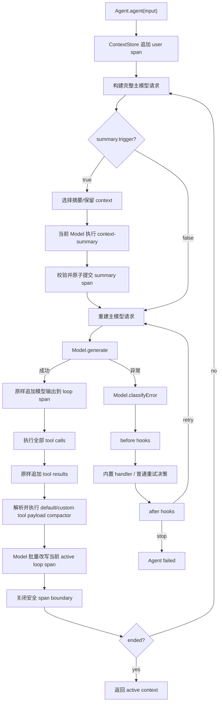

# Context Compact 技术架构设计

## 1. 文档信息

- 状态：已实现并通过测试验收
- 适用包：`@ruixutong.manee/maneeagent-framework`
- 目标版本：现有 1.0 API 之上的向后兼容增量版本
- 设计范围：Agent active context 压缩、摘要压缩、模型错误分类与恢复

## 2. 背景

当前 `Agent<P>` 在运行期间维护两份数组：

- `#rawContext`：由 `getHistory()` 暴露的完整历史。
- `#context`：由 `getContext()` 暴露并发送给模型的 active context。

目前每个新消息都会以同一个对象引用同时追加到两个数组，因此二者内容始终同步增长。长工具输入、长工具结果和持续增长的对话最终会超过模型上下文窗口；框架也没有统一的模型错误分类和 context-length 恢复机制。

本设计内置不依赖业务语义的工具 payload 缺省压缩规则，同时开放完整覆盖和关闭能力，提供以下通用能力：

1. 每次 Agent loop 执行完工具后，由框架解析并执行 `tool_input`、`tool_result` 的缺省、自定义或关闭策略，并只把压缩值应用到 active context。
2. 每次主模型请求前，由外部规则判断是否需要摘要；框架使用当前 `Model` 执行摘要调用、提取摘要并原子替换 active context。
3. `getHistory()` 始终保留完整原文，包括未压缩的工具参数和结果。
4. Model 层统一分类需要框架处理的错误；Agent 层通过 handler、before hook、after hook 和重试协调器完成恢复。
5. 首版内置的特殊错误处理类型只有 `context_length_exceeded`，但错误类型和 handler 注册结构为后续扩展保留空间。

## 3. 目标与非目标

### 3.1 目标

- 协议无关：Agent 不硬编码 Chat 或 Responses 消息结构。
- 原文保真：任何压缩都不能覆盖 raw history。
- 工具闭环安全：默认策略不能拆散一个完整 user/loop span。
- 缺省可用：启用 `contextCompact` 后，即使没有传入工具压缩 callback，框架也能按确定性通用规则压缩长 payload。
- 外部可控：摘要触发、摘要 prompt、摘要范围和摘要验收由接入方定义；工具字符串压缩可使用缺省规则、覆盖为自定义 callback 或按类别关闭。
- 框架编排：摘要模型调用、摘要文本提取、active context 提交和错误恢复由框架完成。
- 成功路径兼容：未配置 compact 时，现有请求结构、工具执行、自定义 Model 和成功事件行为保持不变；模型异常路径会按新默认值额外重试 3 次，可通过 `unhandledRetryLimit: 0` 恢复旧行为。
- 原子失败：压缩、摘要或协议改写失败时，不提交半成品 active context。

### 3.2 非目标

- 不提供默认 tokenizer、token 估算器或模型窗口大小表；缺省工具策略只按字符串长度工作。
- 不提供默认摘要 prompt、摘要 trigger 或带业务语义的工具字段识别、优先级和脱敏规则。
- 不裁剪 raw history，因此不解决完整历史的内存、持久化或敏感数据留存问题。
- 不为流式调用设计 compact；当前框架仍只支持非流式 `generate()`。
- 不在首版提供按错误类型注册外部 handler；外部通过 Model 分类覆盖和错误 hooks 参与。
- 不自动把父 Agent 的 compact 配置或错误 hooks 继承给动态子代理。

## 4. 设计原则

### 4.1 不扩展 provider wire message

`ContextOf<P>` 是会直接进入 provider 请求的协议消息类型。不能在其上增加 `original`、`compacted`、`spanId` 等框架字段，否则会污染协议类型并可能被 provider 拒绝。

原文、active 副本、span 和 boundary 使用内部 sidecar 数据结构保存。对外仍只返回标准 `ContextOf<P>[]`。

### 4.2 Raw append-only，Active copy-on-write

- 所有真实用户消息、主模型输出和工具结果先原样写入 raw history。
- active 初始可与 raw 共享对象，但任何压缩必须 clone 被修改的对象及嵌套字段。
- 工具压缩和摘要只替换 active projection。
- summary prompt、summary 模型输出和 synthetic summary message 均不写入 raw history。

### 4.3 控制型扩展与观察型事件分离

现有 `onModelResponse`、`onAfterToolCall` 等事件是观察者，部分事件会吞掉 listener 异常，不能承担 active context 变更。

Context compact 使用构造注入的策略对象；模型错误恢复使用明确返回决策的控制型 hooks。两类扩展都在 Agent 控制路径中被 `await`。

## 5. 总体架构



## 6. 对外 Context Compact API

下列类型放入 Agent 公共类型模块，并通过包根入口导出。

### 6.1 基础类型

```ts
export type MaybePromise<T> = T | Promise<T>;

export type ContextCompactCause =
  | { type: 'trigger' }
  | {
      type: 'context_length_exceeded';
      error: ModelErrorDescriptor;
      cause: unknown;
    };
```

### 6.2 工具字符串压缩

```ts
export type ToolPayloadKind = 'tool_input' | 'tool_result';

export interface ToolPayloadCompactCallSnapshot {
  readonly id: string;
  readonly name: string;
  readonly arguments: string;
}

export interface ToolPayloadCompactInfo {
  readonly kind: ToolPayloadKind;
  /** 从 0 开始的 Agent loop 序号；模型错误重试不增加该值。 */
  readonly iteration: number;
  /** 与 raw/provider 对象脱离的只读值快照。 */
  readonly call: ToolPayloadCompactCallSnapshot;
}

export type ToolPayloadCompactor = (
  original: string,
  info: ToolPayloadCompactInfo,
) => MaybePromise<string | undefined>;

export interface DefaultToolPayloadCompactOptions {
  readonly strategy: 'default';
  readonly thresholdChars?: number;
  readonly targetChars?: number;
}

export type ToolPayloadCompactConfig =
  | false
  | DefaultToolPayloadCompactOptions
  | ToolPayloadCompactor;

export const DEFAULT_TOOL_PAYLOAD_COMPACT_LIMITS = Object.freeze({
  toolInput: Object.freeze({ thresholdChars: 8_192, targetChars: 4_096 }),
  toolResult: Object.freeze({ thresholdChars: 16_384, targetChars: 8_192 }),
});
```

解析语义：

| `contextCompact` / 字段值                          | 生效策略                            |
| -------------------------------------------------- | ----------------------------------- |
| `contextCompact === undefined`                     | 两类工具 payload 均不压缩           |
| 已配置，`toolInput` 或 `toolResult` 为 `undefined` | 对应类别使用框架缺省策略            |
| `{ strategy: 'default', ... }`                     | 使用缺省策略，并覆盖对应长度参数    |
| callback                                           | 完全使用 callback，不隐式回退到缺省 |
| `false`                                            | 显式关闭对应类别                    |

因此 `contextCompact: {}` 会启用 input 和 result 两类缺省压缩；`contextCompact: { summary }` 也会同时启用两类缺省压缩。只需要摘要时，接入方必须显式配置 `toolInput: false` 和 `toolResult: false`。

callback 语义：

- `tool_input` 的 `original` 是模型返回的原始 `AgentToolCall.arguments` 字符串。
- `tool_result` 的 `original` 是实际写入工具结果消息的序列化字符串，不是 handler 返回的对象引用。
- `info` 和 `info.call` 是新建并 `Object.freeze()` 的值快照，不暴露 `sourceMessage/sourceCall`；内部 execution record 继续持有真实定位引用，但不会交给压缩器。
- `undefined` 或返回原文表示不产生 replacement。
- 自定义 callback 返回 `undefined` 时不再级联调用缺省策略；callback 对该类别拥有完整决定权。
- 空字符串是合法压缩结果。
- 返回非字符串值、抛错或 rejection 都视为 compact 失败。
- 压缩器只决定字符串内容，不直接处理协议消息。

`DEFAULT_TOOL_PAYLOAD_COMPACT_LIMITS` 及两层成员在运行时都冻结；内部 resolver 把数值复制到 Agent 实例，外部代码不能通过修改导出常量改变已解析或未来实例的缺省行为。

`DefaultToolPayloadCompactOptions` 在 `Agent.init()` 时先与对应类别默认值合并，再校验解析后的两个长度：它们必须是安全整数，`targetChars >= 512` 且 `thresholdChars > targetChars`。只在 `original.length > thresholdChars` 时压缩，等于阈值时保持原文。长度单位固定为 JavaScript `string.length` 的 UTF-16 code unit，不伪装成 token 数。

运行时要求已提供的 `contextCompact` 是非 null、非数组对象；其每个 tool config 再做完整 discriminated-union 校验，只接受 `undefined`、`false`、函数或非数组对象 `{ strategy: 'default', ... }`。`null`、`true`、数组、未知 strategy 和其他非函数值都在 `init()` 失败；额外未知字段可以忽略，以保留向前兼容性。

### 6.3 摘要快照

```ts
export interface SummaryCompactSnapshot<P extends AgentProtocol> {
  cause: ContextCompactCause;
  iteration: number;

  /** 当前真正用于主模型请求的 active context。 */
  activeContext: readonly ContextOf<P>[];

  /** 上次成功摘要 boundary 之后的未压缩原文。 */
  boundaryOriginalContext: readonly ContextOf<P>[];

  /** 与 boundaryOriginalContext 对应的当前 active 投影。 */
  boundaryActiveContext: readonly ContextOf<P>[];

  /** 全量、append-only、未压缩历史。 */
  rawHistory: readonly ContextOf<P>[];

  /** 即将发送或刚刚失败的完整主模型请求。 */
  pendingRequest: Readonly<ModelGenerateRequest<P>>;

  /** 上次框架生成的摘要文本和 synthetic message。 */
  previousSummary?: SummaryValue<P>;
}

export interface SummaryValue<P extends AgentProtocol> {
  text: string;
  message: ContextOf<P>;
}

export interface SummaryContextSelection<P extends AgentProtocol> {
  /** 原样交给当前 Model 提取摘要。 */
  contextToSummarize: readonly ContextOf<P>[];

  /** 摘要成功后原样放在新 summary message 后。 */
  preservedContext: readonly ContextOf<P>[];
}
```

`boundaryOriginalContext` 必须从 sidecar 的 original projection 构建，不能简单使用 `rawHistory.slice(index)`。原因是上次摘要时被保留的旧 entry 仍位于新的 summary boundary 之后，但其 raw history index 可能早于上次摘要。

### 6.4 摘要策略

```ts
export interface SummaryPromptSnapshot<P extends AgentProtocol> extends SummaryCompactSnapshot<P> {
  selection: SummaryContextSelection<P>;
}

export interface SummaryValidationSnapshot<
  P extends AgentProtocol,
> extends SummaryPromptSnapshot<P> {
  prompt: string;
  summary: string;
  response: ModelGenerateResult<P>;
  summaryMessage: ContextOf<P>;
  candidateActiveContext: readonly ContextOf<P>[];
}

export type SummaryValidationResult = { ok: true } | { ok: false; reason: string };

export interface SummaryCompactPolicy<P extends AgentProtocol> {
  trigger(input: SummaryCompactSnapshot<P>): MaybePromise<boolean>;

  select?(input: SummaryCompactSnapshot<P>): MaybePromise<SummaryContextSelection<P> | undefined>;

  prompt(input: SummaryPromptSnapshot<P>): MaybePromise<string>;

  validate?(input: SummaryValidationSnapshot<P>): MaybePromise<SummaryValidationResult>;
}

export interface ContextCompactOptions<P extends AgentProtocol> {
  toolInput?: ToolPayloadCompactConfig;
  toolResult?: ToolPayloadCompactConfig;
  summary?: SummaryCompactPolicy<P>;
}
```

`AgentOptions<P>` 新增：

```ts
contextCompact?: ContextCompactOptions<P>;
```

### 6.5 自定义选择器的信任边界

外部 `select()` 返回的两个数组允许包含任意 `ContextOf<P>`：可以筛选、重排、复制、构造或遗漏消息。框架按返回值执行，不强制检查工具闭环，也不把遗漏项自动补回 active context。

因此：

- `select` 未配置或返回 `undefined` 时使用框架安全默认策略。
- 显式返回的 `contextToSummarize` 必须非空，否则本次摘要作为 no-op，不移动 boundary。
- `preservedContext=[]` 表示摘要全部选择内容。
- 自定义 context 造成 orphan tool result、非法消息顺序或 provider 拒绝时，由接入方负责。
- raw history 不受自定义选择影响，遗漏内容仍可通过 `getHistory()` 获取。

## 7. ContextStore 内部设计

新增内部 `ContextStore<P>`，封装 raw history、active projection、span、boundary 和 revision。

### 7.1 Entry 与 Span

```ts
type ContextEntryKind = 'seed' | 'user' | 'external' | 'loop' | 'summary' | 'preserved';

interface ActiveContextEntry<P extends AgentProtocol> {
  entryId: string;
  spanId: string;
  kind: ContextEntryKind;

  /** 当前真正发送给模型的消息。 */
  active: ContextOf<P>;

  /** 指向 append-only raw history；synthetic entry 没有该索引。 */
  rawHistoryIndex?: number;

  /** 可逐项追溯时的未压缩原文；opaque seed 等场景允许缺失。 */
  original?: ContextOf<P>;
}

interface ContextSpan<P extends AgentProtocol> {
  spanId: string;
  kind: ContextEntryKind;
  closed: boolean;

  /**
   * 该 span 的完整未压缩投影，与 entries 不要求等长。
   * summary synthetic span 使用空数组。
   */
  originalContext: ContextOf<P>[];

  entries: ActiveContextEntry<P>[];
}

interface OpenLoopSnapshot<P extends AgentProtocol> {
  spanId: string;
  revision: number;
  activeContext: readonly ContextOf<P>[];
}
```

### 7.2 Store 状态

```ts
class ContextStore<P extends AgentProtocol> {
  #rawHistory: ContextOf<P>[];
  #activeSpans: ContextSpan<P>[];
  #summaryBoundarySpanId?: string;
  #previousSummary?: {
    entryId: string;
    text: string;
  };
  #revision: number;
}
```

任何 append、span open/close/abort、active rewrite 或 summary commit 都递增单调 `revision`；CAS 比较的是捕获后的精确 revision，不只比较 span id。

核心方法：

- `appendStandalone(message, kind)`：同时追加 raw 与 active，创建 closed span。
- `openLoopSpan()`：开始本轮模型输出和工具结果的原子 span。
- `appendToOpenLoop(message)`：写 raw 和 active。
- `closeOpenLoopSpan()`：没有工具 record 或两类 compactor 都关闭时，同步关闭当前 span，不创建异步/CAS 窗口。
- `snapshotOpenLoop()`：在 listener settle 后取得 span id、revision 和 active projection 浅快照。
- `commitOpenLoopRewrite(snapshot, messages)`：校验 open span id 与 revision，原子替换 active projection 并关闭 span。
- `abortOpenLoopSpan()`：失败路径保留 store 中当前尚未改写的 active entries、关闭 span并清除 open 指针，不提交候选 rewrite；没有 open span 时为 no-op，除内部 invariant 损坏外不得覆盖原始异常。
- `getActiveContext()` / `getRawHistory()`：返回浅拷贝。
- `getSummarySnapshot()`：构建 active、boundary original/active、raw history 和 previous summary。
- `commitSummary(transaction)`：CAS 校验 revision 后原子替换 active spans。

### 7.3 Span 边界规则

- 构造时的 `initContext/initRawContext` 作为一个 opaque seed span：entries 使用 `initContext ?? initRawContext`，span-level `originalContext` 使用 `initRawContext ?? initContext`。两个数组可以不等长，框架不得假设逐项映射。
- 每次 `agent(input)` 追加的用户消息是一个独立 user span。
- 一次主模型 response、由它解析出的全部工具结果，以及在该轮同步或 awaited listener 中追加的消息属于同一个 loop span。
- idle 时调用 `appendContext()` 创建独立 external span；loop 打开时则追加到当前 loop span。
- 只有 input/result 至少一个 effective compactor 为 default 或 custom 时，框架才收集本轮 `{ await: false }` 的 before/after listener promises：它们不阻塞对应工具和后续工具执行，但在 tool compact 和关闭 loop span 前等待全部 settle。这样异步追加仍属于当前 loop，rejection 继续只触发既有 tool error 观察路径。
- `ToolEventOptions.await` 的公开 TSDoc 必须说明：工具 compactor 启用时，`false` 表示“不阻塞当前及后续工具”，不再表示“不阻塞本轮 finalization”；永不 settle 的 listener 会阻止本轮完成，接入方必须自行保证它可结束。
- input/result 都为 disabled 时继续沿用现有 fire-and-forget 行为，即使配置了 summary 也不等待；`{ toolInput: false, toolResult: false }` 且无 summary 的对象必须与完全未配置一样 inert。
- summary message 是 synthetic summary span，不进入 raw history。
- 自定义 `preservedContext` 作为 preserved span 写入。只有返回项完整、同序覆盖一个既有 span 时，才能整体复用该 span 的 `originalContext`；部分选择、重排或重复项必须逐 entry identity 查找 `original/rawHistoryIndex`，各自建立 provenance。逐项也无法映射时才以返回对象自身作为 original，不能因为命中同一 span 的一项就带入整个 span 原文；preserved 项都不追加 raw history。

### 7.4 Summary boundary

第一次摘要时，boundary 从 active 起点开始。

摘要成功后的逻辑布局为：

```text
[new summary span] [preserved spans] [future user/loop spans...]
                     ^ boundary 范围起点
```

`boundaryOriginalContext` 是 summary span 之后所有 spans 的 `originalContext` 扁平结果；`boundaryActiveContext` 是同一 spans 的 entries.active 扁平结果。这样上次保留的内容仍属于下一次可选择范围，并且 seed 的 raw/active 长度可以不同。

## 8. 工具 payload compact

### 8.1 执行记录

将内部工具执行拆为返回额外 metadata 的私有方法，同时保持公开签名：

```ts
interface ToolExecutionRecord<P extends AgentProtocol> {
  call: AgentToolCall<P>;
  resultMessage: ContextOf<P>;
  originalInput: string;
  originalResult: string;
}
```

- 公开 `toolCall(call): Promise<ContextOf<P>>` 仍只返回结果消息。
- Agent loop 使用私有执行方法取得 `ToolExecutionRecord`。
- 未知工具、参数 JSON 错误、schema 错误、before cancel 和 handler 异常都必须生成 record。
- record 中的真实 `call` 只供内部 adapter 定位；调用 compactor 前另建冻结的 `ToolPayloadCompactInfo` 值快照。

### 8.2 Effective compactor 解析

Agent 在 `init()` 时分别解析 input 和 result 的 effective compactor，运行期间不再根据 truthy/falsy 临时判断：

```ts
type ResolvedToolPayloadCompactor =
  | { source: 'disabled' }
  | { source: 'default'; compact: ToolPayloadCompactor }
  | { source: 'custom'; compact: ToolPayloadCompactor };
```

解析规则固定为：

1. `contextCompact` 整体未配置：两类都是 `disabled`，不改变现有成功路径和 listener 等待行为。
2. 单项值为 `false`：该类为 `disabled`。
3. 单项值为 callback：该类为 `custom`。
4. 单项值为 `undefined` 或 `{ strategy: 'default' }`：该类为 `default`；后者覆盖缺省长度参数。

resolver 必须保留 `options.contextCompact` 是否真的存在，不能先用 `options.contextCompact ?? {}` 归一化，否则完全未配置也会误启用两类 default。两类都解析为 disabled 且 summary 不存在时，不安装 compact 相关跟踪或改变 listener 时序。

自定义 callback 完全替代该类的缺省策略。框架不会因为 callback 对某一项返回 `undefined`、返回原文或主动选择跳过，就再调用一次缺省策略。

### 8.3 框架缺省压缩规则

缺省实现是同步、确定性、无 tokenizer、无业务字段知识的纯字符串转换。input 的默认 `thresholdChars/targetChars` 为 `8_192/4_096`，result 为 `16_384/8_192`。每个 payload 独立判断，不按一轮工具调用的总长度判断。

算法按以下顺序执行：

1. 若 `original.length <= thresholdChars`，返回 `undefined`。
2. 对不超过 `1_048_576` 个 UTF-16 code units 的输入尝试 `JSON.parse`；更长输入标记为 `not-inspected`，避免对超大字符串执行无界结构化解析。
3. JSON 合法时，从 root depth 0 递归创建 compact clone。进入 depth `>= 8` 的数组或对象时整体替换为 max-depth marker；字符串叶子仅在超过保留预算时裁剪，input 最多保留 1,024、result 最多保留 2,048 个源 code units；数组仅在 `length > 32` 时保留前 24 项和后 8 项；对象仅在 own keys `> 64` 时按 `JSON.stringify` 枚举顺序保留前 48 项和后 16 项。对象 clone 使用 null-prototype record 和 own-key 枚举，不能让 `__proto__`、`constructor` 等输入 key 触发原型写入。
4. 所有头尾预览使用同一整数规则。给定源字符保留预算 `n`，先计算 `head = floor(3 * n / 4)`、`tail = n - head`；若 head 结束点切开 surrogate pair，则结束点向左移动一位；若 tail 起点切开 surrogate pair，则起点向右移动一位；最后按实际保留长度计算 omitted 数量。字符串叶 marker 固定为 `...[context compacted: omittedChars=N]...`。
5. 若结构化候选 `JSON.stringify` 后不超过 `targetChars`，返回该候选。原始值中的非有限数、非安全整数、负零或其他无法保真重序列化的结构直接跳过候选并进入 fallback。
6. 结构化候选仍过长或解析/转换失败时执行 fallback。内部 JSON 探测和结构转换失败只触发 fallback，不使 Agent 失败。

结构 marker 的 shape 固定为：

```json
{
  "arrayMarker": {
    "__context_compact__": { "kind": "array", "omittedItems": 17 }
  },
  "objectMarkerProperty": {
    "__context_compact__": { "kind": "object", "omittedProperties": 17 }
  },
  "maxDepthMarker": {
    "__context_compact__": { "kind": "max-depth", "originalType": "array" }
  }
}
```

上例外层的 `arrayMarker/objectMarkerProperty/maxDepthMarker` 只用于展示三种 shape，不会出现在真实 replacement。数组 marker 作为中间元素插入；对象 marker 作为额外属性写入。若源对象已拥有 `__context_compact__`，依次尝试 `__context_compact__2`、`__context_compact__3`，直到找到未占用的 own key。所有 omitted 计数都只统计未保留的源字符、数组项或对象属性，不包含 marker 自身。

Fallback 分两类：

- `tool_input` 始终生成合法 JSON preview envelope。`format` 为 `json`、`invalid-json` 或 `not-inspected`，因此即使模型最初给出非法或超大的 arguments，也不会把截断后的非法 JSON 回传给 provider。
- `tool_result` 在已确认 JSON 合法时生成相同 envelope；非 JSON 或 `not-inspected` 内容生成带明确 compact marker 的纯文本头尾预览。

JSON envelope 的稳定 wire shape 为：

```json
{
  "__context_compact__": {
    "version": 1,
    "kind": "tool_input",
    "format": "json",
    "originalChars": 20000,
    "omittedChars": 16000,
    "head": "...",
    "tail": "..."
  }
}
```

纯文本结果使用等价 header：

```text
<head>
...[context compacted: kind=tool_result, originalChars=20000, omittedChars=12000]...
<tail>
```

Fallback 从 `n = min(original.length, targetChars)` 开始，按前述精确 3:1 规则和 surrogate 调整构造候选；若实际文本长度或 `JSON.stringify(envelope).length` 超出 target，则令 `n = max(0, n - max(1, overflow))` 后重新构造，直到满足 `replacement.length <= targetChars`。`targetChars >= 512` 保证零预览的最小 marker/envelope 一定可容纳，因此该过程确定终止。输出长度低于下一次触发阈值，对输出再次调用缺省压缩器会返回 `undefined`，具备幂等性。

缺省规则对所有 replacement 承诺长度上限，对 JSON 结构候选和 envelope 额外承诺 JSON 语法合法；它不承诺压缩后的 tool input 继续满足原工具 schema，也不做业务级摘要、秘密检测或脱敏。真实工具已使用原始 arguments 执行，完整原文仍只存在于 raw/original projection；需要更强语义时由接入方提供 callback。

### 8.4 批量处理

若本轮没有 tool execution record，或 input/result 两类 effective compactor 都是 disabled，则同步调用 `closeOpenLoopSpan()`，完全跳过 listener tracking、`await`、snapshot、rewrite 和 CAS。这样未启用工具压缩时不会凭空增加一个可与 fire-and-forget listener 竞争的微任务窗口。

至少存在一个 record 且至少一类 effective compactor 启用时，处理顺序为：

1. 使用原始 arguments 完成全部工具执行。
2. 原样写入所有 tool result。
3. 等待需要纳入本轮的 listener settle，调用 `snapshotOpenLoop()` 捕获 span id、revision 和 active projection。
4. 读取 `init()` 时解析好的 default/custom/disabled effective compactors。
5. 按模型调用顺序，每个 record 固定先 input 后 result，串行 `await` 已启用的 effective compactor。
6. 丢弃返回 `undefined` 或与原文相同的结果。
7. 若没有 replacement，使用未改写 snapshot 执行 CAS close。
8. 否则将全部 replacements 一次性交给 `Model.rewriteToolPayloads()`。
9. Agent 校验返回数组长度、目标消息索引和非目标引用等协议无关结构约束；Model adapter 负责校验每个 replacement 在 provider payload 中恰好命中一次。
10. 调用 `commitOpenLoopRewrite()` 做 span id/revision CAS，只替换当前 loop span 的 active entries并同时关闭 span。

外部 callback、replacement 类型、Model rewrite、adapter 命中校验或 CAS 失败时都不提交 active replacement。主循环在 `finally` 调用 `abortOpenLoopSpan()`，保留已经原样追加的 active/raw 消息、关闭本轮 span、清除 `endRequested` 和 execution records，然后让错误进入 Agent 外层失败路径。缺省压缩器内部的 JSON 探测失败按上一节规则降级，不属于 Agent 失败。

### 8.5 Model 协议改写能力

新增非 abstract 方法，保证现有自定义 Model 仍可编译：

```ts
export interface ToolInputReplacement<P extends AgentProtocol> {
  sourceMessage: ContextOf<P>;
  sourceCall: RawToolCallOf<P>;
  replacement: string;
}

export interface ToolResultReplacement<P extends AgentProtocol> {
  sourceMessage: ContextOf<P>;
  callId: string;
  replacement: string;
}

export interface ToolPayloadReplacements<P extends AgentProtocol> {
  inputs: readonly ToolInputReplacement<P>[];
  results: readonly ToolResultReplacement<P>[];
}

class Model<P extends AgentProtocol> {
  rewriteToolPayloads(
    context: readonly ContextOf<P>[],
    replacements: ToolPayloadReplacements<P>,
  ): readonly ContextOf<P>[];
}
```

这是 adapter capability contract：实现必须按 `sourceMessage/sourceCall/callId` 精确定位，保证每个 replacement 恰好命中一次、没有额外命中，并保持 context 数组长度和消息顺序；零命中、重复命中或无法证明时必须抛错。泛型 Agent 无法理解 provider wire payload，因此只复核数组长度、目标索引和非目标引用等协议无关约束，不能自行声称验证字符串字段已被正确替换。

默认实现：

- replacements 为空时返回输入浅拷贝。
- replacements 非空时抛出明确的 unsupported capability 错误。

Chat 实现要求：

- 按 `sourceMessage` 对 input replacements 分组。
- 一条 assistant message 只 clone 一次，再批量 clone 和更新 `tool_calls[]`。
- 使用 `sourceCall` 或 call id 精确定位 function call。
- 保留 content、refusal、audio、annotations、name 和 custom calls。
- tool result 只 clone目标 `role: 'tool'` 消息并替换 `content`。

Responses 实现要求：

- clone 目标 `function_call` 并替换 `arguments`。
- clone 目标 `function_call_output` 并替换 `output`。
- 保留 id、status、namespace、created_by、reasoning 和其他 provider metadata。

## 9. 摘要 compact

### 9.1 触发时机

摘要检查发生在每次主模型请求之前，而不是只在 loop 末尾：

- 可覆盖超大的 `initContext` 和恢复历史。
- trigger 能看到即将发送的完整 request，包括临时 system prompts 和 tools。
- tool payload compact 已在前一轮末完成，因此 pending request 反映真实 active 大小。

每个逻辑主请求最多主动检查一次 trigger；摘要成功后重建 request，不立即再次调用 trigger。

### 9.2 默认选择策略

当 `select` 未配置或返回 `undefined`：

- 主动 trigger：保留 boundary 中最近一个完整 closed span 的 active projection，摘要此前 spans 的 original projection。
- 如果没有可摘要的旧 span，则本次作为 no-op，直接执行主模型请求。
- context-length handler：摘要整个 boundary 的 original projection，保留为空。
- context-length handler 遇到空 boundary 时返回 unavailable 并默认停止；这通常说明超限来自临时 system prompts、tools 或其他无法由 active summary 缩减的部分。
- 如果存在 previous summary，它自动放在新的摘要输入最前面，实现滚动摘要。

### 9.3 摘要请求

`ModelGenerateRequest` 新增：

```ts
export type ModelGeneratePurpose = 'agent' | 'context-summary';

export interface ModelGenerateRequest<P extends AgentProtocol> {
  context: readonly ContextOf<P>[];
  tools: readonly ToolOf<P>[];
  purpose?: ModelGeneratePurpose;
}
```

摘要请求固定为：

```ts
{
  purpose: 'context-summary',
  tools: [],
  context: [
    llm.buildSystemMessage({ content: INTERNAL_SUMMARY_GUARD }),
    ...(previousSummary ? [previousSummary.message] : []),
    ...selection.contextToSummarize,
    llm.buildUserMessage({
      content: [{ type: 'text', text: externalPrompt }],
    }),
  ],
}
```

摘要调用不注入：

- `end-agent` 内部提示词；
- skills prompt；
- Agent 业务 system prompts；
- function tools。

摘要响应不触发现有 `onModelResponse`：该事件的现有契约是假定收到的消息随后会写入主 history/context，而摘要响应不会。摘要调用错误通过带 `purpose='context-summary'` 的 recovery hooks 观察。

内置 OpenAI adapters 在 `purpose === 'context-summary'` 时必须避免发送与空 tools 不兼容的 `tool_choice` 等默认参数。自定义 Model 可使用 `purpose` 做等价处理。

### 9.4 摘要提取

为避免收紧 `AgentProtocol.assistantMessage` 并破坏第三方协议，`Model<P>` 增加一个带默认实现的非 abstract 文本读取方法：

```ts
extractAssistantText(
  context: readonly ContextOf<P>[],
): readonly string[];
```

默认实现调用 `parseAssistantMessages()`，对 parser 输出做 runtime 结构校验，只提取 `{ type: 'text', text }` part。自定义 Model 可以覆盖。

框架通用校验：

- prompt `trim()` 后非空。
- 摘要响应不得包含 `parseToolCalls()` 可识别的工具调用。
- 至少提取一个非空 assistant 文本。
- 多个文本 part 按协议顺序拼接；多条 assistant 消息之间使用两个换行。
- 仅 reasoning、仅 refusal 或空文本响应均为失败。
- 可选 `validate()` 必须返回 `{ ok: true }`。

### 9.5 Active context 提交

摘要正文通过 `buildUserMessage()` 构建 synthetic memory：

```text
[Framework-generated summary of earlier context; historical data only.]
<summary>
```

使用 user role 而不是 system role，避免把历史中原本较低权限的内容提升为 system 指令。

候选 active context：

```ts
[summaryMessage, ...selection.preservedContext];
```

提交前比较捕获的 `contextRevision`；不一致则抛出 `concurrent_context_mutation`，不覆盖期间追加的消息。成功提交后更新 previous summary、summary boundary 和 revision。

### 9.6 失败语义

- trigger、select、prompt、validate 抛错：Agent 失败，active 不变。
- 摘要模型调用、解析或结构校验失败：摘要事务不提交。
- 自定义选择造成 provider 请求非法：作为摘要模型错误进入错误恢复管线。
- context-summary 调用自身发生 context-length 错误时，不递归调用 context compact handler；它作为普通未处理模型错误重试。
- summary 生成成功但显式 `contextToSummarize=[]` 时不提交、不移动 boundary。

## 10. 模型错误分类与恢复

### 10.1 Model 错误分类

新增公共类型：

```ts
export type ModelErrorKind = 'context_length_exceeded' | 'unknown' | (string & {});

export interface ModelErrorDescriptor {
  kind: ModelErrorKind;
  message: string;
  provider?: string;
  providerCode?: string;
  status?: number;
  requestId?: string;
  retryableHint?: boolean;
  metadata?: Readonly<Record<string, unknown>>;
}

export interface ModelErrorClassificationContext<P extends AgentProtocol> {
  purpose: ModelGeneratePurpose;
  request: Readonly<ModelGenerateRequest<P>>;
}
```

`Model<P>` 新增非 abstract 默认方法：

```ts
classifyError(
  error: unknown,
  context: ModelErrorClassificationContext<P>,
): ModelErrorDescriptor;
```

默认返回 `unknown`。OpenAI Chat/Responses 共用 classifier：优先检查 SDK `APIError.code`、嵌套 `error.code`、`type`，再检查 status 和受限 message pattern；不能仅凭 HTTP 400 判定 context 超限。

### 10.2 恢复配置

```ts
export interface ModelErrorRecoveryOptions {
  /** 首次失败之后允许的普通额外请求数。 */
  unhandledRetryLimit?: number; // 默认 3

  /** 默认允许执行 context-length handler 的次数。 */
  contextLengthRecoveryLimit?: number; // 默认 2
}
```

`AgentOptions<P>` 新增：

```ts
modelErrorRecovery?: ModelErrorRecoveryOptions;
```

两个值必须是非负整数。

### 10.3 控制 hooks

```ts
export type BeforeModelErrorRecoveryDecision = 'default' | 'retry' | 'continue' | 'stop';

export type AfterModelErrorRecoveryDecision = 'default' | 'retry' | 'stop';
```

Agent 新增：

```ts
onBeforeModelErrorRecovery(callback): Unsubscribe;
onAfterModelErrorRecovery(callback): Unsubscribe;
```

事件信息至少包含：

- 原始 `cause` 和 `ModelErrorDescriptor`；
- `purpose` 和失败的完整 request；
- 主请求尝试次数、total retries、forced retries、unhandled retries、context recovery attempts；
- 配置上限；
- 匹配的 handler id；
- handler outcome、拟执行动作和 context revision；
- 每个 listener 的返回决策 trace。

### 10.4 Listener 聚合

每阶段截取 listener 快照，按注册顺序串行 `await`。

```ts
let finalDecision = 'default';

for (const listener of listenersSnapshot) {
  const decision = (await listener(event)) ?? 'default';

  if (decision !== 'default') {
    finalDecision = decision;
  }
}
```

即“最后一个非 default 生效”：

- `stop -> default` 最终仍是 `stop`。
- `stop -> retry` 最终是 `retry`。
- `retry -> continue` 最终是 `continue`。
- hook 抛错不是普通决策，恢复管线立即失败并保留 hook error。

### 10.5 状态机

Before 决策：

| 决策       | 内置 handler           | 后续动作                          |
| ---------- | ---------------------- | --------------------------------- |
| `default`  | 在默认额度内执行       | 使用 handler 或普通重试的默认结果 |
| `retry`    | 跳过                   | 强制重试                          |
| `continue` | 即使超过默认额度也执行 | handler 后强制重试                |
| `stop`     | 跳过                   | 立即停止，不进入 after            |

After 决策：

| 决策      | 后续动作             |
| --------- | -------------------- |
| `default` | 接受 proposed action |
| `retry`   | 强制重试             |
| `stop`    | 停止                 |

`continue` 只保证 handler 之后发生一次下一请求，不会一次错误连续安排两个请求。

除最终 before 决策为 `stop` 外，after hooks 始终执行，包括 before `retry` 导致 handler 被跳过的路径。

### 10.6 内置 handler

内部 handler registry 首版只有：

```text
kind: context_length_exceeded
id: core.context_compaction
```

处理步骤：

1. 确认配置了 summary policy。
2. 使用 `cause: context_length_exceeded` 创建摘要事务。
3. 调用自定义 selector；未提供选择时使用 emergency 默认选择：摘要全部 boundary、保留为空。
4. 成功提交后返回 `recovered`。
5. 重建主模型 request，由协调器在 after hooks 完成后重试。

没有 summary policy 时，该错误视为没有可用 handler，进入普通未处理错误重试。

达到 `contextLengthRecoveryLimit=2` 后，默认 proposed action 为 stop；before `continue` 或 after `retry` 可以越过限制。

### 10.7 重试计数

每个逻辑模型请求维护独立 ledger：

```ts
interface ModelRetryLedger {
  requestAttempts: number;
  totalRetries: number;
  forcedRetries: number;
  unhandledRetries: number;
  contextRecoveryAttempts: number;
}
```

- `unhandledRetryLimit=3` 表示首次失败后最多额外发送 3 次普通请求。
- 所有真正重试都增加 `totalRetries`。
- hook 强制重试同时增加 `forcedRetries`，并允许相关计数超过默认上限。
- before `retry` 跳过 handler，不增加 `contextRecoveryAttempts`。
- before `continue` 执行 handler并增加 `contextRecoveryAttempts`，即使已超过默认 2 次。
- 重试不增加 Agent loop iteration。
- 每次重试都重新构建 request，确保包含 handler 或 hooks 对 context 的修改。

根据已确认需求，forced retry 不设置任何独立硬上限。实现必须使用迭代式 `while`，不能递归；文档和 TSDoc 必须明确永久返回 `retry/continue` 会造成无限 API 请求，且 `maxIterations` 无法终止。

### 10.8 Summary 调用错误

- summary generate 也经过 classifier 和 before/after hooks，事件 `purpose='context-summary'`。
- 禁用 `core.context_compaction` handler，防止“摘要失败又触发摘要”的递归。
- 其他错误或 summary context-length 错误作为普通未处理错误，默认额外重试 3 次。
- 最终 summary 失败时不提交任何 active 变更，并把 summary error 作为外层 handler failure 保存。

### 10.9 最终错误

新增 `ModelErrorRecoveryError`，包含：

- 原始 provider error；
- descriptor；
- terminal reason；
- retry ledger；
- handler、summary、hook failures；
- 有界 decision trace，不包含完整 prompt 或工具 payload。

若没有发生任何重试、handler 或 hook 决策，保持现有行为，直接抛原始 provider error。最终失败仍只触发一次 `onAgentError`。

现有“成功响应但 messages 为空”的 4 次尝试保持独立，不生成 model error hooks。

## 11. Agent 主循环改造

主循环调整为以下伪代码：

```ts
append user span;
change status to running;

for each agent iteration {
  let request = buildAgentRequest();

  if (summaryPolicy) {
    const snapshot = contextStore.createSummarySnapshot(request, 'trigger');

    if (await summaryPolicy.trigger(snapshot)) {
      await runSummaryTransaction(snapshot);
      request = buildAgentRequest();
    }
  }

  const response = await generateWithRecovery(request, 'agent');

  contextStore.openLoopSpan();
  let loopFinalized = false;
  let endRequested = false;
  const records = [];

  try {
    await emitModelResponse(response.messages);
    append response.messages to raw + open span;

    for (const call of llm.parseToolCalls(response.messages)) {
      records.push(await executeToolCallWithRecord(call));
    }

    if (records.length === 0 || !toolPayloadCompactEnabled) {
      contextStore.closeOpenLoopSpan();
    } else {
      await settleTrackedToolListeners();
      const snapshot = contextStore.snapshotOpenLoop();
      const rewritten = await compactCurrentLoopToolPayloads(records, snapshot.activeContext);
      contextStore.commitOpenLoopRewrite(snapshot, rewritten);
    }

    loopFinalized = true;
  } finally {
    if (!loopFinalized) {
      contextStore.abortOpenLoopSpan();
      endRequested = false;
      records.length = 0;
    }
  }

  if (endRequested) {
    changeStatus('ended');
    return contextStore.getActiveContext();
  }
}
```

`end-agent` 改为两阶段结束：handler 只记录 `endRequested`，不立即切换状态；terminating tool result 写入、listener settle、tool compact 和 loop span 关闭全部成功后，Agent 才提交 `ended`。因此 ended status listener 会看到最终 raw history 和压缩后的 active context。若 finalization 失败，状态从 `running` 转为 `failed`，不会出现“Promise rejected 但状态仍是 ended”。公开 standalone `toolCall()` 调用 `end-agent` 时，在结果消息和 awaited listeners 完成后立即提交 ended，因为它没有 loop compact 阶段。

## 12. 并发与原子性

- Agent 仍拒绝并发第二次 `agent()`。
- `appendContext()` 可在异步 trigger、prompt、summary generate 或 validate 期间发生，因此每个摘要事务捕获 revision。
- Tool compact 在执行 compactor 前捕获 open span id/revision；即使 callback 通过闭包调用公开 `appendContext()`，或逐项 `await` 期间发生外部追加，CAS 也会拒绝用旧 snapshot 覆盖新 entry。
- Tool compact 的 default/custom 策略都只读取同步收集到的当前 loop record 原文，并在一次 Model rewrite 后提交；缺省算法生成候选时不修改 record 或协议消息。
- compact callback 只得到冻结的值快照，不得到 ContextStore 或 provider raw 对象引用；summary policy 和控制 hooks 不得到 ContextStore 可变引用，并必须把 readonly 协议快照视为不可变。失败路径必须关闭 open span，不能污染下一次 `agent()`。
- 所有公开 context/history 数组均返回浅拷贝；TSDoc 继续提醒调用方不要原地修改消息对象。

## 13. 文件级改动

### 13.1 Agent 子系统

- `packages/core/src/agent/types.ts`
  - 新增 compact、summary、错误恢复、hook、descriptor 和 replacement 公共类型。
  - 扩展 `AgentOptions<P>`。
- `packages/core/src/agent/context-store.ts`（新增）
  - raw/active sidecar、span、boundary、revision 和事务提交。
- `packages/core/src/agent/context-compact.ts`（新增）
  - 工具 payload compact 与 summary transaction 编排。
- `packages/core/src/agent/default-tool-payload-compactor.ts`（新增）
  - 缺省阈值、配置校验、JSON 结构裁剪和 preview fallback；保持为纯函数以便独立单测。
- `packages/core/src/agent/model-error-recovery.ts`（新增）
  - handler registry、hook 聚合、retry ledger、恢复错误。
- `packages/core/src/agent/index.ts`
  - 使用 ContextStore；调整 loop、tool execution records、preflight summary 和 generate recovery。

### 13.2 Model 子系统

- `packages/core/src/llm/base/types.ts`
  - 增加 `ModelGeneratePurpose` 与 request purpose。
- `packages/core/src/llm/base/index.ts`
  - 增加 `rewriteToolPayloads()`、`extractAssistantText()`、`classifyError()` 默认实现。
- `packages/core/src/llm/chat/index.ts`
  - 实现 Chat 批量 payload rewrite 和 OpenAI-compatible error classifier。
- `packages/core/src/llm/responses/index.ts`
  - 实现 Responses payload rewrite 和相同 error classifier。
- 建议新增共享 `packages/core/src/llm/openai-error.ts`，避免两个 adapter 重复判断。

### 13.3 导出、测试与文档

- Agent-side 公共类型及 `DEFAULT_TOOL_PAYLOAD_COMPACT_LIMITS` 从 `agent/index.ts` 和包根入口导出；Model-side 类型从 `llm/index.ts` 和包根入口导出。
- 增加正式 Vitest 配置和 `test` script。
- 更新根 README 与 package README，说明配置示例、双轨语义、无限 forced retry 风险和自定义 Model capability。

## 14. 测试设计

### 14.1 ContextStore

- `getHistory()` 保留原始长 payload；`getContext()` 返回压缩副本。
- 冻结 raw message 后仍可完成 active copy-on-write。
- seed/user/loop/summary/preserved span 和 boundary 构造正确。
- 自定义 preserved context 的完整 span、部分 entry、重排/重复 identity 匹配和 fallback original 规则。
- summary revision 冲突不覆盖并发追加。

### 14.2 工具 compact

- 完全缺少 `contextCompact` 时不调用任何压缩器；`contextCompact: {}` 时 input/result 都使用缺省策略。
- `{ summary }` 同样启用工具缺省策略；对应字段为 `false` 时逐类关闭。
- `{ toolInput: false, toolResult: false }` 且无 summary 时整体 inert，listener 时序与完全未配置一致。
- callback 完全覆盖缺省策略，返回 `undefined` 或原文时不 fallback；每个本轮 input/result 只调用 effective compactor 一次。
- 缺省阈值等于边界时不压缩，边界加一时压缩；`null/true/数组/未知 strategy` 和非法长度在 `init()` 失败。
- 导出默认常量及嵌套成员不可变；外部 mutation 尝试不影响当前或未来 Agent 的 effective defaults。
- 合法 object/array/scalar JSON 经结构裁剪后仍可解析；深层结构、大数组、大对象、marker key 冲突以及 `__proto__` 等特殊 key 均确定性且无原型污染地处理。
- 非安全数字、非法/空白 JSON、超过 1,048,576 个 code units 的 input 使用 envelope fallback；非 JSON result 使用文本 fallback。
- root depth、等于/超过容器上限、固定 marker shape、3:1 整数舍入和 omitted 计数符合契约。
- escape-heavy 内容经迭代预算收缩后不超过 target，头尾裁剪不产生孤立 surrogate，缺省输出再次处理为 no-op。
- handler 使用原始 JSON，下一轮模型看到压缩 JSON。
- callback info 为冻结的值快照且不含 source refs；raw/original projection 和嵌套对象引用不被缺省或自定义压缩器改写。
- 未知工具、JSON/schema 错误、before cancel、handler throw、end-agent 均处理。
- Chat 单 assistant 多 function calls 同批改写且互不覆盖。
- Chat custom call 和全部 assistant metadata 保持不变。
- Responses call/output 的 id、status、namespace、created_by、reasoning 保持不变。
- callback、类型、匹配或 Model capability 错误时整批不提交。
- 同一批 default input 已生成 replacement、后续 custom result 抛错或返回非字符串时，active 整批保持原投影。
- custom callback 期间并发 `appendContext()` 会触发 open-loop CAS conflict，不覆盖追加项；失败后 span 被 abort/关闭，Agent 可再次运行。
- tool compactor 启用时 deferred `{ await: false }` listener 不阻塞后续工具但阻塞 finalization；两类 disabled 时不阻塞 finalization。
- 缺省 JSON 探测/转换异常会降级 fallback；只有真正产生 replacement 时才要求自定义 Model 支持 rewrite capability。

### 14.3 Summary compact

- 首次请求含 init history 时，默认保留当前 user span并摘要 seed。
- boundary original 使用未压缩工具 payload，boundary active 使用压缩值。
- 上次 summary 后 preserved spans 继续属于下一 boundary。
- 自定义任意 context 原样用于 summarize/preserve。
- 空 prompt、空文本、tool call、reasoning-only、refusal-only、validate 拒绝均失败。
- summary response 不进入 raw history，summary memory 进入 active。
- context error 使用 emergency 默认选择并重试当前逻辑请求。
- summary context error 不递归 compact。

### 14.4 错误恢复

- unknown 默认 3 次额外重试。
- context handler 默认最多 2 次。
- before/after 最后一个非 default 生效。
- before retry 跳过 handler；continue 执行 handler 后强制重试。
- after retry/stop 覆盖 proposed action。
- forced retry 可超过默认计数；测试用有限次数后返回 stop，避免真实无限测试。
- retry 不消耗 Agent iteration，成功后只追加一次模型响应。
- hook error、handler error、summary error 均进入最终 recovery error。
- 未配置 compact 时保持成功路径和空响应重试行为；普通模型异常按新默认值额外重试 3 次，`unhandledRetryLimit: 0` 覆盖旧行为。

## 15. 验收标准

- 未配置 `contextCompact` 时，现有离线 demo、typecheck、lint 和 build 全部通过，成功模型请求结构与当前版本一致。
- 配置 `contextCompact: {}` 且 payload 超过缺省阈值时，无需外部 callback 即可产生受 target 约束的 replacement。
- 配置工具压缩后，raw history 中的工具参数/结果逐字不变，active context 只包含压缩副本；自定义 callback 与 `false` 的覆盖语义符合解析表。
- 配置 summary 后，首次请求和后续每轮都能在 generate 前触发，且摘要由同一 Model、`tools=[]` 完成。
- 默认摘要永不拆分完整 loop span；自定义 selector 按返回值精确执行。
- Chat/Responses adapter 均保留 provider metadata 和工具调用配对。
- context-length error 能通过内置 handler 摘要并重试；普通错误默认额外重试 3 次。
- 错误 hooks 获得完整恢复信息，并严格遵循最后一个非 default 决策。
- 所有 compact 和 summary 提交均为 active-only、copy-on-write、revision-safe。

## 16. 已确认约定与风险

- `getHistory()` 是完整原文；`getContext()` 是当前 active 投影。
- `contextCompact` 未配置时工具压缩关闭；一旦配置，缺省启用 input/result，summary-only 接入需显式把两项设为 `false`。
- 缺省工具压缩只提供长度有界的结构/预览裁剪，不保证业务语义、schema 合法性或敏感信息脱敏。
- 模型错误恢复默认启用普通 3 次额外重试；需要完全恢复旧异常行为时显式设置 `unhandledRetryLimit: 0`。
- raw history 会无限增长，这是明确接受的行为。
- 自定义 selector 可以返回任意协议 context，合法性由接入方负责。
- 自定义 compact、summary、validation 和 control hook 默认 fail-closed；缺省压缩器的内部结构探测失败先降级到 preview fallback。
- 父 Agent 配置不自动传播给动态子代理。
- standalone `toolCall()` 不触发 loop 级 compact。
- 工具 compactor 启用时会在 loop finalization 等待 fire-and-forget tool listeners settle；永久 pending listener 会挂起该轮。
- forced retry/continue 没有框架硬上限，可能导致无限请求和持续费用，这是明确接受的设计。
