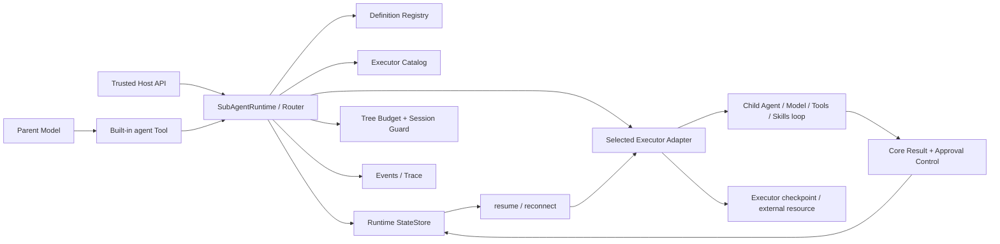

# Subagent v2 生产运行时技术改造

## 1. 文档状态

- 设计状态：总体方向与 Phase 1 Oracle 已冻结；当前 checkout 已完成 C0～C6、C7a/C7b、C7c-1 的 Core transport/RPC/control/Peer/artifact-sidecar、target registry、controller/target bridge 与 controller-owned Model gateway，以及 C7c-2/C7c-3 的离线 Worker/Process placement；HTTP placement 仍待实施。
- 目标版本：Core 与所有公开 Executor/State/Artifact/Observability 包统一首发 `2.0.0`。
- 实施范围：Phase 1 Core/Local、Phase 2 Worker/Process/HTTP Remote、Phase 3 PostgreSQL/BullMQ/Docker/S3/OTel、Compose、测试、demo 与文档迁移。
- 明确排除：conversation handoff、active-agent 所有权转移、Core 内置云 transport 或认证系统。

本文件细化 [PLAN.md](./PLAN.md) 中已经确认的设计。接口名称是实施基线；文件名可以在不改变职责边界和公共语义的前提下微调。分层测试、故障注入与真实方舟 Agent Plan 的逐项发布门禁见 [TEST_ACCEPTANCE_PLAN.md](./TEST_ACCEPTANCE_PLAN.md)。

当前实现边界以源码与包 README 为准：Core v2、官方 Local、Memory/Atomic File StateStore、公开 Agent durable loop、跨协议/跨进程 Phase 1 恢复和离线验收，以及 C7 Core transport/RPC/control/Peer/artifact-sidecar、target registry、controller/target bridge、controller-owned Model gateway 和 C7c-2/C7c-3 离线 Worker/Process placement已经落地；`C7-WORKER` 与 `C7-PROCESS` requirement 因缺少 L5/L6/Ark 仍为 `planned`，HTTP 与 Phase 3 适配器仍按后续章节实施，Phase 2 尚未通过。真实方舟与 Docker/Linux live gate 未执行时不得标记为通过。

## 2. 设计目标与硬性不变量

### 2.1 目标

1. 将 Subagent 从临时 Tool handler 提升为有稳定身份、状态、结果、预算、恢复与事件的任务运行时。
2. 用协议无关的 Core 控制面连接任意本地、进程或远程 Executor。
3. 让模型和宿主都只能通过同一 Router 进入任务系统，避免绕过 session、能力、预算与状态校验。
4. 让输入、输出、审批、恢复和错误都具有可测试的强契约。
5. 在不引入 handoff 的前提下支持阻塞调用、后台任务、并发、暂停与 durable resume。

### 2.2 不变量

- 根 **sessionId** 是唯一稳定访问归属；Core 不再引入 **agentId**、**principalId** 或 **tenantId**。
- 嵌套任意深度的任务，其 **ownerSessionId** 始终等于树根 sessionId。
- sessionId、runId、taskId、subagentSessionId、approvalId、binding 和 recoveryData 永不进入模型可调用参数。
- 定义名称和版本、Executor 名称、taskId 与 binding 在恢复时必须精确匹配；不得自动升级、fallback 或 create。
- **resume** 继续已持久化的暂停执行；**reconnect** 连接原有外部执行；业务重试只能 create 新 task，并写入 retryOf。
- task input 是业务数据，不进入 system role。模型不可修改 definition 固定系统提示或 Executor 策略。
- 默认不继承父 transcript、Tools、Skills 或可变 app state；只有显式 projector 可以传递最小数据。
- 第一次有效 agent-result 提交是唯一权威结果。第二个不同 Tool call 的提交不能覆盖它。
- end-agent 只有在结果已提交且自己是本轮唯一 Tool call 时才成功。
- 任意 Tool 副作用仍可能是 at-least-once；框架的 exactly-once 只覆盖结果接受、审批决定和任务状态 CAS。
- queued、running、waiting_approval、terminal 等状态都由持久状态机驱动，不能从日志或自然语言推断。
- 终态不可逆；恢复和重连不得把 terminal task 重新置为 running。
- 同一个有状态 Agent 实例仍禁止并发调用 agent/resumeRun；并发发生在独立 task/child 实例与 Router 调度层。
- Core 不反向依赖任何 concrete Executor 包。
- `SubAgentRuntime` 必须先完成异步初始化；Chat/Responses durable checkpoint 必须通过版本化协议 codec，custom protocol 没有 codec 时只能 same-process、不可持久恢复或跨进程执行。

## 3. 当前实现与改造锚点

| 当前位置                                                                     | 当前行为                                   | v2 改造                                               |
| ---------------------------------------------------------------------------- | ------------------------------------------ | ----------------------------------------------------- |
| packages/core/src/agent/types.ts 的 AgentConstructor、AgentOptions.subAgents | 用同协议构造器注册 child                   | 删除；改为 SubAgentDefinition + SubAgentRuntime       |
| packages/core/src/agent/index.ts 的内置 agent Tool                           | 参数为 agentName/input/outputDescription   | 改为 subAgent/executor/input 的动态强 schema          |
| packages/core/src/agent/index.ts 的 RuntimeSubAgent                          | 动态继承并注入字符串 agent-result          | 删除；由 Executor 安装 definition-specific 完成控制器 |
| packages/core/src/agent/index.ts 的 child 构造                               | 自动复用父 Model，task 进入 system prompt  | Executor 显式绑定实现；input 仅作为 task data         |
| packages/core/src/agent/index.ts 的模型 Tool 循环                            | 所有 calls 顺序 await                      | Subagent calls 批量提交，结果按原 call 顺序回填       |
| packages/core/src/agent/index.ts 的 end-agent                                | prompt 要求 standalone，运行时未做整批校验 | 执行批次前强制验证                                    |
| packages/core/src/llm/base/types.ts                                          | ModelGenerateRequest 没有 signal/deadline  | 增加可选运行上下文并贯穿适配器                        |
| packages/core/src/llm/chat/index.ts 与 responses/index.ts                    | SDK 请求不能被 Core 取消                   | 将 AbortSignal 传给 OpenAI SDK request options        |
| packages/core/test                                                           | 无专门 Subagent 单元测试                   | 新增 v2 状态、恢复、审批、并发与 conformance suite    |
| demo/src/main.ts、complex.ts、ark-subagent.ts、feature-suite                 | 使用旧 subAgents 和 outputDescription      | 全量迁移，不保留兼容 helper                           |

## 4. 总体架构



依赖方向固定为：

```text
application/demo
  -> core
  -> executor-local (application explicitly wires both)

executor-local
  -> core contracts

core
  -X-> executor-local
```

Core 通过结构化接口接收 Executor 实例。Executor 可以依赖 Core 的 Agent 和 Tool API，但 Core 不导入 Executor 实现。

## 5. 术语与标识

| 标识              | 生命周期                                           | 生成方                 | 用途                         |
| ----------------- | -------------------------------------------------- | ---------------------- | ---------------------------- |
| sessionId         | 根会话整个持久生命周期                             | Core helper 或可信宿主 | 唯一访问归属与恢复域         |
| runId             | 根 Agent 一次逻辑运行；pause/resume/reconnect 不变 | Core                   | 关联一次根执行与 trace       |
| taskId            | 每次逻辑委派；业务 retry 会生成新值                | Core Router            | 查询、取消、结果与幂等       |
| parentTaskId      | 嵌套任务的直接父 task                              | Core Router            | 构建任务树                   |
| subagentSessionId | child 上下文/checkpoint 句柄                       | Core Router            | Executor 恢复 child 上下文   |
| approvalId        | 一次审批请求                                       | Core control plane     | host-only 决策 CAS           |
| callId            | provider Tool call ID                              | Model adapter/provider | Tool 结果闭环与 replay 去重  |
| attempt           | 同一 task 的 Executor operation 次数               | Core Router            | create/resume/reconnect 诊断 |
| retryOf           | 新 task 指向旧 task                                | Core Router            | 显式业务重试关系             |

补充约束：

- runId、taskId 和 subagentSessionId 都不是授权主体。
- 对 task 的控制 API 必须同时接收可信 owner sessionId 与 taskId；Core 先加载记录，再做精确相等校验。
- 子任务创建时继承根 ownerSessionId，不允许 Executor 或模型改写。
- sessionId 应使用高熵不可预测值，但仅靠不可预测性不构成认证。
- 根 Agent 从数据库或文件恢复时，宿主必须提供原 sessionId 与 runId。新 session 无权接管旧 task。
- task 的 create operation 从 attempt = 1 开始，每次 resume/reconnect 增加；业务 retry 是 attempt = 1 的新 task，并通过 retryOf 关联。

## 6. Core 公共类型设计

下面的 TypeScript 用于锁定公共语义，实施时按仓库现有 readonly、泛型和导出风格整理。

### 6.1 JSON 边界

模型 Tool、父 Tool result 与远程 Executor 都要求无损 JSON，因此 v2 的标准 task 输入输出限制为 JSON-safe：

```ts
export type JsonPrimitive = string | number | boolean | null;
export type JsonValue =
  | JsonPrimitive
  | readonly JsonValue[]
  | { readonly [key: string]: JsonValue };
```

Core 在 Zod parse 后再做 JSON-safe 校验，拒绝 undefined、bigint、symbol、function、循环对象、NaN、Infinity、Date、Map 等不能无损进入协议的数据。未来若支持 artifact 或 binary，使用独立 ArtifactReference，不在普通 output 中隐式编码。

canonical JSON 与 hash 固定使用 RFC 8785/JCS：按 UTF-16 code unit 排序对象 key、使用 ECMAScript 数字序列化（`-0` 归一为 `0`）、保留 Unicode 原始码点而不做 normalization，并拒绝 lone surrogate/非 I-JSON 字符。输入和输出默认各 256 KiB；projection 默认最多 32 项、单项 64 KiB、合计 128 KiB，边界值允许，超一单位拒绝。

```ts
export interface ArtifactReference {
  readonly version: '1';
  readonly id: string;
  readonly mediaType: string;
  readonly size: number;
  readonly sha256: string;
}
```

引用不含本地路径、URL、bucket、credential 或授权 token。默认单件 32 MiB、每 task 最多 8 件且合计 128 MiB；`ArtifactStore` 只能在 owner session/task scope 内解析，remote Executor 通过受控 ArtifactStore channel 读取。Memory artifact 生命周期不超过 task，durable adapter 的 retention 必须显式配置并由终态清理器执行。

### 6.2 SubAgentDefinition

```ts
export interface SubAgentDefinition<
  I extends JsonValue = JsonValue,
  O extends JsonValue = JsonValue,
> {
  readonly name: string;
  readonly version: string;
  readonly description: string;
  readonly inputSchema: z.ZodType<I>;
  readonly outputSchema: z.ZodType<O>;
  readonly executorPolicy?: SubAgentExecutorPolicy;
  readonly contextProjector?: SubAgentContextProjector<I>;
  readonly delegation?:
    | { readonly mode: 'none' }
    | {
        readonly mode: 'allowlist';
        readonly definitions: readonly string[];
        readonly allowSelf?: boolean;
      };
}

export interface SubAgentExecutorPolicy {
  readonly allowedNames?: readonly string[];
  readonly requiredCapabilities?: ExecutorCapabilityRequirement;
}

export interface ExecutorCapabilityRequirement {
  readonly spawn?: boolean;
  readonly cancel?: boolean;
  readonly events?: boolean;
  readonly approval?: boolean;
  readonly usage?: 'estimated' | 'provider';
  readonly resumeRecovery?: 'same_process' | 'checkpoint';
  readonly externalReconnect?: boolean;
}

export function defineSubAgent<I extends JsonValue, O extends JsonValue>(
  definition: SubAgentDefinition<I, O>,
): SubAgentDefinition<I, O>;
```

定义约束：

- name、version、description 必须为 trim 后非空字符串，并有长度上限。
- 模型可见的 active catalog 中每个 name 只能有一个 active version；恢复 registry 按 name + version 唯一，可以同时保留多个历史版本。
- recovery-only definition 不进入模型目录，也不能用于 create，只能解析已有 checkpoint。active version 升级不能删除仍有存量 task 的旧 definition/binding。
- version 是宿主管理的不透明字符串；Core 不推断 semver 向前兼容。
- allowedNames 省略表示不主动限制 Executor；空数组表示无 Executor 可用，应在 init 时报告配置错误。
- requiredCapabilities 是强制交集，不是提示。
- delegation 默认等价于 mode: none。只有 allowlist 中的 active definition 会进入 child 的模型目录；调用自身还必须同时设置 allowSelf: true，并继续受树级深度限制。
- contextProjector 是 host-only 本地函数，因此 Definition 本身不要求可序列化。
- 远端只收到 definition ref、已经校验的 JSON input 和投影数据；远端在自己的同版本 registry 中重新解析并再次校验。

### 6.3 显式上下文投影

```ts
export interface SubAgentContextProjectionInput<I extends JsonValue> {
  readonly ownerSessionId: string;
  readonly runId: string;
  readonly parentTaskId?: string;
  readonly definition: SubAgentDefinition<I, JsonValue>;
  readonly input: I;
  readonly parentContext: readonly unknown[];
  readonly parentRawHistory: readonly unknown[];
  readonly signal: AbortSignal;
  readonly deadlineAt: number;
}

export type SubAgentContextItem =
  | { readonly kind: 'text'; readonly name: string; readonly text: string }
  | { readonly kind: 'data'; readonly name: string; readonly value: JsonValue }
  | { readonly kind: 'artifact'; readonly artifact: ArtifactReference };

export type SubAgentContextProjector<I extends JsonValue> = (
  input: SubAgentContextProjectionInput<I>,
) => readonly SubAgentContextItem[] | Promise<readonly SubAgentContextItem[]>;
```

投影规则：

- 默认 projector 不存在，投影为空。
- 投影结果有数量和总字节上限，并在 Executor 边界再次校验。
- 投影项作为受标记 task context 或 artifact 输入，不拼接到 framework system prompt。
- projector 抛错时 task 不创建，返回 CONTEXT_PROJECTION_FAILED。
- Core 不自动投影父 Tools、Skills、完整 transcript 或可变 app object。

### 6.4 Executor 描述与能力

```ts
export interface SubAgentExecutorDescriptor {
  readonly name: string;
  readonly description: string;
  readonly useCases: readonly string[];
  readonly capabilities: {
    readonly execute: true;
    readonly spawn: boolean;
    readonly cancel: boolean;
    readonly events: boolean;
    readonly approval: boolean;
    readonly usage: 'none' | 'estimated' | 'provider';
    readonly recovery: {
      readonly resume: 'none' | 'same_process' | 'checkpoint';
      readonly reconnect: 'none' | 'external_binding';
    };
  };
  readonly adapterStateVersion: string;
}

export interface ExecutorCatalogSnapshot {
  readonly revision: number;
  readonly capturedAt: number;
  readonly executors: readonly ExecutorAvailability[];
}

export interface ExecutorAvailability {
  readonly descriptor: SubAgentExecutorDescriptor;
  readonly status: 'available' | 'degraded' | 'unavailable';
  readonly reasonCode?: string;
  readonly supportedDefinitions?: readonly SubAgentDefinitionRef[];
}
```

目录规则：

- Executor name 在 Registry 内唯一，重复注册在 init 阶段失败。
- availability 由 registry 后台刷新或宿主主动更新；构建 Model Tool 描述不能隐式发起网络请求。
- Router 取 availability、supportedDefinitions、definition allowedNames 和 requiredCapabilities 的交集。
- degraded 是否可选由宿主策略显式决定，默认仍可选但目录会展示 degraded。
- unavailable 永不进入模型 allowed enum。
- Model 选择后 Router 读取最新 snapshot 再校验，防止目录与执行之间的 TOCTOU。
- 选择无效时返回稳定错误码与最新可选列表，不换用其他 Executor。
- checkpoint 可以满足 same_process 的 resumeRecovery 要求，反之不成立；externalReconnect 只由 recovery.reconnect = external_binding 满足。
- approval = true 时 recovery.resume 不能为 none，因为审批暂停后必须可继续。adapterStateVersion、recovery 与 binding codec 在 init 阶段做一致性校验。

### 6.5 Executor binding

```ts
export interface SubAgentExecutorBinding {
  readonly executorName: string;
  readonly ownerSessionId: string;
  readonly taskId: string;
  readonly subagentSessionId: string;
  readonly definitionName: string;
  readonly definitionVersion: string;
  readonly adapterStateVersion: string;
  readonly recoveryData: JsonValue;
}
```

recoveryData 对 Core 不透明，但必须经过 Executor 自己的 codec/schema 校验。它可能包含外部 job ID、checkpoint key 或连接游标，因此：

- 不进入模型、普通日志或默认事件。
- StateStore 落盘时应支持宿主提供的加密封装。
- resume/reconnect 前同时校验固定字段、adapterStateVersion 和 recoveryData。
- Executor 升级不能静默解释旧 state；需要显式迁移器或返回 ADAPTER_STATE_VERSION_MISMATCH。

### 6.6 Executor operation

```ts
export type SubAgentExecutorOperation =
  | {
      readonly type: 'create';
      readonly idempotencyKey: string;
    }
  | {
      readonly type: 'resume';
      readonly binding: SubAgentExecutorBinding;
      readonly reason: 'approval' | 'checkpoint';
      readonly approvals: readonly ApprovalDecision[];
    }
  | {
      readonly type: 'reconnect';
      readonly binding: SubAgentExecutorBinding;
    };

export interface SubAgentExecutionRequest<I extends JsonValue = JsonValue> {
  readonly operation: SubAgentExecutorOperation;
  readonly ownerSessionId: string;
  readonly runId: string;
  readonly taskId: string;
  readonly parentTaskId?: string;
  readonly subagentSessionId: string;
  readonly path: readonly string[];
  readonly attempt: number;
  readonly retryOf?: string;
  readonly definition: SubAgentDefinition<I, JsonValue>;
  readonly input: I;
  readonly projectedContext: readonly SubAgentContextItem[];
  readonly limits: ResolvedSubAgentLimits;
  readonly signal: AbortSignal;
}
```

create、resume、reconnect 共享一个请求结构，使 capability、事件和 conformance 可以一致验证。区别是：

- create 必须没有旧 binding，且 idempotencyKey 重放返回同一 task。
- reason = approval 的 resume 必须来自 waiting_approval，并携带已由 host control plane 接受的决定。
- reason = checkpoint 的 resume 只允许 recovery.resume = checkpoint，源 task 保持 running 但必须标记 recoveryRequired，且旧 lease 已失效；它不产生 public paused outcome。
- reconnect 只连接外部仍运行、暂停或已完成的原 task，不消费审批决定。
- resume/reconnect 的固定字段必须和 binding 完全一致。
- 任何 mismatch 都不能转成 create。

### 6.7 Executor 与 Handle

```ts
export interface SubAgentExecutor {
  readonly descriptor: SubAgentExecutorDescriptor;

  supports(definition: SubAgentDefinitionRef): boolean | Promise<boolean>;

  execute(
    request: SubAgentExecutionRequest,
    control: SubAgentExecutionControl,
  ): Promise<SubAgentExecutionOutcome>;

  spawn(
    request: SubAgentExecutionRequest,
    control: SubAgentExecutionControl,
  ): Promise<ExecutorTaskHandle>;
}

export interface ExecutorTaskHandle {
  readonly taskId: string;
  readonly binding: SubAgentExecutorBinding;
  snapshot(): Promise<ExecutorTaskSnapshot>;
  wait(): Promise<SubAgentExecutionOutcome>;
  cancel(reason?: string): Promise<void>;
  events(options?: { readonly afterSequence?: number }): AsyncIterable<SubAgentTaskEvent>;
}
```

execute 是“阻塞到本次执行可返回的边界”，不是承诺一定到 terminal。Phase 1 的 paused outcome 只表示 host approval，此时持久 task state 必须是 waiting_approval；普通故障 checkpoint 不向调用方返回 paused，而是保持 running + recoveryRequired，随后走 checkpoint resume。spawn 返回内部 Handle；Core Runtime 会再包装 session guard，宿主不直接获得可绕过 Core 的 raw handle。

即使 descriptor 声明某能力不支持，对应方法仍须返回稳定 UNSUPPORTED_CAPABILITY 错误，不允许 undefined behavior。Phase 1 官方本地 Executor 要完整支持 execute、spawn、cancel、events、approval、checkpoint recovery 和 usage 汇总。

### 6.8 Executor control plane

```ts
export interface SubAgentExecutionControl {
  readonly signal: AbortSignal;
  readonly deadlineAt: number;
  readonly delegation: SubAgentDelegationClient;
  commitBinding(binding: SubAgentExecutorBinding): Promise<void>;
  submitResult(callId: string, candidate: JsonValue): Promise<ResultReceipt>;
  authorizeTool(request: ApprovalRequestInput): Promise<ApprovalDirective>;
  reportProgress(update: SubAgentProgress): Promise<void>;
  consumeBudget(delta: SubAgentUsageDelta): Promise<void>;
  emit(event: ExecutorEventInput): Promise<void>;
}

export type ApprovalDirective =
  | { readonly type: 'approved'; readonly approvalId: string }
  | {
      readonly type: 'suspend';
      readonly request: ApprovalRequest;
      readonly checkpointRevision: number;
    };

export interface SubAgentDispatcher {
  getCatalog(): readonly SubAgentCatalogEntry[];
  dispatchTool(callId: string, request: ModelSubAgentRequest): Promise<SubAgentExecutionOutcome>;
}

export interface SubAgentDelegationClient extends SubAgentDispatcher {
  execute(request: ChildDelegationRequest): Promise<SubAgentExecutionOutcome>;
  spawn(request: ChildDelegationRequest): Promise<SubAgentTaskHandle>;
}
```

Core 是结果、审批、预算和 task record 的权威；Executor 承载 child 循环并通过 control plane 提交状态。这样本地与远程适配器使用相同 exactly-once 和 session 语义。

delegation 是 task-scoped client：Core 已固定 ownerSessionId、runId、parentTaskId、path、depth 与共享 budget，child 只能从 definition delegation allowlist 和过滤后的 Executor catalog 中选择，不能覆盖这些字段。默认 catalog 为空。

需要审批的 Tool 必须在执行业务 handler 前先保存 pending call checkpoint，再调用 authorizeTool。返回 suspend 时 Executor 必须立即停止该 child loop、不得调用 handler，并向 Core 返回 approval paused outcome；恢复后相同 callId 再次 authorize，只有持久化 approved decision 才返回 approved。该顺序属于 Executor conformance 的强制测试。

progress 与业务结果彻底分离：

- reportProgress 可以调用多次，只进入 event channel。
- progress 不满足 outputSchema，不会让 task 进入 result_submitted 或 succeeded。
- 父模型默认不消费 progress；宿主 UI 或监控通过 Handle/events 获取。

### 6.9 任务状态、结果与错误

```ts
export type SubAgentTaskState =
  | 'queued'
  | 'running'
  | 'waiting_approval'
  | 'result_submitted'
  | 'succeeded'
  | 'failed'
  | 'cancelled'
  | 'timed_out'
  | 'budget_exceeded';

export type SubAgentTaskResult<O extends JsonValue = JsonValue> =
  | {
      readonly status: 'succeeded';
      readonly task: SubAgentTaskIdentity;
      readonly executor: string;
      readonly output: O;
      readonly usage?: SubAgentUsage;
    }
  | {
      readonly status: 'failed' | 'cancelled' | 'timed_out' | 'budget_exceeded';
      readonly task: SubAgentTaskIdentity;
      readonly executor: string;
      readonly error: SubAgentErrorDescriptor;
      readonly partialOutput?: O;
      readonly usage?: SubAgentUsage;
    };

export type SubAgentExecutionOutcome<O extends JsonValue = JsonValue> =
  | { readonly type: 'terminal'; readonly result: SubAgentTaskResult<O> }
  | {
      readonly type: 'paused';
      readonly reason: 'approval';
      readonly task: SubAgentTaskIdentity;
      readonly approvals: readonly ApprovalRequest[];
      readonly checkpointRevision: number;
    };
```

父模型最终只接收 protocol-neutral 的 terminal envelope。paused 不会被伪造成 Tool result；Core 先 checkpoint 父 loop 并让根 Agent 返回 waiting_approval，恢复后再为原 callId 写入 terminal Tool result。

稳定错误族至少包括：

```ts
export type SubAgentErrorCode =
  | 'DEFINITION_NOT_FOUND'
  | 'DEFINITION_VERSION_MISMATCH'
  | 'INVALID_INPUT'
  | 'INVALID_OUTPUT'
  | 'OUTPUT_NOT_JSON_SAFE'
  | 'CONTEXT_PROJECTION_FAILED'
  | 'RESOURCE_NOT_FOUND'
  | 'STREAMING_UNSUPPORTED'
  | 'EXECUTOR_NOT_FOUND'
  | 'EXECUTOR_DISALLOWED'
  | 'EXECUTOR_UNAVAILABLE'
  | 'UNSUPPORTED_CAPABILITY'
  | 'BINDING_INVALID'
  | 'ADAPTER_STATE_VERSION_MISMATCH'
  | 'CHECKPOINT_VERSION_MISMATCH'
  | 'CHECKPOINT_MIGRATION_FAILED'
  | 'EVENT_BACKPRESSURE'
  | 'SESSION_MISMATCH'
  | 'IDEMPOTENCY_CONFLICT'
  | 'INVALID_STATE_TRANSITION'
  | 'RESULT_REQUIRED'
  | 'RESULT_ALREADY_SUBMITTED'
  | 'RESULT_REPLAY_CONFLICT'
  | 'RESULT_PHASE_CLOSED'
  | 'END_AGENT_MUST_BE_STANDALONE'
  | 'APPROVAL_REQUIRED'
  | 'APPROVAL_REJECTED'
  | 'APPROVAL_EXPIRED'
  | 'APPROVAL_CONFLICT'
  | 'CHILD_DEFINITION_DISALLOWED'
  | 'RECOVERY_UNSUPPORTED'
  | 'RECOVERY_TARGET_LOST'
  | 'LIMIT_EXCEEDED'
  | 'BUDGET_EXCEEDED'
  | 'TIMED_OUT'
  | 'CANCELLED'
  | 'EXECUTOR_FAILED'
  | 'INTERNAL_ERROR';
```

错误描述默认只含 code、safe message、retryable、causeCode、`outcomeUnknown?` 和必要定位 ID。public lookup/control 对未知资源与跨 session 固定返回不可区分的 `RESOURCE_NOT_FOUND`（固定 message、`retryable=false`、不回显资源是否存在）；`SESSION_MISMATCH` 只用于已经认证授权的内部诊断边界。provider error body、prompt、input/output、binding 与 stack 不进入模型或普通事件。

### 6.10 Core Runtime

```ts
export interface SubAgentRuntimeOptions {
  readonly sessionId: string;
  readonly activeDefinitions: readonly SubAgentDefinition[];
  readonly recoveryDefinitions?: readonly SubAgentDefinition[];
  readonly executors: readonly SubAgentExecutor[];
  readonly stateStore: AgentRuntimeStateStore;
  readonly limits?: Partial<SubAgentLimits>;
  readonly catalogPolicy?: ExecutorCatalogPolicy;
}

export interface SubAgentExecuteRequest<I extends JsonValue> {
  readonly runId: string;
  readonly requestId: string;
  readonly parentTaskId?: string;
  readonly subAgent: string;
  readonly executor: string;
  readonly input: I;
  readonly retryOf?: string;
}

export interface SubAgentRuntime extends SubAgentDispatcher {
  readonly ready: boolean;
  init(): Promise<void>;
  refreshCatalog(): Promise<ExecutorCatalogSnapshot>;
  execute(request: SubAgentExecuteRequest): Promise<SubAgentExecutionOutcome>;
  spawn(request: SubAgentExecuteRequest): Promise<SubAgentTaskHandle>;
  getTask(sessionId: string, taskId: string): Promise<SubAgentTaskSnapshot>;
  getSubAgentSession(
    sessionId: string,
    subagentSessionId: string,
  ): Promise<SubAgentSessionSnapshot>;
  wait(sessionId: string, taskId: string): Promise<SubAgentExecutionOutcome>;
  cancel(sessionId: string, taskId: string, reason?: string): Promise<void>;
  resume(
    sessionId: string,
    taskId: string,
    options: {
      readonly decisions?: readonly ApprovalDecision[];
    },
  ): Promise<SubAgentExecutionOutcome>;
  reconnect(sessionId: string, taskId: string): Promise<SubAgentTaskHandle>;
  events(
    sessionId: string,
    taskId: string,
    options?: { readonly afterSequence?: number },
  ): AsyncIterable<SubAgentTaskEvent>;
}
```

`createSubAgentRuntime()` 同步返回未 ready 对象；`await runtime.init()` 异步执行 Executor `supports()` snapshot、definition/factory、binding codec、protocol checkpoint codec 与 migrator 校验。`Agent.init()` 保持同步，只接受已经 ready 且 session/store 一致的 Runtime，否则在任何 Model/Executor/网络操作前失败。所有 public 方法都走同一 session guard 和 Router，不公开 Executor raw handle。StateStore 维护 ownerSessionId + subagentSessionId 到 taskId 的索引；该索引不能脱离可信根 session 单独查询。requestId 是 host-only、`ownerSessionId + runId` 作用域的幂等键：模型 Tool adapter 从 provider callId 内部生成，程序化调用方必须显式提供，但它从不进入模型 schema。resume 根据持久状态推导 reason：waiting_approval 必须带有效 decisions，running + recoveryRequired 必须不带 decision；其他组合直接拒绝。Runtime 初始化完成后 definition/executor 注册表被冻结；availability 只能通过显式异步 `refreshCatalog()` 生成新 revision，构建模型目录不得隐式联网。

terminal API oracle 固定为：`getTask/getSubAgentSession/wait/events` 返回只读原状态；`cancel` 幂等返回原 snapshot 且不追加事件；`resume` 返回 `INVALID_STATE_TRANSITION`；仅声明 external binding 的 `reconnect` 可以只读返回原 terminal outcome，其他 Executor 返回 `UNSUPPORTED_CAPABILITY`。正常 paused 流以 outcome 表达，不使用错误；`APPROVAL_REQUIRED` 只用于调用 `resume` 但缺少当前全部有效 decision 的控制面误用。

### 6.11 Protocol checkpoint codec 与 child runner

```ts
export interface AgentProtocolCheckpointCodec<P extends AgentProtocol> {
  readonly protocol: string;
  readonly version: string;
  encode(context: readonly ContextOf<P>[]): JsonValue;
  decode(value: JsonValue): readonly ContextOf<P>[];
}

export interface SubAgentChildRunner {
  run(
    request: SubAgentChildRunRequest,
    control: SubAgentExecutionControl,
  ): Promise<SubAgentExecutionOutcome>;
}
```

Core 为 Chat/Responses 提供严格 JSON-safe、版本化 codec。持久恢复在读取 context 前校验 codec version；自定义协议没有 codec 时只能使用 Memory same-process 路径。Core 导出协议无关 `SubAgentChildRunner`/completion SPI，Local/Worker/Process/Remote 负责创建独立 child Agent、注入保留的 typed `agent-result`/`end-agent` 与 task-scoped runtime context；Core 不导入这些具体 runner。

## 7. Agent 集成

### 7.1 AgentOptions

删除：

- AgentOptions.subAgents
- AgentConstructor
- AgentInstance 仅为 Subagent 构造器服务的契约
- ToolDescriptionContext.subAgents 的旧构造器列表

新增建议：

```ts
export interface AgentOptions<P extends AgentProtocol> {
  readonly llm: Model<P>;
  readonly session?: {
    readonly sessionId: string;
    readonly stateStore: AgentRuntimeStateStore;
  };
  readonly subAgentDispatcher?: SubAgentDispatcher;
  // 保留现有 skills、skillRuntime、systemPrompts、context、
  // maxIterations、contextCompact、modelErrorRecovery 等配置。
}
```

根 Agent 启用完整 SubAgentRuntime dispatcher 时，session、Runtime.sessionId 与 root Agent sessionId 必须一致，且 Agent 与 Runtime 必须使用同一个 AgentRuntimeStateStore 实例/事务域；缺失或不一致在 init 阶段失败。Executor 运行 child 时则注入 task-scoped SubAgentDelegationClient，并通过内部 task runtime context 提供固定 session/run/task/signal。未使用 Subagent 的 Agent 可以保持轻量，但仍要能接收 AbortSignal。

### 7.2 根 Agent 结果与暂停

为了 durable approval，根 Agent 不能只返回 Context 数组或抛出一个不可恢复的中断。v2 引入：

```ts
export type AgentRunOutcome<P extends AgentProtocol> =
  | {
      readonly status: 'succeeded';
      readonly sessionId: string;
      readonly runId: string;
      readonly context: readonly ContextOf<P>[];
    }
  | {
      readonly status: 'waiting_approval';
      readonly sessionId: string;
      readonly runId: string;
      readonly checkpointRevision: number;
      readonly approvals: readonly ApprovalRequest[];
    }
  | {
      readonly status: 'cancelled' | 'failed';
      readonly sessionId: string;
      readonly runId: string;
      readonly error: AgentRunError;
      readonly context: readonly ContextOf<P>[];
    };
```

`agent()` 与 `resumeRun()` 直接返回 `AgentRunOutcome`；waiting、取消和运行时失败是 outcome，只有配置、编程和初始化错误抛异常。每次新的根 `agent()` 调用都由 Core 创建新的 runId 和 run record；普通复用同一个 Agent 实例也不能复用旧 runId。只有 host-only `resumeRun({ runId, decisions })` 可以传入持久化的原 runId，pause/resume/reconnect 期间该值不变。nested task 始终继承根 runId，不能自行创建。v2 streaming 不支持，`stream=true` 在创建 run/task 前返回 `STREAMING_UNSUPPORTED`，不能用 throw 丢失 waiting_approval checkpoint。

### 7.3 父循环 checkpoint

阻塞 Subagent 在审批时暂停 root，Core 必须在以下精确位置持久化父状态：

- assistant Tool-call 消息已经写入 active context 与 raw history。
- 当前 Tool batch 尚未写入暂停 call 的 Tool result。
- 已完成兄弟 call 的结果、callId 与原始协议顺序已经持久化。
- 尚未完成兄弟 task 的 taskId、binding 与状态已经持久化。
- open loop snapshot、context revision、compact rewrite 状态与 endRequested 标志已经持久化。
- sessionId、runId、model iteration、maxIterations 剩余值与共享 budget ledger 已持久化。
- Agent/definition/executor/checkpoint schema version 已持久化。

resumeRun 读取 checkpoint 后：

1. 校验可信 sessionId、原 runId、checkpoint revision 和 lease。
2. 对 approval decision 做一次性 CAS。
3. 对 waiting_approval 使用 resume(approval)，对 running + recoveryRequired 使用 resume(checkpoint)，对仍存在的外部 job 使用 reconnect；三者都作用于原 task。
4. 已完成兄弟 call 直接重用持久化结果，不再次执行。
5. 所有 call 取得 terminal envelope 后按原 call 顺序构建 Tool result。
6. 关闭同一个 open loop span，继续下一轮模型调用。

如果根 checkpoint 只保存 child binding 而没有 pending batch，上述语义无法成立，因此统一的 AgentRuntimeStateStore 与跨 run/task transaction 是 Phase 1 的必需接口。

### 7.4 Tool handler runtime context

现有 ToolHandler 只有 parameters，无法接收 cancel、deadline 或 call identity。v2 扩展为第二个可选参数，以便装饰器与运行时 Tool 使用同一契约：

```ts
export interface ToolRuntimeContext<P extends AgentProtocol = AgentProtocol> {
  readonly sessionId?: string;
  readonly runId?: string;
  readonly taskId?: string;
  readonly call: AgentToolCall<P>;
  readonly signal: AbortSignal;
  readonly deadlineAt?: number;
}

export type ToolHandler = (
  parameters: unknown,
  context: ToolRuntimeContext,
) => unknown | Promise<unknown>;
```

直接 v2 可以修改公开签名，但仍允许实现只声明第一个参数。所有框架内置 Tool 和 Executor child Tool 必须使用 runtime context。

## 8. 模型可见 agent Tool

### 8.1 目录与 schema

每次构建模型请求时，Core 从内存 catalog snapshot 生成根 object JSON Schema，并以 `oneOf` 表达 definition-specific 分支；Router 内部继续使用 Zod discriminated union。概念上的 Router 校验结构为：

```ts
z.discriminatedUnion('subAgent', [
  z.object({
    subAgent: z.literal('researcher'),
    executor: z.enum(['local', 'worker']),
    input: researcher.inputSchema,
  }),
  z.object({
    subAgent: z.literal('reviewer'),
    executor: z.enum(['remote-prod']),
    input: reviewer.inputSchema,
  }),
]);
```

`toOpenAIToolParameters` 必须扩展为接受该根 object + `oneOf`/discriminator 形态，不能因为现有转换器只接受单一 `z.object()` 而丢失分支。provider 的严格 JSON Schema 能力不足时可以使用等价的宽声明，但 Router 的 Zod parse 和 catalog revalidation 不能降级。所有组合被过滤为空时完全移除内置 `agent` Tool，不保留不可调用占位 schema。

Tool description 只展示：

- definition name/version/description。
- 输入字段的人类可读说明。
- 当前 filtered Executor name、description、useCases 与必要 capability 摘要。

禁止展示：

- sessionId、runId、taskId、subagentSessionId。
- binding、recoveryData、StateStore key。
- 本地 factory、完整 Tools/Skills 清单、系统 prompt。
- 暂不可用且不允许选择的 Executor。

### 8.2 调度失败

在 task 创建前失败时，Tool result 使用稳定 dispatch envelope：

```ts
{
  ok: false,
  error: {
    code: 'EXECUTOR_UNAVAILABLE',
    message: 'Selected executor is currently unavailable.',
    retryable: true
  },
  availableExecutors: [
    { name: 'local', description: '...', capabilities: ['approval', 'recovery'] }
  ]
}
```

Router 不创建 task、不消费 descendant budget，也不 fallback。父模型可以基于刷新目录重新选择。

### 8.3 终态回填

terminal task 返回父模型：

```ts
{
  status: 'succeeded',
  task: {
    taskId: '...',
    subAgent: { name: 'researcher', version: '2' }
  },
  executor: 'local',
  output: { summary: '...', sources: [] }
}
```

失败、取消、超时和预算耗尽使用相同 envelope，只有 succeeded 允许 output；其他终态只允许 partialOutput。父模型不接收 raw child history。

## 9. 批量 Tool 执行语义

### 9.1 分类与顺序

Core 在执行一轮 Tool calls 前先完整解析并分类：

1. 对整批 end-agent 做 standalone 校验。
2. 所有非 agent Tool 按 provider 中的相对顺序串行执行并持久化结果；该阶段结束前不启动 Subagent。
3. 普通 Tool 全部 settle 后，把该轮所有 agent calls 一次性 submit，再等待各自结果。
4. Router 用树级 semaphore 和 Executor 内部队列控制 Subagent 的实际并发。
5. Tool result 最终按 provider 原 call 顺序写回。

同一模型响应中的 calls 不应互相依赖，因为模型尚未看到任何 Tool result。Phase 1 明确禁止普通 Tool 与 Subagent 实际重叠，以确保 child waiting_approval 时不存在尚未 checkpoint、可能带副作用的普通 Tool。实现应把该轮全部 agent calls 视为一个可 checkpoint 的 sub-batch，不能简单在现有 for-loop 中逐个 await。普通 Tool handler 失败时写入稳定、脱敏的 Tool error envelope，并继续 settle 其余普通 Tool，随后仍提交 agent sub-batch；只有根 cancel、timeout 或状态损坏这类 run-fatal 结果才中止整批且不启动尚未提交的 child。

### 9.2 fail-isolated

- 一个 child failed/cancelled/timed_out 不自动取消兄弟任务。
- 每个 child 生成自己的 terminal envelope，父模型决定下一步。
- 根 run 被显式 cancel 时，所有尚未 terminal 的子孙收到 signal 并进入取消流程。
- 一个 child waiting_approval 会暂停父 Tool batch；已经完成的兄弟结果被 checkpoint，未完成兄弟可以按 Executor 能力继续运行并在恢复时 reconnect。
- 宿主可以配置 fail-fast 作为未来策略，但不是 Phase 1 默认值。

### 9.3 end-agent 批级校验

- end-agent 是本轮唯一 Tool call 时才执行。
- end-agent 与 agent-result 同轮出现时，agent-result 可以按正常规则提交，end-agent 返回 END_AGENT_MUST_BE_STANDALONE；child 下一轮必须单独结束。
- end-agent 与其他普通或 agent call 同轮时，只拒绝 end-agent；其余 calls 按各自语义执行。
- 多个 end-agent 同轮全部拒绝。
- 校验发生在任何 call 执行前，不能依赖数组执行顺序碰巧阻止非法结束。

## 10. Result Controller

### 10.1 agent-result

本地 Executor 为 child 注入的概念 schema：

```ts
z.object({
  result: definition.outputSchema,
});
```

提交过程：

1. 使用 definition.outputSchema parse candidate。
2. 检查 JSON-safe 和输出字节上限。
3. 使用 task revision + result slot 做 CAS。
4. 对 canonical JSON 计算 outputHash；第一次有效提交保存 output、outputHash、callId、receiptId、submittedAt 和 schema version。
5. CAS 成功后才向 child 返回成功 receipt。
6. 相同 callId 且 outputHash 相同的 replay 返回原 receipt，不重复写事件；相同 callId 但 payload/hash 不同返回 RESULT_REPLAY_CONFLICT。
7. 不同 callId 再提交返回 RESULT_ALREADY_SUBMITTED，原 output 不变。

这保证“结果发布” exactly-once，不保证提交前执行过的任意 Tool 副作用 exactly-once。

canonical JSON 必须递归按对象 key 排序、保留数组顺序并使用已经通过 JSON-safe 校验的值，再对 UTF-8 字节计算 SHA-256；本地与远程 conformance fixture 必须得到相同 outputHash。

### 10.2 end-agent

child end-agent 的成功前置条件：

- 本轮只有一个 Tool call，且它是 end-agent。
- task 当前为 result_submitted。
- result receipt 已持久化且 output 能按同版本 schema decode。
- task 未被取消、超时或 budget 终止。

成功时以 CAS 将 result_submitted 改为 succeeded，再返回 Tool result。若进程在状态 CAS 后、响应 child 前崩溃，replay 读取 succeeded 并返回相同完成 receipt，不再次推进状态。

task 进入 result_submitted 后，除 standalone end-agent 以及同一 callId + outputHash 的协议重放外，普通 Tool、子任务委派、新审批请求和新的 agent-result 一律返回 RESULT_PHASE_CLOSED，不执行 handler，也不改变 task state。这样状态机不需要表达 result_submitted -> waiting_approval。

### 10.3 partialOutput

- result_submitted 后发生 Executor crash、取消、超时或无法恢复时，task 进入对应非成功终态并保留 partialOutput。
- partialOutput 永不出现在 succeeded.output 之外的 output 字段。
- 父模型和宿主必须显式区分 succeeded 与 partial。
- result_submitted 自身不是对父模型可见的最终成功。

## 11. Task 状态机

| 当前状态                   | 触发                          | 下一状态         | 持久化与重放                                   |
| -------------------------- | ----------------------------- | ---------------- | ---------------------------------------------- |
| 无记录                     | Router 接受 create            | queued           | 原子创建 taskId/idempotencyKey；重放返回原记录 |
| queued                     | 获得树级与 Executor 槽        | running          | 保存 attempt、startedAt、binding               |
| queued                     | cancel/timeout/budget         | 对应终态         | 不启动 Executor                                |
| running                    | host-only approval request    | waiting_approval | 保存 approval、binding、child checkpoint       |
| running                    | lease/进程丢失且可 checkpoint | running          | 设置 recoveryRequired，不产生 paused outcome   |
| running + recoveryRequired | resume(checkpoint)            | running          | 新 lease/fencing、attempt 增加                 |
| waiting_approval           | 有效批准并 resume             | running          | 决定 CAS；attempt 增加                         |
| waiting_approval           | host reject                   | failed           | APPROVAL_REJECTED                              |
| waiting_approval           | expiresAt 到达                | failed           | APPROVAL_EXPIRED                               |
| waiting_approval           | host cancel                   | cancelled        | 显式取消，传播 signal                          |
| running                    | 首次有效 agent-result         | result_submitted | output CAS + receipt                           |
| result_submitted           | standalone end-agent          | succeeded        | 终态 CAS                                       |
| running/result_submitted   | cancel                        | cancelled        | result_submitted 时保留 partial                |
| running/result_submitted   | active timeout                | timed_out        | result_submitted 时保留 partial                |
| running/result_submitted   | budget 拒绝                   | budget_exceeded  | result_submitted 时保留 partial                |
| running/result_submitted   | 不可恢复错误                  | failed           | result_submitted 时保留 partial                |
| running/waiting/任意终态   | external reconnect            | 原状态           | 找回原 job/结果；attempt 增加，不执行 create   |
| 任意终态                   | 任意 operation                | 原终态           | 返回快照或冲突，不可重新运行                   |

reconnecting 不作为持久业务状态；它是 operation/event。重连期间原 task 保持原状态，避免额外状态造成竞态。对 terminal external job 的 reconnect 只是重新取得原结果/Handle 的只读例外，不允许改变终态。

## 12. 审批与 durable resume

### 12.1 审批数据

```ts
export interface ApprovalRequest {
  readonly approvalId: string;
  readonly ownerSessionId: string;
  readonly taskId: string;
  readonly callId: string;
  readonly toolName: string;
  readonly summary: string;
  readonly createdAt: number;
  readonly expiresAt?: number;
  readonly revision: number;
}

export interface ApprovalDecision {
  readonly approvalId: string;
  readonly decision: 'approved' | 'rejected';
  readonly reason?: string;
  readonly expectedRevision: number;
}
```

Tool 原始参数默认不进入 ApprovalRequest；如果 UI 必须展示细节，由宿主提供独立脱敏 preview。

### 12.2 控制面规则

- 决策 API 不暴露给模型，也不是 Agent Tool。
- Core 只接受宿主通过可信 session 上下文提交的 decision。
- 相同 approvalId、revision 和相同 decision 重放为幂等成功。
- 冲突 decision 或旧 revision 返回 APPROVAL_CONFLICT。
- rejected 固定映射为 failed + APPROVAL_REJECTED，不继续执行被拒 Tool；只有宿主显式 cancel 才进入 cancelled。
- 仅 `now < expiresAt` 时可以批准；`now >= expiresAt` 时 expiry 的 fenced CAS 获胜并固定映射为 failed + APPROVAL_EXPIRED。没有 expiresAt 时可长期暂停，但仍可被 session owner 取消。
- 多个并发 child 同时暂停时，根 outcome 聚合所有未决审批；宿主可以逐个决定，只有当前 batch 所需审批全部解决后才继续父模型。

### 12.3 阻塞与后台差异

- 模型 Tool 使用 execute。child approval 会让 execute 返回 paused，Core checkpoint 根 run，并让 Agent.agent 返回 waiting_approval。
- 宿主 spawn 的后台 task 只把自身置为 waiting_approval，父 Agent 不受影响。
- 后台 task 的 resume 仍通过 SubAgentRuntime.resume，不直接调用 raw Executor handle。
- paused outcome 的 reason 在 Phase 1 固定为 approval；故障恢复不会产生另一个未落库的通用 paused 状态。

## 13. create、resume、reconnect 与 retry

### 13.1 create

create 流程：

1. 用 session-bound Runtime 接收请求。
2. 解析 definition identity，并用 inputSchema + JSON-safe 校验输入，计算 canonical input hash。
3. 模型路径由 Tool adapter 使用 runId + callId，宿主路径使用必填 requestId，在 `ownerSessionId + runId` 作用域查询幂等记录；一致命中直接返回原 task，不再执行 catalog、projector、limits 或 budget。
4. 获取 catalog snapshot，过滤并校验指定 Executor。
5. 执行带 signal/deadline 的 contextProjector。
6. 检查 depth、descendants、递归、预算和 timeout。
7. Core 生成 taskId 和 subagentSessionId。
8. StateStore 通过同一作用域幂等唯一索引原子创建 queued record。
9. 调用原 Executor 的 create operation。
10. Executor 提交 binding 后进入 running。

idempotencyKey 不由模型提供。相同 key 的 replay 先通过 StateStore 唯一索引返回相同 task，不重复消耗 descendant budget；同 key 但 definition/executor/canonical input hash 不同返回 IDEMPOTENCY_CONFLICT。

### 13.2 resume

resume 只适用于两种明确情况：waiting_approval 的审批继续，或 recovery.resume = checkpoint 的故障恢复：

- 加载原 task、root run checkpoint、binding 和 definition version。
- 校验 session、lease、state revision、Executor descriptor 与 adapter state。
- approval resume 原子写入 decisions，reason = approval；checkpoint resume 要求 task 为 running + recoveryRequired、旧 lease 已失效且 reason = checkpoint。
- 官方 Local Executor 的 Memory 与 Atomic File 变体都声明 `recovery.resume = checkpoint`；Memory Store 的 checkpoint 只存在于当前进程，进程退出后仍会因权威状态丢失而返回 `RECOVERY_TARGET_LOST`，Atomic File 才能在新进程执行 checkpoint resume。
- 不改变 taskId、subagentSessionId、runId 或 definition version。

### 13.3 reconnect

reconnect 用于外部任务仍在运行、暂停或已完成，但当前进程失去 Handle 的场景：

- 必须有 recovery.reconnect = external_binding 和完整 binding；checkpoint-only Executor 不允许走 reconnect。
- 只调用 binding.executorName 对应的同名 Executor。
- Executor 使用 recoveryData 找回原 job；找不到返回 RECOVERY_TARGET_LOST。
- 如果外部 job 已 terminal，返回原 terminal outcome。
- 不重放 create，不重新执行已完成 child Tool。

唯一恢复矩阵：

| descriptor                   | operation          | 允许源状态/条件                                    | 典型实现                                  | 不满足时                   |
| ---------------------------- | ------------------ | -------------------------------------------------- | ----------------------------------------- | -------------------------- |
| resume = none                | 无                 | 不可恢复                                           | 纯一次性 Executor                         | RECOVERY_UNSUPPORTED       |
| resume = same_process        | resume(approval)   | waiting_approval，原进程和 Handle 仍存活           | 自定义进程内 placement；官方 Local 不声明 | RECOVERY_TARGET_LOST       |
| resume = checkpoint          | resume(approval)   | waiting_approval + checkpoint                      | Memory/File/DB Local                      | BINDING_INVALID 或版本错误 |
| resume = checkpoint          | resume(checkpoint) | running + recoveryRequired + 旧 lease 失效         | File/DB Local、可重建进程                 | BINDING_INVALID 或版本错误 |
| reconnect = external_binding | reconnect          | running/waiting_approval/terminal，外部 job 仍存在 | Remote/queue job                          | RECOVERY_TARGET_LOST       |

同一 Executor 可以同时声明 checkpoint resume 与 external reconnect；两项能力正交。reconnect 到 waiting_approval 后仍由 host 提交 decision，再走 approval resume。descriptor 与 binding 不一致在 init/恢复时失败，绝不 fallback。

### 13.4 retry

retry 是可信宿主做出的新业务决定；模型 wire 不含 taskId/retryOf，父模型不能直接发起：

- 创建新 taskId/subagentSessionId。
- retryOf 只能指向非成功 terminal 旧 taskId。
- retryOf 要求新 task 使用与旧 task 完全相同的 definition name + version；如果只想使用新版 definition，应创建不带 retryOf 的独立 task。
- 原 definition version 已是 recovery-only 时不能 create retry；宿主要么保留该版本 active，要么使用新版创建不带 retryOf 的独立 task，并在业务元数据中自行关联。
- 重新消耗 descendant、并发、timeout 和预算。
- 可以选择不同 Executor，但仍需通过当前 definition policy。
- 旧 task 保持原终态，不被覆盖。

provider 请求已经发出但结果不可确认时，原 task 以 `EXECUTOR_FAILED` 进入 `failed`，在 task snapshot、error descriptor 与 `task.failed` 安全事件中持久化 `outcomeUnknown=true`。框架、Executor、队列和 SDK 都禁止自动重发；只有可信宿主可以显式创建符合上述约束的新 retry task。

## 14. Limits、预算与取消

### 14.1 默认值

```ts
export interface SubAgentLimits {
  readonly maxDepth: number; // default 3
  readonly maxDescendants: number; // default 32
  readonly maxConcurrent: number; // default 4
  readonly maxTurns: number; // default 16 per task
  readonly timeoutMs: number; // default 120_000
  readonly maxProviderCalls?: number;
  readonly maxInputTokens?: number;
  readonly maxOutputTokens?: number;
  readonly maxCost?: number;
}
```

精确定义：

- 根 Agent depth = 0，第一个 child depth = 1。
- maxDescendants 统计该 root run 创建过的所有逻辑 task，包括显式 retry；idempotent replay 不重复计数。
- queued task 不占 maxConcurrent；拿到执行槽后才占用，waiting_approval 释放执行槽。
- maxTurns 是每个逻辑 task 跨 resume/reconnect 累计的模型生成轮数，不能恢复后重置。
- timeoutMs 统计 queued、running 以及 resume/reconnect 操作的活跃墙钟时间；waiting_approval 期间冻结。task record 持久化 activeElapsedMs、activeStartedAt 与 remainingMs，进入审批时取消当前 timer，resume/reconnect 时用 remainingMs 重新计算本次 operation 的 deadlineAt，不能继续使用暂停前的绝对 deadline。审批可单独设置 expiresAt。
- 根取消会 fan-out 到所有非终态后代；单 task cancel 默认不取消兄弟。
- 同 definition 自递归默认禁止；允许后仍受 maxDepth 和 maxDescendants。

### 14.2 共享 budget ledger

TreeBudget 由 root run 统一持久化，至少记录：

- 已创建 descendant 数。
- 当前执行槽与等待队列。
- provider call 次数。
- 输入/输出 token 和可选 cost。
- 每个 task 已使用 turns 与 active time。

Executor 在模型调用前预留 budget，调用后按真实 usage 结算。usage 能力为 none 的 Executor：

- 仍必须执行 turns、timeout、depth、descendants 和 concurrency。
- 无法保证 token/cost 硬限制。
- descriptor 必须诚实声明，definition 或 host policy 可禁止选择。

### 14.3 AbortSignal 全链路

需要修改：

- ModelGenerateRequest 增加 signal、deadlineAt 和 runtime metadata。
- Chat 与 Responses adapter 把 signal 传入 OpenAI SDK request options。
- ToolRuntimeContext 携带 signal/deadline。
- context summary 与 model error recovery 共用同一 signal。
- queue wait、approval wait、Executor wait、child Model 和 Tool 都监听 cancel。
- abort/cancel/timed_out 不进入普通 model retry 或 context-length recovery。
- 任意退出路径释放 tree semaphore、Executor slot、lease 和 listener。

## 15. StateStore 与持久化

### 15.1 Core SPI

```ts
export interface AgentRuntimeStateStore {
  readonly transactionDomainId: string;

  createRun(record: StoredAgentRun): Promise<void>;
  loadRun(ownerSessionId: string, runId: string): Promise<StoredAgentRun | undefined>;
  loadTask(ownerSessionId: string, taskId: string): Promise<StoredTask | undefined>;
  findTaskByIdempotencyKey(
    ownerSessionId: string,
    idempotencyKey: string,
  ): Promise<StoredTask | undefined>;
  findTaskBySubAgentSession(
    ownerSessionId: string,
    subagentSessionId: string,
  ): Promise<StoredTask | undefined>;

  transaction<T>(
    ownerSessionId: string,
    lease: StateLease,
    work: (tx: AgentRuntimeStateTransaction) => Promise<T>,
  ): Promise<T>;

  readEvents(
    ownerSessionId: string,
    taskId: string,
    afterSequence?: number,
  ): Promise<readonly SubAgentTaskEvent[]>;
  acquireLease(key: string, ttlMs: number): Promise<StateLease>;
}

export interface AgentRuntimeStateTransaction {
  loadRun(runId: string): Promise<StoredAgentRun | undefined>;
  loadTask(taskId: string): Promise<StoredTask | undefined>;
  findTaskByIdempotencyKey(runId: string, requestId: string): Promise<StoredTask | undefined>;
  findTaskBySubAgentSession(subagentSessionId: string): Promise<StoredTask | undefined>;
  createTask(record: StoredTask): Promise<'created' | 'existing'>;
  compareAndSetTask(
    taskId: string,
    expectedRevision: number,
    fencingToken: string,
    next: StoredTask,
  ): Promise<boolean>;
  compareAndSetRun(
    runId: string,
    expectedRevision: number,
    fencingToken: string,
    next: StoredAgentRun,
  ): Promise<boolean>;
  appendEvents(taskId: string, events: readonly SubAgentTaskEvent[]): Promise<void>;
}

export interface StateLease {
  readonly key: string;
  readonly fencingToken: string;
  readonly expiresAt: number;
  renew(ttlMs: number): Promise<StateLease>;
  release(): Promise<void>;
}
```

`StateLease.expiresAt` 属于签发该 lease 的 StateStore logical clock domain，不能与另一个进程或节点的 wall clock 直接比较。Core 对 live execution owner 另行维护宿主单调时钟 proof：以最终成功 acquire attempt 或 renew 请求的开始时间加 `ttlMs` 作为保守上界，只有请求成功才发布新 proof；renew 在旧 proof 边界仍未确认时立即按 ownership loss 处理。acquire 必须与调用方 signal/deadline 竞争；Store 不支持取消且在调用结束后迟到返回 lease 时，Core best-effort 释放该 lease。这样既允许测试和 Store 使用可控 logical clock，也不要求未来 PostgreSQL/远程 Store 与 controller 绝对时钟同步。

createRun 对 ownerSessionId + runId 建唯一约束。createTask 必须在同一事务中原子维护 ownerSessionId + runId + requestId 与 ownerSessionId + subagentSessionId 两个唯一索引；不同 session/run 可以复用相同 requestId。existing 只在 identity、definition、executor 和 input hash 全部相同时视为幂等重放，否则返回冲突。transaction-local read/index API 必须看见本事务已暂存 mutation，避免实现者在事务外预读后产生 TOCTOU。

transaction callback 必须有实现定义的短时上限，且只能等待同一 `AgentRuntimeStateStore` 的 transaction-local 操作；严禁在事务中等待 Model、Tool、Executor、projector、网络或其他外部副作用。run revision 与 task revision 分别递增，任何一方的 CAS 都不能代替另一方。

AgentOptions.session.stateStore 与 SubAgentRuntime.stateStore 在 Phase 1 必须是同一实例和 transactionDomainId。父 run checkpoint、受影响 child task CAS、budget 变更和 event append 在一个 transaction 中提交，避免一边已暂停、另一边仍显示 running。Executor 自己的外部 checkpoint 可以独立存储，但 Core binding 必须在该事务域中落库。

StoredTask 至少持久化：

- identity、definition ref、Executor name、binding、state、revision。
- ownerSessionId + subagentSessionId 的反向索引，用于同 session 范围内定位 child checkpoint。
- input 与 projected context 的安全编码或引用。
- result receipt、output/partialOutput、错误、usage。
- parent/path/depth/attempt/retryOf/idempotencyKey。
- timestamps、activeElapsedMs、activeStartedAt、remainingMs、recoveryRequired、approval IDs、event sequence。

StoredAgentRun 至少持久化：

- sessionId、runId、Agent/checkpoint schema version。
- active context、raw history 与 context revision。
- model iteration、pending assistant Tool message、pending batch 与 call order。
- 已完成 Tool results、未完成 task IDs、open loop/compact transaction 状态。
- tree budget、pending approvals、endRequested 与 status。
- 版本化 `ContextStoreCheckpointV1`，使用稳定 context/item/span ID 表达 provenance、active/raw 关联与 compact transaction；不能依赖进程内对象引用相等。ContextStore 提供显式 export/restore，恢复时按 protocol checkpoint codec 解码。

### 15.2 revision、lease 与 fencing

- 每个 task/run 写入都使用 revision CAS。
- resume/reconnect 前获取有 TTL 的 lease，并生成单调 fencing token。
- transaction 内每次 task/run CAS 都必须携带当前 fencing token；旧进程即使恢复运行也不能推进状态。
- lease 过期后可以被新进程接管，但必须按 capability 矩阵对原 task 执行 checkpoint resume 或 external reconnect，不能 create。
- 文件 Store 使用按 session 的 write-ahead transaction journal/commit marker、临时文件 + fsync + atomic rename、revision CAS、进程锁与 fencing record；恢复只重放已有 commit marker 的 transaction，确保父 run 与 child task 不出现半提交。
- WAL 中带 checksum 的单条不可变 transaction 与 commit marker 是权威；snapshot/index 只是可重建 cache。短进程文件锁只保护 journal append，长运行所有权由 session lease/fencing 管理，fencing token 使用十进制 bigint 字符串且只在 takeover 时递增。
- session 目录使用 session ID 的 SHA-256 派生名并校验 realpath；拒绝 UNC/网络文件系统、symlink escape 和工作根之外路径。持久 codec 通过 `KeyProvider` 执行 AES-256-GCM 信封加密；Windows 不能只用 chmod 证明安全，若 `SecureRootVerifier` 无法确认 owner-only ACL 则必须启用加密，否则初始化失败。
- 文件 Store 只承诺受控单宿主的 process-crash recovery；不承诺断电一致性、网络文件系统、多节点时钟或高并发多写者一致性。

### 15.3 checkpoint 版本

分别维护：

- Core task record schema version。
- Core Agent run checkpoint schema version。
- definition version。
- Executor adapterStateVersion。

四者都必须在恢复前检查。迁移器在 Runtime init 时按 `{ recordKind, fromVersion, toVersion }` 唯一注册，输出新记录而不得修改原记录；无迁移路径返回 `CHECKPOINT_VERSION_MISMATCH`，迁移器抛错或输出无效返回 `CHECKPOINT_MIGRATION_FAILED`，两者都不覆盖原始 checkpoint。

## 16. 官方本地 Executor

### 16.1 包边界

暂定：

- workspace：packages/executor-local
- npm：@ruixutong.manee/maneeagent-executor-local

Core 只导出 contracts；本地包依赖 Core，并提供：

- LocalSubAgentExecutor。
- definition + Agent factory registry。
- child Agent runner。
- Result Controller Tool 注入。
- tree-aware queue、cancel、approval、events 与 usage bridge。
- MemoryRuntimeStateStore。
- AtomicFileRuntimeStateStore。
- conformance adapter factory。

### 16.2 本地定义绑定

```ts
localExecutor.register({
  definition: researcherDefinition,
  create({ limits, delegation }) {
    return new ResearcherAgent({
      llm: childModel,
      maxIterations: limits.maxTurns,
      subAgentDispatcher: delegation,
      systemPrompts: fixedResearcherPrompts,
    });
  },
});
```

create factory 是本地对象，不序列化。它必须通过 closure、宿主 model registry 或其他显式依赖配置 child Model、Tools、Skills、system prompts 和其他能力，不能假定从父 Agent 自动继承。

Local definition-to-factory registry 同样按 name + version 唯一，并保留 recovery-only 版本的 factory；Core active catalog 决定哪些版本可 create，Local registry 不能自行把历史版本重新暴露给模型。

Local factory 接收 SubAgentExecutionControl.delegation 并把它作为 child 的 subAgentDispatcher；该 client 已被 Core 固定 ownerSessionId/runId/parentTaskId/path/budget，factory 拿不到可改写这些字段的 root Runtime。definition delegation = none 时目录为空；allowlist 时只暴露允许的 active definitions 和过滤后的 Executor。Local runner 还通过内部 task runtime context 注入当前 taskId、signal 与 deadline。

本地 Executor 在 factory 创建后注入受保留的 agent-result 和 end-agent 完成控制器；定义/Agent 自行声明同名 Tool 时 init 失败。

### 16.3 恢复等级

- Memory Store：官方 Local 仍声明 `recovery.resume = checkpoint` 并按同一 checkpoint contract 恢复审批；但状态仅驻留当前进程，进程退出后无法提供 durable checkpoint，固定返回 `RECOVERY_TARGET_LOST`。
- Atomic File Store + 可重建 definition/model/tool registry：recovery.resume = checkpoint；可在新进程用 resume(checkpoint) 重建 child 上下文并继续。
- 任意不可重放的 Tool 副作用仍需业务 idempotency key。
- 本地 Executor 的 recovery.reconnect 固定为 none，不应把 checkpoint 能力声明成 external_binding。

## 17. Phase 2 Executor

### 17.0 C7 固定 Transport 与恢复 Oracle

C7 的三个 placement 共用 Core 导出的协议无关 transport v1 contract，不允许各包复制或扩展不兼容 wire：

当前 Core 实现已经冻结并公开该公共层：C7b 基线与 C7c-1 扩展后的 14-kind strict RPC、16-method control dispatcher/proxy、双向 `SubAgentTransportPeer`、canonical replay/reply cache、同步 writer admission receipt、带 settlement headroom 的 drain/rollover、spawn 的 `accepted → settled` 或 direct `unbound_create` recovery settlement、有界 abort/timeout tombstone、默认 32 MiB artifact sidecar、controller/target bridge 与 `model.request`/`model.reply` gateway。writer 的可选 `settled` 只报告 I/O 完成，不参与下一帧准入排序；非法同步 receipt 在调用返回前失败，准入前 abort 不发送 packet。Peer 对 accepted/settled/events/model reply 与原 request 做语义关联，超长 timeout 分段调度；soft drain 仍允许所有 reply/replay 和 active executor task 的 control/cancel/snapshot/events continuation，hard sequence bound 才 fail-close。它们通过 closed schema、scope/receipt/outcome 重验、owner partition 和 safe-error 白名单把远端 runner 接回 Core control plane。C7c-2/C7c-3 已在这套公共层上交付离线 Worker/Process transport，以及各自的 `worker_threads`/`child_process` 生命周期；HTTP transport、鉴权和网络生命周期仍未实现。Worker/Process 的 L5/L6/Ark 证据同样未完成，因此不能把本节状态写成 Phase 2 通过。

- JSON envelope 固定为 `{ version: '1', channelId, sequence, messageId, correlationId?, taskId?, operationId?, kind, payload }`，所有 object 都是 closed shape；默认单个 JSON frame 上限 16 MiB。
- 每个方向的 `sequence` 从 1 连续递增。相同 `messageId + canonical decoded envelope` 是协议重放并返回原 reply，sidecar 以 `sidecarId` 无序比较；相同 ID 不同语义或 bytes 为冲突；sequence gap、未知字段、错版本、超限或非 JSON-safe payload 都在调用 Executor/Core 前失败。
- `SubAgentExecutionRequest` 不直接跨 transport 传输 `AbortSignal` 或 control closure。wire 使用 `remainingMs`，接收端按本地时钟创建 signal 和绝对 deadline；`reconstructSubAgentExecutionRequest()` 返回 `{ request, dispose }`，adapter 必须在处理 settle 后调用幂等 `dispose()` 释放接收端 timer/listener。不得信任远端绝对时间。超过 Node 单个 timer 上限 `2^31-1 ms` 的长 deadline 必须分段调度，不得溢出、静默截短或退化为近即时 timeout。
- artifact reference 继续走 closed JSON；bytes 使用 transport sidecar，Worker 使用 transferable `ArrayBuffer`，Process 使用 advanced serialization 的 `Uint8Array`，HTTP 使用 17.2 冻结的单请求 signed `multipart/mixed` packet。sidecar 必须拒绝 Proxy，使用 internal slots 固定源长度并复制到普通 owned buffer，再校验声明 size 与明文 SHA-256；不能调用源对象可覆写的 getter、iterator、`slice()` 或 `Symbol.species`，也不以 base64 塞入 JSON frame。当前 remote execution-control proxy 不提供 artifact `put`；它只接受已有 reference 对应的 sidecar，不提供独立 upload/stage/commit route。
- 目标节点只能按宿主预注册的 `definition name + version` 和 runner identity 解析 factory/Zod schema；factory、Zod object、模块路径和凭证都不进入 wire。

#### 17.0.1 Trusted target runner registry 与校验顺序

所有 placement 共享一个 target-side trusted registry。注册键固定为 `{ runnerId, definitionName, definitionVersion }`；值是在目标节点启动时由宿主代码注册的 factory、input/output Zod schema、protocol/checkpoint codec identity 和允许的 model gateway identity。`runnerId` 是 opaque、host-only 标识，只能由 controller 根据已经冻结的 Executor binding/registry 选择，不进入模型可见 catalog，也不能由 execution input 覆盖。远端不能提交模块路径、构造函数、Zod 对象、Model endpoint 或任意动态 import specifier。

目标节点对新的 execution packet 固定按以下顺序处理：

1. 完成 transport frame、sidecar、sequence/replay、size 与 JSON-safe 校验，得到 owned immutable packet。
2. 校验可信 owner session/run/task/operation scope，并用 packet 中的 ref 查找精确 `{ runnerId, definitionName, definitionVersion }`；unknown、disabled 或 identity/version 不一致统一返回安全 `RESOURCE_NOT_FOUND`/compatibility error，不尝试其他 runner。
3. 比对 registry 固定的 protocol、checkpoint codec、adapter state 与 model gateway identity；任一不一致在创建 Agent、打开事件流或调用 Model 前失败。
4. 使用该 registry entry 自己持有的 input Zod schema 对 wire input 执行 `safeParse`，再对 parse 后结果执行 JSON-safe/JCS、256 KiB input、projection 与 artifact limits 校验。runner 只接收这份 owned parse result；不得使用 wire 携带的 schema，也不得先构造 runner 再校验。
5. 以上步骤全部通过后，才由 factory 创建独立 child Agent/runner，注入 task-scoped control、delegation、artifact client、signal/deadline 与 protocol-specific Model proxy。

同一 input 会先在 controller Router create 阶段校验，再在 target registry 入站阶段重验；两端必须注册相同 definition version。带 transform/default/refinement 的 schema 必须把“controller 输出再次作为同版本 schema 输入”纳入 registry compatibility/conformance，不能靠跳过 target parse 规避非幂等 schema。

#### 17.0.2 Controller/target bridge 与 lazy handle

Core 新增且只保留一套 placement-neutral bridge：controller 侧 bridge 实现 `SubAgentExecutor`，把 execution request/control 映射到 `SubAgentTransportPeer`；target 侧 bridge 把验证后的 request 交给 `SubAgentChildRunner`，并把 16-method control 反向代理回 authoritative Core Runtime。Core task/run/approval/result receipt/lease/fencing 仍由 controller StateStore 决定，target job、PID/thread、HTTP cursor 都不是权威 task state。

`spawn` 收到合法 `executor.accepted` 后只构造一个 lazy `ExecutorTaskHandle`：`snapshot()`、`wait()`、`cancel()` 和 `events()` 在调用时才发对应 RPC。创建 handle 不得启动隐式 poll、无限 event subscription 或后台 timer；`events({ afterSequence, limit, signal })` 每次最多取得一页，再按 consumer demand 拉下一页，取消/iterator return 必须释放当前请求。handle 只保存 validated binding/task identity 和 bridge 引用；进程重建后由 Executor 通过 binding 创建新 handle，不序列化 closure 或 Peer 实例。`execute` 可以复用同一 handle 的 wait path，但不得建立第二套 settle/replay 语义。

#### 17.0.3 Model gateway RPC 与 provider outcome Oracle

C7c 把 strict RPC 从 12 kind 原子扩展为 14 kind，只新增一对双向消息，不改变已有 12 kind 或 16-method control：

- `model.request`：target 的 protocol-specific Model proxy 请求 controller gateway 执行一轮 generate；payload 只含 frozen gateway/codec identity、协议 codec 编码后的 JSON-safe context/tools/purpose/runtime 元数据和 host-only `providerOperationId`，不含 API key、base URL、SDK client、任意 header 或可执行对象。
- `model.reply`：controller 返回同一 `providerOperationId` 对应的 codec-normalized messages/usage，或 closed safe error；SDK raw response、provider error body/header 和 credential 永不跨回 target。request/reply 必须与原 task、execution epoch、iteration/request-attempt、gateway identity 和 correlation ID 精确关联。

`providerOperationId` 由受信 target Model proxy 根据 controller 分配的 task/epoch 与当前 iteration/request-attempt 生成或取得，模型文本、Tool 参数和用户 input 都不能指定它。它只存在于内部 RPC、authoritative provider-operation ledger、checkpoint/recovery metadata 和脱敏事件关联字段中；Model adapter 必须在构造 provider body/header 前剥离它。重复 ID + 相同 canonical request 只能读取已持久的 completed reply，重复 ID + 不同 request 固定为 idempotency conflict。

每轮 child Model 调用顺序冻结为：

1. target 先把调用前完整 child context、pending Tool batch、iteration/request-attempt 和 `providerOperationId` 通过 `commitCheckpoint` 写回 controller，并等待 durable ACK。
2. 只有收到该 ACK 后才能发送 `model.request`；未 ACK、超时或连接中断都不得触发 gateway/provider。
3. controller 在 authoritative provider ledger 中将同一 operation 从 `prepared` CAS 为 `in_flight` 后才调用 SDK，且 SDK `maxRetries=0`；这次 CAS 是不可自动重发的恢复分界线。provider response 必须先以 codec-normalized `completed` result 持久化，再发送 `model.reply`。
4. target 收到并校验 reply 后更新 child checkpoint，再继续 Agent loop；reply 丢失可按同一 `providerOperationId` 读取已持久的 completed result，不能发起第二个 provider attempt。

authoritative ledger 的 `in_flight` CAS 一旦提交，随后发生 controller crash、网络断开、timeout 或进程丢失时，无论故障实际位于 SDK create 调用前还是调用后，生产恢复都必须把原 task 置为 `failed + outcomeUnknown=true`，禁止 bridge、Peer、Executor、SDK 和 recovery 自动重发；恢复逻辑不能根据缺失的进程内证据猜测 provider 是否已收到请求。确定性测试必须分别提供两个 failpoint：CAS 后、SDK create 前的注入断言 SDK count = 0，SDK create 返回/抛出前后的注入断言 SDK count = 1；两者的持久恢复 Oracle 都同为 outcome unknown/no auto resend。`prepared` 且尚未进入 `in_flight` 可以从已 ACK checkpoint 用相同 operation 继续；`completed` 只能重放原 normalized reply。Worker/Process/loopback 可使用 controller-process scoped ledger，HTTP external reconnect 和任何跨 controller 重启声明必须使用与 Runtime 同恢复域的 durable ledger；否则 capability 必须保守降为不可跨进程恢复。

#### 17.0.4 三种 placement 的复用边界

Worker、Process 与 HTTP 必须复用 Core 的 request reconstruction、target registry、controller/target bridge、14-kind RPC codec、16-method control、lazy handle、Model gateway proxy、safe wire projector 和 Peer state machine，不得各自复制 runner/control/result/replay 逻辑。各包只实现以下 transport/lifecycle 边界：

- Worker：`MessagePort` packet I/O、transferable sidecar、Worker 启停/exit/cancel 分类和 worker binding codec。
- Process：advanced-serialization IPC、环境/stdio 白名单、child process 启停/kill/exit 分类和 process binding codec。
- HTTP：TLS/HMAC、signed multipart packet、heartbeat/availability、durable remote job/cursor/reconnect、HTTP binding codec 和部署级 replay cache。

三者可以提供自己的 availability probe、adapter-state version、binding codec 和故障分类，但不能改变 RPC kind、control method、registry lookup/validation 顺序或 provider outcome Oracle。Local Executor 不被强制绕 transport loopback；它继续直接实现同一 Core SPI/conformance。所有 placement 只改变 child execution 的位置，根 Agent、run、session、provider gateway 和对话所有权始终留在 controller，不实现 handoff。

Executor 可以返回内部 `recovery_required` settle marker，但它不是公开 task state 或 Agent outcome。Core 只在以下条件接受：authoritative task 仍为 running、marker operation 与当前 epoch 一致，并且不存在 outcome-unknown provider intent。`checkpoint` recovery 必须已有合法 binding、完整 child checkpoint 和精确 runner/codec compatibility；`unbound_create` 只允许在 binding/checkpoint 均未提交时用原 idempotency operation 重放。每次 live dispatch 最多自动恢复一次，继续失败后等待 host 显式 `recover()`/retry；绝不创建替代 task/job。provider 已 `in_flight` 时固定 `failed + outcomeUnknown`，`result_submitted` 崩溃固定 `failed + partial`，terminal 只读且不可逆。

### 17.1 Worker Thread / Child Process

新增独立公开包 `@ruixutong.manee/maneeagent-executor-worker` 与 `@ruixutong.manee/maneeagent-executor-process`，要求：

- 只跨 IPC 发送 definition ref、JSON input、context projection、limits 和 binding。
- worker/process 内使用 17.0.1 的 trusted target runner registry 精确解析 runner/factory。
- 入站严格按 17.0.1 顺序重新执行 Zod、JSON-safe、identity 与 limits 校验。
- signal/cancel 映射为 IPC 控制消息和进程终止兜底。
- 区分正常 child failure、协议错误、进程 crash 和宿主 kill。
- checkpoint、result receipt 和 event sequence 可在进程退出后恢复。
- 两者 `reconnect=none`，只允许同一幂等 operation 重放或 checkpoint resume；不把进程重建伪装成 external reconnect。
- 首版每个 task 使用一个 Worker/Process，不做池化。两者只执行宿主信任的 registry entry，不宣称为不受信代码沙箱。
- Worker 必须显式传入最小 `env` 且 `execArgv: []`，不得使用 `SHARE_ENV` 或展开 `process.env`。
- Process 固定 `execPath=process.execPath`、`serialization='advanced'`、`detached=false`；`fork()` 本身不通过 shell，不伪造它不支持的 `shell` option。stdio 不转发正文并设置 64 KiB 上限；环境固定为内部最小白名单，不提供宿主扩展入口，并禁止透传 `NODE_*`、`ARK_*`、`TOKEN`、`SECRET`、`KEY`、`PASSWORD`、`CREDENTIAL`、`AUTH`、`COOKIE`、`LD_*` 与 `DYLD_*`。
- cancel 先发送协议控制消息，5 秒内未确认才终止 Worker/Process，并等待 exit/close 完成资源清理。binding 只保存 logical job ID，不保存 threadId、PID、路径或 secret。

当前 C7c-2 的 Worker 离线实现已登记 `C7-WORKER-01`～`C7-WORKER-29`。这些 case 覆盖静态 target/manifest、最小环境和 secret 边界、binding 与 session/task scope、Chat/Responses fake SDK、transferable sidecar、真实 Worker handshake/cancel/crash/checkpoint、容量与资源清理，以及以下恢复窗口：

- F19：`result_ready` 后回复丢失只重放同一 provider operation 和已持久化结果；provider 仍为 `in_flight` 时按 `failed + outcomeUnknown=true` 关闭原 task，禁止自动重发。
- F08：result receipt CAS 已成功、回复尚未到达 child 时 Worker 崩溃，权威终态为 `failed` 并保留 `partialOutput`；receipt 只读重放，不创建 replacement job，也不再调用 Model。
- F09：terminal CAS 已成功、completion 回复尚未到达调用方时 Worker 崩溃，原 `succeeded` 必须保留；completion receipt 只读重放，不创建 replacement job，也不再调用 Model。
- terminal/cancel receipt 作为 compact tombstone 保留，用于 create/cancel 幂等重放；终态立即释放 Worker/Peer/Port/timer 等重资源，但 `maxRetainedTasks` 不得通过 LRU 删除这些证据。容量耗尽时新 task fail closed，直到整个 Executor `dispose()`；当前不提供逐 task retention 删除 API。

C7c-3 的 Process 离线实现登记 `C7-PROCESS-01`～`C7-PROCESS-32`。01～11 覆盖 conformance、closed binding、静态 target/manifest、最小环境、Chat/Responses fake SDK 与 advanced-serialization owned sidecar；12～29 在真实 OS 子进程中复用 Worker 的 handshake、scope/capacity、checkpoint、cancel receipt 与 F08/F09/F19 Oracle；30～32 额外锁定固定 `execPath`/空 argv 与 `execArgv`/单 IPC parent、`send() === false` 只表示 backpressure 且 callback 才是 I/O settle，以及 controller 永久断开后的 ref'ed orphan watchdog。`exit` 只记录退出状态，stdio/IPC/capacity 必须等 `close` 后释放；IPC 双向拒绝 `sendHandle`，frame/sidecar 在 owned copy 前执行数量与字节上限检查。Process 使用内部固定最小环境，不提供宿主扩展入口；它只承诺有界回收受控直属 child，不承诺清理 target 自行创建的任意进程树。

这些离线证据不包含真实方舟 L5、分布式/部署级 L6 或 Docker/Linux live gate；因此 manifest 中 `C7-WORKER` requirement 继续保持 `planned`。C7c-3 的 Process 离线实现也复用了相同 F08/F09/F19 Oracle，并增加 advanced IPC、环境/stdio、send callback/backpressure、sendHandle、cancel/kill、exit/close 与 controller 断连孤儿 watchdog；`C7-PROCESS` 同样因缺少 L5/L6/Ark 保持 `planned`。Worker 与 Process 都只执行宿主信任的 target，不是网络、文件系统或操作系统安全沙箱；Process 只承诺回收受控直属 child，不承诺任意进程树。HTTP 仍待交付，Phase 2 未通过。

### 17.2 HTTP Remote Executor

公开包 `@ruixutong.manee/maneeagent-executor-http` 只改变 execution placement，不是 handoff。它包含：

- TLS + HMAC-SHA256 v1 默认 verifier：签名输入固定含 `keyId/timestamp/nonce/bodyDigest`，校验时钟窗口并使用分布式 replay cache；宿主可以替换为企业 IAM verifier。
- create idempotency key。
- heartbeat 与 availability snapshot。
- task status、event cursor、cancel、approval、resume 和 reconnect RPC。
- binding codec 与 adapter state version。
- 重复、乱序、迟到消息处理。
- safe error mapper、payload size limit、TLS/secret guidance。

HTTP 包通过 conformance suite 证明语义一致；Core 不规定 HTTP、gRPC、队列或云产品。

HTTP v1 固定行为：

- 所有 RPC 使用 signed POST：`/v1/heartbeat`、`/v1/jobs/create`、`/v1/jobs/{id}/resume`、`/reconnect`、`/cancel`、`/poll`、`/control/{requestId}/reply`。create 以授权主体、owner session 与 idempotency key 唯一；响应不确定时只可重放同一 operation 取回原 job。
- binding recovery data 只含 `{ kind: 'maneeagent-http/v1', endpointId, jobId }`。`endpointId` 在本地可信 registry 中解析 base URL 与 auth；binding 不含 URL、credential、cursor 或临时授权。
- heartbeat 默认 10 秒；最近成功小于 30 秒为 available、30–60 秒为 degraded、达到 60 秒为 unavailable。只有 Runtime init/显式 `refreshCatalog()` 更新模型目录 revision；schema 构建不联网，执行前仍 preflight 且无 fallback。
- remote job event cursor 与 Core task event sequence 是两个独立域。controller 断线时 job 进入 remote 内部 `awaiting_control`，reconnect 用原 binding/cursor 继续；丢失 job 返回 `RECOVERY_TARGET_LOST`，不能 create 替代。
- 默认只接受 TLS。仅显式 `allowInsecureLoopback` 可在测试/开发使用 `127.0.0.1`、`::1` 或 `localhost`，redirect 一律拒绝。

HTTP transport sidecar 固定使用单请求 signed `multipart/mixed`，不设计独立 upload/stage route。完整格式如下：

- 首 part 必须且只能是 `Content-Type: application/vnd.maneeagent.packet+json`，body 为 closed JSON `{ version: '1', frame: string, sidecars: descriptor[] }`；`frame` 是已经序列化的 RPC JSON string，不是嵌套 JSON object，也不能由 multipart parser 重序列化，descriptor 使用 Core sidecar closed schema。
- 后续每个 part 必须是 `Content-Type: application/octet-stream`，`Content-ID` 精确等于对应 `sidecarId`，并严格按首 part 的 descriptor 顺序出现；不允许额外/missing/duplicate part、未知 MIME header、nested multipart、content-transfer-encoding 或 base64。
- 每件最多 32 MiB，每 packet 最多 8 件且 sidecar 合计最多 128 MiB；HTTP server 还必须在解析前执行总 body/header/boundary 上限。每件复制到 owned buffer 后校验 descriptor size 与 SHA-256，全部 part 收齐并通过 frame/sidecar 校验后才一次调用 `Peer.receive()`。
- 任一 MIME、长度、digest、frame 或 HMAC 校验失败都丢弃整个请求，不调用 Peer/Core、不保留 stage/orphan。完整原始 multipart body bytes（包括 boundary、CRLF、part headers 和顺序）参与 `Manee-Body-SHA256`，因此 frame 与 sidecar 被同一签名原子覆盖。

HMAC-SHA256 v1 固定使用六个 headers：`Manee-Auth-Version: 1`、`Manee-Key-Id`、`Manee-Timestamp`、`Manee-Nonce`、`Manee-Body-SHA256`、`Manee-Signature`。canonical string 是 UTF-8、字段间仅 LF (`0x0a`)、**无尾换行**的精确字符串：

```text
MANEE-HMAC-SHA256-V1\n${keyId}\n${timestamp}\n${nonce}\n${METHOD}\n${path}\n${bodyDigest}
```

其中 `timestamp` 是无符号十进制 Unix milliseconds，除值 `0` 外不得有前导零；默认时间窗口为 `abs(now - timestamp) <= 60000`，正负边界均有效。`nonce` 必须是无 padding base64url，解码后 16～64 bytes；`bodyDigest` 必须是完整原始 body 的 64 字符 lowercase hex SHA-256；key 至少 32 bytes；signature 必须是无 padding base64url、解码后恰好 32 bytes 的 HMAC-SHA256，并用 constant-time compare。任何字段禁止 CR/LF。

`METHOD` 必须已经是 endpoint allowlist 中的 uppercase ASCII method；v1 当前只允许 `POST`。raw request path 必须在到达 verifier 时就已经是与预注册 route template 匹配的唯一 canonical form，动态 job/request ID 只允许 route 定义的 opaque ASCII identifier alphabet。请求 target 禁止 query（包括空 `?`）、fragment、任何 `%` percent-encoding、反斜杠、ASCII control、`.`/`..` 独立 segment、重复 `/` 与 trailing slash；verifier、HTTP framework 和前置代理都不得先 percent decode、dot removal、slash collapse、Unicode normalize 或改写大小写再验签，validated raw path 本身就是 canonical `path`。无法从代理/框架无损取得原始 request-target，或代理可能在 verifier 前改写 path 时，部署必须 fail closed，不能用已归一化 URL 猜测签名输入。

验证顺序固定为：closed headers/route/body bounds → raw body digest → timestamp/key/encoding → signature constant-time compare → 原子 `ReplayCache.consume(keyId, nonce, expiresAt)`（TTL 固定 120 秒）→ `authorize(authContext, ownerSessionId, method)` → multipart/RPC/Core。生产 handler 要求 distributed replay cache，内存实现只允许显式 loopback/test。未知 key、错签名、过期、replay、path/query 不规范、未授权及其他认证失败对外都返回同一安全 401，且进入 Core/Peer/runner 的 callback 次数必须为 0；session ID 本身不构成授权。

### 17.3 Phase 3 生产适配器

- `@ruixutong.manee/maneeagent-state-postgres`：PostgreSQL 是 run/task、lease/fencing、outbox 和幂等索引的唯一权威。
- `@ruixutong.manee/maneeagent-executor-bullmq`：Redis/BullMQ 只负责投递与 wakeup；状态迁移仍由 PostgreSQL fenced transaction 决定，poison message 进入脱敏 DLQ。
- `@ruixutong.manee/maneeagent-executor-docker`：只接受预注册 image digest/entrypoint；task 容器非 root、只读 rootfs、无 Docker socket、默认无网络，模型请求经宿主 gateway。
- `@ruixutong.manee/maneeagent-artifact-s3`：S3-compatible/MinIO 对象使用 `KeyProvider` AES-256-GCM 信封加密、明文 SHA-256 校验、短时授权与 orphan/retention 清理。
- `@ruixutong.manee/maneeagent-observability-otel`：把 Core 稳定 telemetry sink 映射为 OpenTelemetry；Core 不直接依赖 OTel SDK。

Docker Compose 验收环境固定包含 PostgreSQL、Redis、MinIO、HTTP worker、BullMQ worker、隔离 Docker Engine、controller 和故障代理。secret、证书与临时 KeyProvider material 只生成到忽略目录，不进入 `.env`、argv、日志或 artifact。

## 18. 事件与观测

```ts
export interface SubAgentTaskEvent {
  readonly eventId: string;
  readonly sequence: number;
  readonly type: SubAgentTaskEventType;
  readonly sessionId: string;
  readonly runId: string;
  readonly taskId: string;
  readonly parentTaskId?: string;
  readonly path: readonly string[];
  readonly definition: SubAgentDefinitionRef;
  readonly executor: string;
  readonly attempt: number;
  readonly timestamp: number;
  readonly traceId?: string;
  readonly spanId?: string;
  readonly data: SafeEventData;
}
```

事件类型至少包括：

- task.queued、task.started、task.paused、task.resumed。
- task.result_submitted、task.succeeded、task.failed、task.cancelled、task.timed_out。
- task.budget_exceeded。
- approval.requested、approval.decided。
- recovery.started、recovery.resumed、recovery.reconnected、recovery.failed。
- progress.reported、usage.updated、budget.rejected。

sequence 在 task 内单调递增；eventId 全局去重。事件与对应 task/run mutation 在同一 StateStore transaction 中 append，重连消费者使用 afterSequence 从持久 event log 恢复订阅。

Phase 1 的持久 event log 是唯一权威；live subscriber 默认缓冲 256 项。消费者取消必须立即清理 listener；缓冲溢出时关闭该订阅并返回 `EVENT_BACKPRESSURE` 与最后确认 cursor，消费者用 `afterSequence` 重放，不能静默丢事件。长期 retention 由 Phase 3 StateStore 配置，默认不由 Core 自动删除。

默认 SafeEventData 只包含名称、状态、错误 code、长度、耗时和 usage，不含 raw prompt、Tool args、output、provider error body 或 recoveryData。对 OpenTelemetry 的映射为 root run span -> task span -> model/tool spans。

## 19. 文件级改造

### 19.1 packages/core

建议新增：

| 文件                                | 职责                                                       |
| ----------------------------------- | ---------------------------------------------------------- |
| src/subagent/types.ts               | JSON、definition、task、result、binding、Executor 公共类型 |
| src/subagent/definition.ts          | defineSubAgent、名称/版本/schema 校验                      |
| src/subagent/definition-registry.ts | 稳定注册、版本解析、模型目录数据                           |
| src/subagent/executor-registry.ts   | descriptor、availability snapshot、过滤与选择校验          |
| src/subagent/router.ts              | execute/spawn/resume/reconnect 主控制流                    |
| src/subagent/state-machine.ts       | 合法迁移、CAS mutation、terminal invariant                 |
| src/subagent/state-store.ts         | Runtime StateStore、record 与 lease SPI                    |
| src/subagent/result-controller.ts   | agent-result receipt、end-agent gate、partial output       |
| src/subagent/approval.ts            | host-only request/decision/revision                        |
| src/subagent/limits.ts              | tree ledger、semaphore、timeout 与 recursion               |
| src/subagent/events.ts              | event sequence、redaction 与 trace bridge                  |
| src/subagent/errors.ts              | 稳定错误 code 和 safe mapper                               |
| src/subagent/index.ts               | 子模块公共导出                                             |

修改：

| 文件                              | 改造                                                                         |
| --------------------------------- | ---------------------------------------------------------------------------- |
| src/agent/types.ts                | 删除 legacy Subagent 类型；增加 session、run outcome、ToolRuntimeContext     |
| src/agent/index.ts                | 接入 Runtime；动态 agent Tool；批执行；checkpoint/pause/resume；end 批级校验 |
| src/agent/context-store.ts        | 可序列化 snapshot/revision 与 open-loop 恢复                                 |
| src/agent/context-compact.ts      | checkpoint compact transaction，恢复不得重复 summary/compactor               |
| src/agent/model-error-recovery.ts | abort/cancel 不重试；保留 runtime metadata                                   |
| src/agent/decorators/index.ts     | handler 可接收 runtime context；保留装饰器 metadata                          |
| src/llm/base/types.ts             | ModelGenerateRequest 增加 signal/deadline/runtime metadata                   |
| src/llm/chat/index.ts             | SDK create 传 signal；结果顺序与 callId 恢复                                 |
| src/llm/responses/index.ts        | SDK create 传 signal；结果顺序与 callId 恢复                                 |
| src/index.ts                      | 导出 v2 Core API，移除旧出口                                                 |
| package.json                      | major 版本、exports/依赖按最终模块结构更新                                   |

### 19.2 packages/executor-local

建议新增：

- src/local-executor.ts
- src/local-definition-registry.ts
- src/local-agent-runner.ts
- src/local-task-handle.ts
- src/result-tools.ts
- src/state/memory-store.ts
- src/state/atomic-file-store.ts
- src/state/codec.ts
- src/state/lease.ts
- src/index.ts
- test/local-executor.conformance.test.ts
- test/file-restart.integration.test.ts
- README.md
- package.json、tsconfig、构建配置

所有公开包首发版本固定为 `2.0.0`；内部依赖使用 `workspace:^`，发布产物包含 ESM、CJS、声明文件、source map 与 README。

### 19.3 Phase 2/3 workspace

- `packages/executor-worker`（C7c-2 离线实现已交付；待发布 `2.0.0`，L5/L6/Ark 未完成）
- `packages/executor-process`（C7c-3 离线实现已交付；待发布 `2.0.0`，L5/L6/Ark 未完成）
- `packages/executor-http`（待交付）
- `packages/state-postgres`
- `packages/executor-bullmq`
- `packages/executor-docker`
- `packages/artifact-s3`
- `packages/observability-otel`
- `compose/subagent-v2`

### 19.4 tests

Core 建议按主题拆分：

- test/subagent/definition-catalog.test.ts
- test/subagent/router.test.ts
- test/subagent/result-controller.test.ts
- test/subagent/task-state.test.ts
- test/subagent/session-recovery.test.ts
- test/subagent/approval.test.ts
- test/subagent/batch-concurrency.test.ts
- test/subagent/limits-budget.test.ts
- test/subagent/context-isolation.test.ts
- test/subagent/events-redaction.test.ts
- test/subagent/protocol-chat.test.ts
- test/subagent/protocol-responses.test.ts
- test/subagent/executor-conformance.ts

### 19.5 demo 与文档

必须迁移：

- demo/src/main.ts
- demo/src/complex.ts
- demo/src/ark-subagent.ts
- demo/src/feature-suite/ark-agent-plan.ts
- README.md
- packages/core/README.md
- demo/README.md

旧 subAgents、AgentConstructor、RuntimeSubAgent、agentName 和 outputDescription 在仓库中应只出现在迁移说明或历史计划，不出现在可执行代码。

## 20. 实施顺序

### Step 1：冻结 v2 contracts

- 先完成 types、错误码、状态机和测试 fixture。
- 用类型测试锁定 Definition、Executor、Result、Handle、StateStore 与 AgentRunOutcome。
- 明确 JSON-safe、session 和 version 校验。

### Step 2：StateStore 与状态控制器

- 实现 task/run record、revision CAS、lease/fencing。
- 实现 result receipt、approval CAS、terminal invariant。
- 不接模型，先用纯函数/假 Executor 完成状态测试。

### Step 3：Router、Catalog 与 Limits

- 实现 definition/executor registry、snapshot filter/no fallback。
- 实现 create/resume/reconnect/retry、tree budget 和 semaphore。
- 用 fake Executor 跑 conformance 基线。

### Step 4：Agent loop 集成

- 替换内置 agent Tool。
- 实现 dynamic discriminated schema。
- 将 Tool loop 改为可 checkpoint batch。
- 强制 end-agent standalone。
- 增加 AgentRunOutcome、resumeRun 和 signal。

### Step 5：官方本地 Executor

- 实现 factory registry 和 child runner。
- 安装 typed agent-result/end-agent。
- 实现 Memory/File Store、Handle、cancel、approval 与 events。
- 跑 core conformance 和 child-process restart。

### Step 6：协议、demo 与文档迁移

- 更新 Chat/Responses signal 和 Tool result 恢复。
- 迁移离线 demo，再迁移付费方舟 demo。
- 更新 README、环境边界和 v1 -> v2 迁移说明。
- 删除所有 legacy 代码和出口。

### Step 7：发布门禁

- 执行完整静态、单测、demo 与 pack 检查。
- 检查 package major、exports、README 与 workspace lockfile。
- 真实方舟只在显式凭证环境运行，不加入默认 test。

### Step 8：Phase 2/3 placement 与 Compose

- Worker/Process 的 C7c-2/C7c-3 离线实现已经交付；下一步实现 HTTP Remote，再实现 PostgreSQL、BullMQ、Docker、S3 与 OTel bridge。每个包先通过同一 conformance/L6，再进入真实 placement profile；Worker 与 Process 也必须补齐各自的 L5/L6/Ark 证据。
- 固定 Node.js 22 发布证据：Windows bootstrap 下载便携 Node 并验证官方 SHA-256，Linux 使用固定 digest 的 Node 22 acceptance 镜像；两端都使用 `pnpm@11.1.3`。
- Compose live gate 在 Docker Desktop 可用后运行；没有 Docker 时只能标记外部前置未满足，不能把 Phase 3 声称为 passed。

## 21. v1 到 v2 迁移示意

v1：

```ts
const parent = new ParentAgent({
  llm,
  subAgents: [ResearchAgent],
});

// 模型 Tool:
// { agentName: 'ResearchAgent', input: '...', outputDescription: '...' }
```

v2：

```ts
const research = defineSubAgent({
  name: 'research',
  version: '1',
  description: 'Researches a scoped question and returns cited findings.',
  inputSchema: z.object({
    question: z.string().min(1),
  }),
  outputSchema: z.object({
    summary: z.string(),
    sources: z.array(z.string().url()),
  }),
  executorPolicy: {
    allowedNames: ['local'],
    requiredCapabilities: {
      approval: true,
      resumeRecovery: 'checkpoint',
    },
  },
});

const local = new LocalSubAgentExecutor({ stateStore });
local.register({
  definition: research,
  create: ({ limits, delegation }) =>
    new ResearchAgent({
      llm: childModel,
      maxIterations: limits.maxTurns,
      subAgentDispatcher: delegation,
      systemPrompts: ['Fixed child policy.'],
    }),
});

const runtime = createSubAgentRuntime({
  sessionId,
  activeDefinitions: [research],
  executors: [local],
  stateStore,
});

const parent = new ParentAgent({
  llm: parentModel,
  session: { sessionId, stateStore },
  subAgentDispatcher: runtime,
});

// 模型 Tool:
// {
//   subAgent: 'research',
//   executor: 'local',
//   input: { question: '...' }
// }
```

示意中的具体 factory 参数名可在实现时按最终 API 调整，但以下语义不可改变：

- Definition 与本地 factory 分离。
- child Model 显式配置。
- sessionId 稳定且 Runtime/Agent 一致。
- input/output 都由定义 schema 固定。
- 模型选择 Executor，Router 重新校验。

## 22. 验证矩阵

### 22.1 定义与目录

- active catalog 重复 name、空 name/version、保留 Tool 名冲突。
- 一个 active version + 多个 recovery-only version，恢复精确版本且历史版本不暴露给模型。
- Executor 重名、capability filter、allowed names、availability revision。
- 目录生成后 Executor 下线的 TOCTOU。
- 无可选 Executor、模型选错 Executor、no fallback。

### 22.2 输入与结果

- 模型 Tool input、程序化 input、远端入站三次校验。
- JSON 非安全输入/输出拒绝。
- first valid result、invalid result、missing result、duplicate call。
- 相同 callId + outputHash replay 返回同 receipt；同 callId 不同 payload 与第二个 call 都拒绝。
- result 后 end、同轮 result + end、end 无结果、多个 end。
- result_submitted 后普通 Tool、审批与嵌套委派全部拒绝。
- result 后 crash/cancel/timeout 返回 partial，不误报 succeeded。

### 22.3 session 与恢复

- 新 session 创建和原 session 恢复。
- 跨 session get/wait/cancel/resume/reconnect 全部拒绝。
- 同 session 可按 subagentSessionId 查询 child session，跨 session 查询拒绝。
- definition/executor/adapter/checkpoint 任一 version mismatch。
- model callId/host requestId 建立唯一幂等索引；create replay 不重复 task，冲突 payload 拒绝。
- recovery capability 矩阵逐项覆盖；resume/reconnect 不触发 create，File Local 固定走 checkpoint resume。
- 外部 task lost 返回稳定错误。
- 业务 retry 新 task + retryOf + budget 计数。

### 22.4 并发与父 checkpoint

- 一轮多个 agent calls 同时 submit、受 maxConcurrent 限制、结果按 call order。
- 普通 Tool + agent 混合批次先完成普通 Tool，再一次性 submit 所有 agent calls，两阶段不重叠。
- A succeeded、B waiting_approval 后进程退出；恢复时 A 不重跑，B 用同 task/callId 继续。
- 并发 child 一个失败不取消兄弟。
- 根 cancel fan-out，单 child cancel 不影响兄弟。
- queue 取消、timeout、slot/lease/listener 清理。

### 22.5 审批

- host approve/reject/expire。
- agent 文本或 Tool 参数无法批准。
- suspend directive 返回前 Tool handler 绝不执行；恢复后相同 callId 只有 approved 才执行。
- 相同决定 replay 幂等，冲突决定失败。
- 多个 child approvals 聚合与逐个恢复。
- background task 只暂停自身，blocking child 暂停 root。

### 22.6 limits 与 signal

- root depth = 0，边界 depth 允许/拒绝。
- self recursion 默认拒绝，opt-in 后仍受 depth。
- descendants 包含 retry，不包含 replay。
- maxTurns 跨 resume 不重置。
- queued + running 计 timeout，approval 冻结并用 remainingMs 重建 operation deadline。
- provider call/token/cost ledger。
- AbortSignal 到 queue、Executor、Model、Tool、summary 和 recovery。
- abort 不进入模型重试。

### 22.7 StateStore

- revision CAS 冲突。
- createRun、idempotency/child-session 唯一索引、event cursor 与跨 run/task transaction。
- 两个进程争抢同一 file checkpoint，只有持有最新 fencing token 的实例可推进。
- transaction journal 在 temp write、commit marker、snapshot apply 各阶段中断后的恢复，不能出现 run/task 半提交。
- terminal record 不可回滚。
- result receipt 与 approval decision 的重复写。
- 默认落盘/事件不泄露 recoveryData 到日志。

### 22.8 协议与隔离

- Chat parent + Responses child、Responses parent + Chat child。
- 父 Tool result 由父 Model adapter 构建，child 协议不泄露。
- 默认空 context projection。
- 显式 text/data/artifact projection。
- nested delegation 默认无目录；allowlist client 固定根 session/run/parent/path/budget，自递归需显式允许。
- 父 Skills、Tools、system prompt、app object 不隐式继承。
- parent raw history 不包含 child transcript。

## 23. 验收命令

Phase 1 合并前：

```bash
pnpm install
pnpm format:check
pnpm typecheck
pnpm lint
pnpm build
pnpm test
pnpm demo
pnpm demo:chat
pnpm demo:finance-news:smoke
npm pack --dry-run
```

新增本地 Executor 包后，pack dry-run 应在每个发布包目录分别执行，并核对 README、ESM/CJS、声明文件和 source map。

真实验收仅在显式提供凭证时执行：

```bash
pnpm demo:ark:subagent
pnpm demo:features:ark
```

不执行 Windows/Electron 交互 demo 作为自动门禁；它们按现有观察模式和显式授权规则手工回归。

## 24. 发布与回滚

- Core 与所有公开适配器包统一发布 `2.0.0`，不在 1.x minor 中偷渡 breaking wire change。
- 官方适配器与 Core 使用 `^2.0.0` 发布依赖范围，workspace 源码使用 `workspace:^`。
- 发布前提供 v1 -> v2 迁移表和完整可运行示例。
- 已落盘的 v2 checkpoint 必须带完整 schema/definition/adapter version；禁止用回滚后的旧二进制静默读取。
- 如果 v2 发布后需要回滚代码，运行中的 v2 tasks 应先 drain 或由兼容的同版本 worker 完成；不能用 v1 创建替代 task。

## 25. 风险与对策

| 风险                       | 后果                                  | 对策                                                          |
| -------------------------- | ------------------------------------- | ------------------------------------------------------------- |
| 父 checkpoint 不完整       | 审批恢复后重复 child 或丢 Tool result | 持久化 pending batch、callId、兄弟结果与 open-loop revision   |
| sessionId 被当成认证       | 跨用户访问风险                        | 外部 transport 先鉴权；Core 只接收可信 session 并做相等性检查 |
| Executor availability 竞态 | 模型选择已下线目标                    | snapshot 展示 + 执行前复核 + 明确失败，无 fallback            |
| result 与 end 崩溃窗口     | 重复结果或误报成功                    | receipt CAS、result_submitted 中间态、terminal CAS            |
| 文件 Store 双恢复          | 两个进程同时推进副作用                | lease + fencing + revision CAS；限定单宿主                    |
| abort 被 recovery 重试     | 取消后仍产生费用/副作用               | abort 分类为终止，禁止普通 retry                              |
| Zod 对象不可远程序列化     | 远端无法加载定义                      | 仅发送 ref/JSON；目标 registry 解析相同版本                   |
| Executor 虚报能力          | 无法恢复或取消                        | conformance suite + capability-dependent contract tests       |
| child output 注入父模型    | 指令污染                              | JSON schema、长度上限、Tool data 边界；权限不由输出决定       |
| usage 不可计量             | token/cost 超预算                     | descriptor 声明 none；definition/host 可禁止                  |

## 26. 实施假设

- 本地 Executor 包路径和 npm 名已冻结为 `packages/executor-local` 与 `@ruixutong.manee/maneeagent-executor-local`。
- Core 与 Executor 使用现有 Zod 依赖，不新增另一套 schema 库。
- Phase 1 原子文件 Store 面向受控本机磁盘，不支持网络共享目录。
- definition input/output 首版限定 JSON-safe；artifact 通过独立引用表达。
- 当前 Agent 的 context compact 能力继续保留，但必须补充 checkpoint transaction 测试。
- v2 不保留 legacy adapter，也不同时维护两套 model-facing agent Tool。

## 27. 完成定义

只有同时满足以下条件，Phase 1 才算完成：

- legacy Subagent 代码、类型、Tool wire 和 demo 已全部删除或迁移。
- Core 不依赖 concrete Executor，官方本地 Executor 是独立包。
- typed input/output、result exactly-once、end standalone 和 partial result 通过离线测试。
- blocking execute、background spawn、审批暂停、durable resume、reconnect 和 cancel 都有稳定状态与 API。
- 父 Tool batch 在进程中断后可无重复恢复。
- session/version/binding mismatch 明确失败且不 create/fallback。
- limits、budget、AbortSignal 和层级事件可验证。
- Chat/Responses 跨协议 child 测试通过。
- Memory 与 Atomic File Store 通过 conformance 和争抢恢复测试。
- README、包导出、demo、pack 内容与 v2 事实一致。
- 默认 test 不需要 API key，不产生真实模型费用。

本方案中的“远程执行”始终指 child task 的执行位置变化，不表示对话控制权 handoff。
